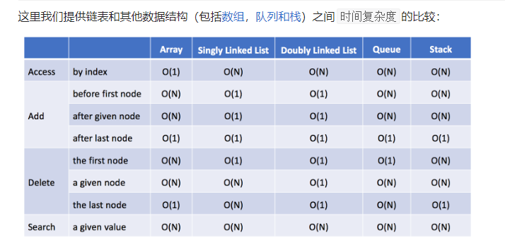
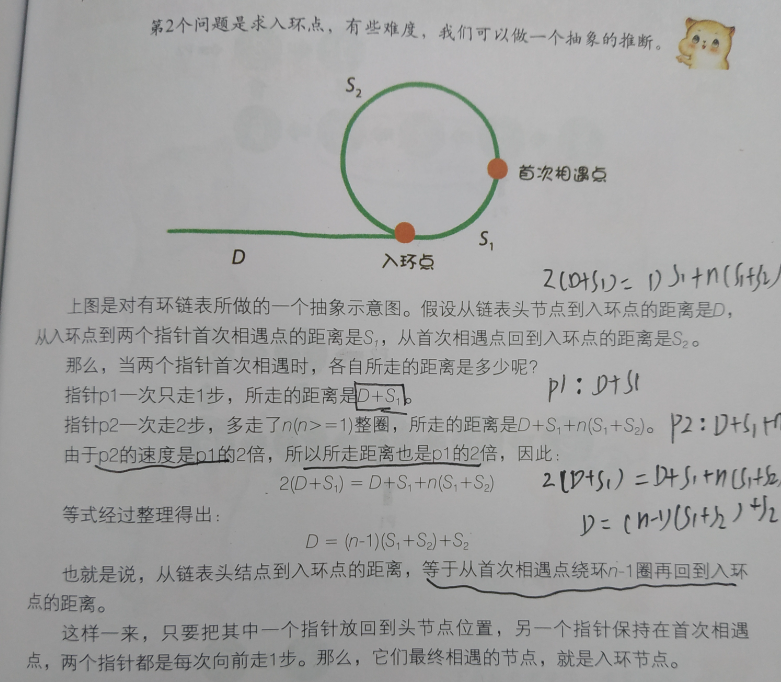
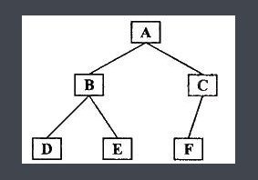
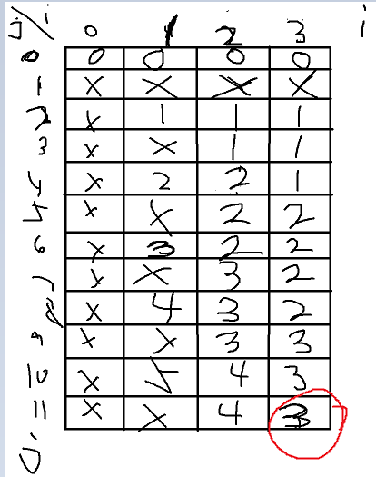

# LeetCode question&answer&解析

做一下修改，再改一下

# 每日一题:

#### [1636. 按照频率将数组升序排序 ](https://leetcode.cn/problems/sort-array-by-increasing-frequency/) 2022.09.18 Easy 

```java
class Solution {
    public int[] frequencySort(int[] nums) {
        Map<Integer, Integer> freq = new HashMap<>();

        for(int num : nums){
            freq.put(num,freq.getOrDefault(num, 0) + 1);
        }

        List<Integer> list = new ArrayList<>();
        for(int num : nums){
            list.add(num);
        }

        //获取值对应的频率，如果频率不同按照升序对list排序，相同按照降序排序
        Collections.sort(list, (a, b) -> {
            int cnt1 = freq.get(a), cnt2 = freq.get(b);
            return cnt1 != cnt2 ? cnt1 - cnt2 : b - a;
        });

        for(int i = 0; i < nums.length; i++){
            nums[i] = list.get(i);
        }
        return nums;
    }
}
```


#### [698. 划分为k个相等的子集](https://leetcode.cn/problems/partition-to-k-equal-sum-subsets/) 2022.09.19 Mid 回溯剪枝算法

```java
class Solution {
    public boolean canPartitionKSubsets(int[] nums, int k) {
        
        //数据预处理部分，求sum和target
        int sum = 0; 
        for(int num : nums){
            sum += num;
        }
        
        if(sum % k != 0){
            return false;
        }
        int target = sum/k;
        
        //创建桶用来放球(k和k+ 1都行，k+1防止溢出的)
        int[] bucket = new int[k + 1];
        
        //吧nums的数降序排列
        Arrays.sort(nums);
        int left = 0, right= nums.length - 1;
        while (left < right) {
            int temp = nums[left];
            nums[left] = nums[right];
            nums[right] = temp;
            left++;
            right--;
        }
        
        return checkSuccess(nums, 0, bucket, k, target);
    }

    public boolean checkSuccess(int[] nums, int index, int[] bucket, int k, int target){
        //如果index = nums.length代表球已经都被放好了
        if(index == nums.length){
            return true;
        }
        
        // i对对应的是桶的编号
        for(int i = 0; i < k; i++){
            //这个桶内的值和上一个一样代表这个桶里不需要再继续加入数值了，加入这个条件剪枝防止超时
            if (i > 0 && bucket[i] == bucket[i - 1]){
                continue;
            }
            //如果值加进去溢出，就放入下一个桶
            if(bucket[i] + nums[index] > target){
                continue;
            }

            bucket[i] += nums[index];
            //如果一直到最后一个值都是成功的话说明分类成功了，直接一层层返回true
            //否则的话会被返回false，然后跳过这个if，进行下一步
            if(checkSuccess(nums, index + 1, bucket, k, target)){
                return true;
            }
            //上面如果是false的话会进行撤销选择：挪出 i 号桶
            bucket[i] -= nums[index];
        }
        // k 个桶都不满足要求，也就是再for循环内没有true被return出来的话属于分不出来，就会返回false
        return false;
    }
}
```


#### [854. 相似度为 K 的字符串](https://leetcode.cn/problems/k-similar-strings/) 2022.09.20 hard，广度优先算法 BFS

```java
class Solution {
    public int kSimilarity(String s1, String s2) {
        int n = s1.length();
        //用pair的原因：相比hashmap，pair可以直接用getKey()和getValue()这两个function，更方便
        Queue<Pair<String, Integer>> queue = new ArrayDeque<Pair<String, Integer>>();
        Set<String> visit = new HashSet<String>();
        queue.offer(new Pair<String, Integer>(s1, 0));
        visit.add(s1);
        int step = 0;

        //广度优先搜索开始了
        while (!queue.isEmpty()) {
            int sz = queue.size();
            //用loop的原因是这一轮拿出来的值，他们的step都是一样的
            for (int i = 0; i < sz; i++) {
                //队列拿出
                Pair<String, Integer> pair = queue.poll();
                //cur是值
                String cur = pair.getKey();
                //pos是交换了几次
                int pos = pair.getValue();
                if (cur.equals(s2)) {
                    return step;
                }
                //pos的位置已经是换完的了，就pos++去找下一个
                while (pos < n && cur.charAt(pos) == s2.charAt(pos)) {
                    pos++;
                }
                for (int j = pos + 1; j < n; j++) {
                    if (s2.charAt(j) == cur.charAt(j)) {
                        continue;
                    }
                    //s2当前位置和cur当前位置字母相同，就换位置，然后添加到visit和队列中
                    if (s2.charAt(pos) == cur.charAt(j)) {
                        String next = swap(cur, pos, j);
                        if (!visit.contains(next)) {
                            visit.add(next);
                            queue.offer(new Pair<String, Integer>(next, pos + 1));
                        }
                    }
                }
            }
            step++;
        } 
        return step;
    }
    //交换sting内字符位置
    public String swap(String cur, int i, int j) {
        char[] arr = cur.toCharArray();
        char c = arr[i];
        arr[i] = arr[j];
        arr[j] = c;
        return new String(arr);
    }
}
```


#### [1640. 能否连接形成数组](https://leetcode.cn/problems/check-array-formation-through-concatenation/) 2022.09.21 Easy

```java
class Solution {
    public boolean canFormArray(int[] arr, int[][] pieces) {
        //哈希表存arr的数和编号，然后piece里拿每一个数组的第一个值去哈希里面找对应再arr中的编号
        HashMap<Integer, Integer> map = new HashMap<>();
        int n = arr.length, m = pieces.length;
        for(int i = 0; i < n; i++){
            map.put(arr[i], i);
        }
        for(int[] piece : pieces){
            //如果piece中有的值在arr中找不到就是false
            if(!map.containsKey(piece[0])){
                return false;
            }
            //找到值对应在arr中的位置
            Integer order = map.get(piece[0]);
            //然后去对比这个数组中每一个数是否和arr中的位置开始之后的数相同
            //并且还得先判断位置是否会超过arr的长度, 超长了就直接false
            for(int j = 0; j < piece.length; j++){
                if(order + j >= arr.length || arr[order + j] != piece[j]){
                    return false;
                }
            }
        }
        return true;
    }
}
```


#### [1652. 拆炸弹](https://leetcode.cn/problems/defuse-the-bomb/) 2022.09.23 Easy

```java
class Solution {
    public int[] decrypt(int[] code, int k) {
        int n = code.length;
        int[] ans = new int[n];
        for(int i = 0; i < n; i++){
            if(k == 0){
                ans[i] = 0;
            }
            if(k > 0){
                int sum = 0;
                for(int j = i + 1; j < i + k + 1; j++){
                    sum += code[j % n];
                }
                ans[i] = sum;
            }
            if(k < 0){
                int sum = 0;
                for(int j = n + i - 1; j > n + i + k - 1; j--){
                    sum += code[j % n];
                }
                ans[i] = sum;
            }
        }
        return ans;
    }
}
```


#### [788. 旋转数字](https://leetcode.cn/problems/rotated-digits/) 222.09.24 Mid

```java
class Solution {
    public int rotatedDigits(int n) {
        int count = 0;
        for(int i = 1; i <= n; i++){
            String num = String.valueOf(i);
            //需要用两个boolean分别判断是否有3，4，7，如果有那么就是false，还要判断是否有至少一个2，5，6，9 如果至少有一个就是true
            //双重判断确保这个数是好数
            boolean check = true, valid = false;
            for(int j = 0; j < num.length(); j++){
                if(num.charAt(j) == '3' || num.charAt(j) == '4' || num.charAt(j) == '7') {
                    check = false;
                }
                if(num.charAt(j) == '2' || num.charAt(j) == '5' || num.charAt(j) == '6' || num.charAt(j) == '9'){
                    valid = true;
                }
            }
            if(check && valid){
                count++;
            }
        }
        return count;
    }
}
```


#### [面试题 17.19. 消失的两个数字](https://leetcode.cn/problems/missing-two-lcci/) 2022.09.25 Hard

```java
class Solution {
    public int[] missingTwo(int[] nums) {
        int m = nums.length;
        int n = m + 2;
        boolean f1 = false;
        boolean f2 = false;
        //假设某个数存在过，那么可以将数组下标对应的数+n，最后只需要判断下标对应的数是否大于n即可，大于n则说明存在过
        for (int i = 0; i < m; ++i) {
            int val = nums[i] % n;
            if (val == n - 2) {
                f1 = true;
            } else if (val == n - 1) {
                f2 = true;
            } else {
                nums[val] += n;
            }
        }
        int[] ans = new int[2];
        int id = 0;
        //如果不大于说明缺失，这是判断n-2之前的数有没有缺失值的
        for (int i = 1; i < m; i++) {
            if (nums[i] <= n) {
                ans[id++] = i;
            }
        }
        // f1是true说明f1对应的n-2的值存在，f1不是true对应的n-2的值不存在，所以用 !f1判断
        if (!f1) {
            ans[id++] = n - 2;
        }
        /// f2是true说明f2对应的n-1的值存在，f2不是true对应的n-1的值不存在所以用 !f2判断
        if (!f2) {
            ans[id++] = n - 1;
        }
        if (nums[0] <= n) {
            ans[id++] = n;
        }
        return ans;
    }
}
```


#### [面试题 01.02. 判定是否互为字符重排](https://leetcode.cn/problems/check-permutation-lcci/) 2022.09.26 Easy

还有个巨简单的办法，把两个字符串变成char数组，然后sort，然后比较是否equal就对了

```java
class Solution {
    public boolean CheckPermutation(String s1, String s2) {
        HashMap<Character, Integer> visited = new HashMap<>();
        int n = s1.length();
        if(s1.length() != s2.length()){
            return false;
        }
        for(int i = 0; i < n; i++){
            visited.put(s1.charAt(i), visited.getOrDefault(s1.charAt(i), 0) + 1);
        }
        
        for(int j = 0; j < s2.length(); j++){
            if(!visited.containsKey(s2.charAt(j))){
                return false;
            }else{
                if(visited.get(s2.charAt(j)) <= 0 ){
                    return false;
                }else{
                    visited.replace(s2.charAt(j), visited.get(s2.charAt(j))-1);
                }
            }
        }
        return true;
    }
}
```


#### [面试题 17.09. 第 k 个数](https://leetcode.cn/problems/get-kth-magic-number-lcci/) 2022.09.27 Mid

```java
class Solution {
    public int getKthMagicNumber(int k) {
        int[] factors = new int[]{3, 5, 7};
        Set<Long> seen = new HashSet<>();
        //用PriorityQueue的原因是因为优先级队列会一直保证当前队列中最小的值在最前头, 用long是因为会超出int的最大取值范围
        PriorityQueue<Long> queue = new PriorityQueue<>();
        queue.offer(1L);
        seen.add(1L);
        int res = 0;

        for(int i = 0; i < k; i++){
            long curr = queue.poll();
            res = (int)curr;
            for(int factor : factors){
                long next = curr * factor;
                if(!seen.contains(next)){
                    queue.offer(next);
                    seen.add(next);
                }
            }
        }
        return res;
    }
}
```


#### [面试题 01.09. 字符串轮转](https://leetcode.cn/problems/string-rotation-lcci/) 2022.09.28 Easy

```java
class Solution {
    public boolean isFlipedString(String s1, String s2) {
        int m = s1.length(), n = s2.length();
        if(m != n){
            return false;
        }
        if(n == 0){
            return true;
        }
        //固定i，每次在基础上加j位之后和s2相比，如果有不一样的就返回 false，否则返回true
        for(int i = 0; i < m; i++){
            boolean check = true;
            for(int j = 0; j < n; j++){
                if(s1.charAt((i+j)%n) != s2.charAt(j)){
                    check = false;
                    break;
                }   
            }
            if(check == true){
                return true;
            }
        }
        return false;
    }
}

```

#### [面试题 01.08. 零矩阵 ](https://leetcode.cn/problems/zero-matrix-lcci/) 2022.09.29 Mid

```
做过，直接找下面数组那块
```


#### [1694. 重新格式化电话号码](https://leetcode.cn/problems/reformat-phone-number/) 2022.09.30 Easy

```java
class Solution {
    public String reformatNumber(String number) {
        StringBuilder digits = new StringBuilder();
        for (int i = 0; i < number.length(); ++i) {
            char ch = number.charAt(i);
            if (Character.isDigit(ch)) {
                digits.append(ch);
            }
        }

        int n = digits.length();
        int pt = 0;
        StringBuilder ans = new StringBuilder();
        while (n > 0) {
            if (n > 4) {
                ans.append(digits.substring(pt, pt + 3) + "-");
                pt += 3;
                n -= 3;
            } else {
                if (n == 4) {
                    ans.append(digits.substring(pt, pt + 2) + "-" + digits.substring(pt + 2, pt + 4));
                } else {
                    ans.append(digits.substring(pt, pt + n));
                }
                break;
            }
        }
        return ans.toString();
    }
}
```


#### [777. 在LR字符串中交换相邻字符](https://leetcode.cn/problems/swap-adjacent-in-lr-string/) 2022.10.01 Mid

双指针问题

```java
class Solution {
    public boolean canTransform(String start, String end) {
        //LX替换XL, XL不能替换LX, XR替换RX, RX不能替换XR
        //找start和end两个字符串的所有L和R是否符合位置
        if(start.length() != end.length()){
            return false;
        }
        int n = start.length();
        int i = 0, j = 0;
        while(i < n && j < n){
            while(i < n && start.charAt(i) == 'X'){
                i++;
            }
            while(j < n && end.charAt(j) == 'X'){
                j++;
            }
            if(i < n && j < n){
                if(start.charAt(i) != end.charAt(j)){
                    return false;
                }
                char temp = start.charAt(i);
                if((temp == 'R' && i > j) ||(temp == 'L') && i < j ){
                    return false;
                }
                i++;
                j++;
            }
        }
        while(i < n){
            if(start.charAt(i) != 'X'){
                return false;
            }
            i++;
        }
        while(j < n){
            if(end.charAt(j) != 'X'){
                return false;
            }
            j++;
        }
        return true;
    }
}
```


#### [1784. 检查二进制字符串字段](https://leetcode.cn/problems/check-if-binary-string-has-at-most-one-segment-of-ones/) 2022.10.02 Easy

```java
class Solution {
    public boolean checkOnesSegment(String s) {
        //没别的，找有没有 01 就完事了
        int n = s.length();
        for(int i = 1; i < n; i++){
            if(s.charAt(i) == '1' && s.charAt(i-1) == '0'){
                return false;
            }
        }
        return true;
    }
}
```


#### [921. 使括号有效的最少添加](https://leetcode.cn/problems/minimum-add-to-make-parentheses-valid/) 2022.10.03 Mid

```java
//记录左括号数量，每有一个右括号就把左括号数量减少，如果没左括号了就代表要补左括号，如果遍历完了还有左括号就需要补等量的右括号
class Solution {
    public int minAddToMakeValid(String s) {
        int ans = 0; 
        int leftCount = 0; 
        int n = s.length();
        for(int i = 0; i < n; i++){
            if(s.charAt(i) == '('){
                leftCount++;
            }else{
                if(leftCount > 0){
                    leftCount--;
                }else{
                    ans++;
                }
            }
        }
        ans += leftCount;
        return ans;
    }
}
```


#### [811. 子域名访问计数2](https://leetcode.cn/problems/subdomain-visit-count/) 2022.10.04 mid

```java
class Solution {
    public List<String> subdomainVisits(String[] cpdomains) {
        List<String> ans = new ArrayList<String>();
        Map<String, Integer> counts = new HashMap<String, Integer>();
        for (String cpdomain : cpdomains) {
            int space = cpdomain.indexOf(' ');
            int count = Integer.parseInt(cpdomain.substring(0, space));
            String domain = cpdomain.substring(space + 1);
            counts.put(domain, counts.getOrDefault(domain, 0) + count);
            for (int i = 0; i < domain.length(); i++) {
                if (domain.charAt(i) == '.') {
                    String subdomain = domain.substring(i + 1);
                    counts.put(subdomain, counts.getOrDefault(subdomain, 0) + count);
                }
            }
        }
        for (Map.Entry<String, Integer> entry : counts.entrySet()) {
            String subdomain = entry.getKey();
            int count = entry.getValue();
            ans.add(count + " " + subdomain);
        }
        return ans;
    }
}
```


#### [927. 三等分](https://leetcode.cn/problems/three-equal-parts/) 2022.10.05 hard 不会没看直接炒的答案

```java
class Solution {
    public int[] threeEqualParts(int[] arr) {
        int sum = Arrays.stream(arr).sum();
        if (sum % 3 != 0) {
            return new int[]{-1, -1};
        }
        if (sum == 0) {
            return new int[]{0, 2};
        }

        int partial = sum / 3;
        int first = 0, second = 0, third = 0, cur = 0;
        for (int i = 0; i < arr.length; i++) {
            if (arr[i] == 1) {
                if (cur == 0) {
                    first = i;
                } else if (cur == partial) {
                    second = i;
                } else if (cur == 2 * partial) {
                    third = i;
                }
                cur++;
            }
        }

        int len = arr.length - third;
        if (first + len <= second && second + len <= third) {
            int i = 0;
            while (third + i < arr.length) {
                if (arr[first + i] != arr[second + i] || arr[first + i] != arr[third + i]) {
                    return new int[]{-1, -1};
                }
                i++;
            }
            return new int[]{first + len - 1, second + len};
        }
        return new int[]{-1, -1};
    }
}
```


#### [1800. 最大升序子数组和](https://leetcode.cn/problems/maximum-ascending-subarray-sum/) 2022.10.06 Easy dp动态规划问题

```java
class Solution {
    public int maxAscendingSum(int[] nums) {
        int res = 0;
        int l = 0;
        //动态规划真的妙啊，每次初始化sum为子数组的第一题个数，就不用考虑这个问题了
        while (l < nums.length) {
            int cursum = nums[l++];
            while (l < nums.length && nums[l] > nums[l - 1]) {
                cursum += nums[l++];
            }
            res = Math.max(res, cursum);
        }
        return res;
    }
}
```


#### [870. 优势洗牌](https://leetcode.cn/problems/advantage-shuffle/) 2022.10.07 Mid

对nums2和nums1内的值排序， 并且对nums2内值对应的下标一并排序，这样对照nums1和nums2相同位置上的值，如果nums1的大就替换掉nums2的值，否则nums1的值替换掉nums2末尾的值，依次类推

```java
class Solution {
    public int[] advantageCount(int[] nums1, int[] nums2) {
        int n = nums1.length;
        Integer[] idx = new Integer[n];
        for(int i = 0; i < n; i++){
            idx[i] = i;
        }
        Arrays.sort(nums1);
        //根据nums2数据升序，排序nums2(索引), idx用Integer是为了下面能排序
        //如例子1，排序完之后idx内的值为[0,2,1,3]
        Arrays.sort(idx, (i, j) -> nums2[i] - nums2[j]); 
        int l = 0, r = n - 1;
        //idx[l]对应的其实是nums2内值的顺序
        for(int i : nums1){
            if(i > nums2[idx[l]]){
                nums2[idx[l++]] = i;
            }else{
                nums2[idx[r--]] = i;
            }
        }
        return nums2;
    }
}
```


#### [856. 括号的分数](https://leetcode.cn/problems/score-of-parentheses/) 2022.10.08 mid

```java
//用栈的思想，（就push 0， 遇到）就取出来栈顶，如果是0就把1 push 回去，如果不是就按照要求操作
class Solution {
    public int scoreOfParentheses(String s) {
        int n = s.length(), ans = 0;
        Stack<Integer> stack = new Stack<>();
        for(int i = 0; i < n; i++){
            if(s.charAt(i) == '('){
                stack.push(0);
            }else{
                if(stack.peek() == 0){
                    stack.pop();
                    stack.push(1);
                }else{
                    int sum = 0;
                    while(stack.peek() != 0){
                        sum += stack.pop();
                    }
                    stack.pop();
                    stack.push(sum * 2);
                }
            }
        }
        while(!stack.isEmpty()){
            ans += stack.pop();
        }
        return ans;
    }
}
```


#### [1790. 仅执行一次字符串交换能否使两个字符串相等](https://leetcode.cn/problems/check-if-one-string-swap-can-make-strings-equal/) 2022.10.10 Easy

```java
//储存下标然后判断
class Solution {
    public boolean areAlmostEqual(String s1, String s2) {
        int n = s1.length();
        List<Integer> diff = new ArrayList<Integer>();
        for (int i = 0; i < n; ++i) {
            if (s1.charAt(i) != s2.charAt(i)) {
                if (diff.size() >= 2) {
                    return false;
                }
                diff.add(i);
            }
        }
        if (diff.isEmpty()) {
            return true;
        }
        if (diff.size() != 2) {
            return false;
        }
        return s1.charAt(diff.get(0)) == s2.charAt(diff.get(1)) && s1.charAt(diff.get(1)) == s2.charAt(diff.get(0));
    }
}
```


#### [817. 链表组件](https://leetcode.cn/problems/linked-list-components/) 2022.10.11 Mid

```java
//创建一个listnode 存放前一个节点，然后每次判断只有当数组同时有现节点值但没前节点值 的时候才count++
class Solution {
    public int numComponents(ListNode head, int[] nums) {
        Set<Integer> set = new HashSet<>();
        for(int num : nums){
            set.add(num);
        }
        ListNode curr = new ListNode(-1, head);
        int count = 0;
        while(head != null){
            if(set.contains(head.val) && !set.contains(curr.val)){
                count++;
            }
            curr = head;
            head = head.next;
        }
        return count;
    }
}
```


#### [769. 最多能完成排序的块](https://leetcode.cn/problems/max-chunks-to-make-sorted/) 2022.11.12 Mid

```java
class Solution {
    public int maxChunksToSorted(int[] arr) {
        //只要arr[i]的元素的值和 arr排序以后这个位置的元素的值相同，就说明这个值到下一个此情况的值的区间内的数符合题意
        //所以只要找到 arr[i] = i 的并计算有几次就行了
        int m = 0, res = 0;
        for (int i = 0; i < arr.length; i++) {
            m = Math.max(m, arr[i]);
            if (m == i) {
                res++;
            }
        }
        return res;
    }
}

```


#### [940. 不同的子序列 II](https://leetcode.cn/problems/distinct-subsequences-ii/)

看答案把，真不会

```java
class Solution {
    public int distinctSubseqII(String s) {
        final int MOD = 1000000007;
        int[] last = new int[26];
        Arrays.fill(last, -1);

        int n = s.length();
        int[] f = new int[n];
        Arrays.fill(f, 1);
        for (int i = 0; i < n; ++i) {
            for (int j = 0; j < 26; ++j) {
                if (last[j] != -1) {
                    f[i] = (f[i] + f[last[j]]) % MOD;
                }
            }
            last[s.charAt(i) - 'a'] = i;
        }

        int ans = 0;
        for (int i = 0; i < 26; ++i) {
            if (last[i] != -1) {
                ans = (ans + f[last[i]]) % MOD;
            }
        }
        return ans;
    }
}
```


#### [1441. 用栈操作构建数组](https://leetcode.cn/problems/build-an-array-with-stack-operations/) 2022.10.14 mid

```java
class Solution {
    public List<String> buildArray(int[] target, int n) {
        List<String> res = new ArrayList<String>();
        int prev = 0;
        for (int number : target) {
            for (int i = 0; i < number - prev - 1; i++) {
                res.add("Push");
                res.add("Pop");
            }
            res.add("Push");
            prev = number;
        }
        return res;
    }
}
```


#### [886. 可能的二分法 ](https://leetcode.cn/problems/possible-bipartition/) 2022.10.15 Mid 不会

```java
class Solution {
    public boolean possibleBipartition(int n, int[][] dislikes) {
        int[] color = new int[n + 1];
        List<Integer>[] g = new List[n + 1];
        for (int i = 0; i <= n; ++i) {
            g[i] = new ArrayList<Integer>();
        }
        for (int[] p : dislikes) {
            g[p[0]].add(p[1]);
            g[p[1]].add(p[0]);
        }
        for (int i = 1; i <= n; ++i) {
            if (color[i] == 0) {
                Queue<Integer> queue = new ArrayDeque<Integer>();
                queue.offer(i);
                color[i] = 1;
                while (!queue.isEmpty()) {
                    int t = queue.poll();
                    for (int next : g[t]) {
                        if (color[next] > 0 && color[next] == color[t]) {
                            return false;
                        }
                        if (color[next] == 0) {
                            color[next] = 3 ^ color[t];
                            queue.offer(next);
                        }
                    }
                }
            }
        }
        return true;
    }
}
```


#### [904. 水果成篮](https://leetcode.cn/problems/fruit-into-baskets/) 2022.10.16 mid

```java
class Solution {
    //用滑动窗口解决问题，用哈希表存储水果类型和出现次数，如果哈希表size > 2就得移动left，并且删除左边的
    public int totalFruit(int[] fruits) {
        int n = fruits.length;
        Map<Integer, Integer> cnt = new HashMap<Integer, Integer>();

        int left = 0, ans = 0;
        for (int right = 0; right < n; ++right) {
            cnt.put(fruits[right], cnt.getOrDefault(fruits[right], 0) + 1);
            while (cnt.size() > 2) {
                cnt.put(fruits[left], cnt.get(fruits[left]) - 1);
                if (cnt.get(fruits[left]) == 0) {
                    cnt.remove(fruits[left]);
                }
                ++left;
            }
            ans = Math.max(ans, right - left + 1);
        }
        return ans;
    }
}
```


#### [902. 最大为 N 的数字组合](https://leetcode.cn/problems/numbers-at-most-n-given-digit-set/) 2022.10.17 Hard， 动态规划没看

```java
class Solution {
    public int atMostNGivenDigitSet(String[] digits, int n) {
        String s = Integer.toString(n);
        int m = digits.length, k = s.length();
        int[][] dp = new int[k + 1][2];
        dp[0][1] = 1;
        for (int i = 1; i <= k; i++) {
            for (int j = 0; j < m; j++) {
                if (digits[j].charAt(0) == s.charAt(i - 1)) {
                    dp[i][1] = dp[i - 1][1];
                } else if (digits[j].charAt(0) < s.charAt(i - 1)) {
                    dp[i][0] += dp[i - 1][1];
                } else {
                    break;
                }
            }
            if (i > 1) {
                dp[i][0] += m + dp[i - 1][0] * m;
            }
        }
        return dp[k][0] + dp[k][1];
    }
}

```


#### [1700. 无法吃午餐的学生数量 ](https://leetcode.cn/problems/number-of-students-unable-to-eat-lunch/) Easy 2022.10.18

```java
class Solution {
    public int countStudents(int[] students, int[] sandwiches) {
        //s1是吃1的，s0是吃0的，如果学生里没有吃栈顶的三明治的学生的话，就可以返回结果了
        int s1 = Arrays.stream(students).sum();
        int s0 = students.length - s1;
        for (int i = 0; i < sandwiches.length; i++) {
            if (sandwiches[i] == 0 && s0 > 0) {
                s0--;
            } else if (sandwiches[i] == 1 && s1 > 0) {
                s1--;
            } else {
                break;
            }
        }
        return s0 + s1;
    }
}
```


#### [779. 第K个语法符号 ](https://leetcode.cn/problems/k-th-symbol-in-grammar/)Mid 2022.10.19

```java
class Solution {
    public int kthGrammar(int n, int k) {
        if (k == 1) {
            return 0;
        }
        if (k > (1 << (n - 2))) {
            return 1 ^ kthGrammar(n - 1, k - (1 << (n - 2)));
        }
        return kthGrammar(n - 1, k);
    }
}
```


#### [901. 股票价格跨度](https://leetcode.cn/problems/online-stock-span/) mid 2022.10.20

```java
class StockSpanner {
    Deque<int[]> stack;
    int idx;

    public StockSpanner() {
        stack = new ArrayDeque<int[]>();
        stack.push(new int[]{-1, Integer.MAX_VALUE});
        idx = -1;
    }

    public int next(int price) {
        idx++;
        while (price >= stack.peek()[1]) {
            stack.pop();
        }
        int ret = idx - stack.peek()[0];
        stack.push(new int[]{idx, price});
        return ret;
    }
}
```


#### [1235. 规划兼职工作](https://leetcode.cn/problems/maximum-profit-in-job-scheduling/) Hard 2022.10.21

#### array.sort(): 

```
(a, b) => a - b 代表sort the numbers in ascending order.(升序排列);
(a, b) => b - a 代表sort the numbers in descending order.(降序排列);
```


```java
class Solution {
    public int jobScheduling(int[] startTime, int[] endTime, int[] profit) {
        int n = startTime.length;
        int[][] jobs = new int[n][];
        for (int i = 0; i < n; i++) {
            jobs[i] = new int[]{startTime[i], endTime[i], profit[i]};
        }
        //按照工作结束时间的大小进行升序排列，a[1] b[1]对应的是endtime
        Arrays.sort(jobs, (a, b) -> a[1] - b[1]);
        
        //使用 dp[i] 表示前 i 份兼职工作可以获得的最大报酬，初始时 dp[0]=0，
        // 0份兼职没钱，1份兼职可以赚profit[0]的钱
        //状态转移方程为dp[i] = max(dp[i-1], dp[k] + profit[i-1]), 
        int[] dp = new int[n + 1];
        for (int i = 1; i <= n; i++) {
            //找 end time 小于等于第i份工作start time 的最大报酬的下标k，最大报酬为dp[k]
            int k = binarySearch(jobs, i - 1, jobs[i - 1][0]);
            dp[i] = Math.max(dp[i - 1], dp[k] + jobs[i - 1][2]);
        }
        return dp[n];
    }
	
    // right是当前工作，target是当前工作起始时间
    public int binarySearch(int[][] jobs, int right, int target) {
        int left = 0;
        while (left < right) {
            // 找结束时间小于等于当前工作的最后一个工作，然后因为dp的原因，这个工作的dp[k]就是最大报酬了
            int mid = left + (right - left) / 2;
            if (jobs[mid][1] > target) {
                right = mid;
            } else {
                left = mid + 1;
            }
        }
        return left;
    }
}
```


#### [1768. 交替合并字符串 ](https://leetcode.cn/problems/merge-strings-alternately/)Easy  2022.10.22

```java
class Solution {
    public String mergeAlternately(String word1, String word2) {
        int m = word1.length(), n = word2.length();
        int l = 0, r = 0;
        //双指针
        StringBuilder ans = new StringBuilder();
        while(l < m || r < n){
            if(l < m){
                ans.append(word1.charAt(l));
                l++;
            }
            if(r < n){
                ans.append(word2.charAt(r));
                r++;
            }
        }
        return ans.toString();
    }
}
```


#### [915. 分割数组](https://leetcode.cn/problems/partition-array-into-disjoint-intervals/) mid 2022.10.23

```java
class Solution {
    public int partitionDisjoint(int[] nums) {
        int n = nums.length;
        int[] max = new int[n], min = new int[n];
        max[0] = nums[0];
        min[n-1] = nums[n-1];
        for(int i = 1; i < n; i++){
            max[i] = Math.max(nums[i], max[i-1]);
            min[n-1-i] = Math.min(nums[n-1-i], min[n-i]);
        }
        for(int i = 0; i < n ; i++){
            if(max[i] <=  min[i + 1]){
                return i + 1;
            }
        }
        return -1;
    }
}
```


#### [934. 最短的桥](https://leetcode.cn/problems/shortest-bridge/) mid 2022.10.24 两个bfs，或者dfs+bfs

```java
class Solution {
    public int shortestBridge(int[][] grid) {
        int n = grid.length;
        int[][] dirS = {{-1,0}, {1,0}, {0,1}, {0,-1}};
        List<int[]> island = new ArrayList<int[]>();
        //deque比Linkedlist要快
        Queue<int[]> queue = new ArrayDeque<int[]>();
        
        for(int i = 0; i < n; i++){
            for(int j = 0; j < n; j++){
                //只需要田间第一个为1的点到queue就行
                if(grid[i][j] == 1){
                    queue.offer(new int[]{i,j});
                    grid[i][j] = -1;

                    //找到其中一个岛的所有坐标，记录到island中，并且都设置成1
                    while(!queue.isEmpty()){
                        int[] cell = queue.poll();
                        island.add(cell);
                        int x = cell[0], y = cell[1];
                        for(int k = 0; k < 4; k++){
                            int nx = x + dirS[k][0];
                            int ny = y + dirS[k][1];
                            if(nx >= 0 && ny >= 0 && nx < n && ny < n && grid[nx][ny] == 1){
                                queue.offer(new int[]{nx, ny});
                                grid[nx][ny] = -1;
                            }
                        }
                    }
                    //queue这时候为空了
                    //把所有岛1的坐标加入到 queue 中
                    for(int[] cell : island){
                        queue.offer(cell);
                    }
                    //按照层序遍历二叉树的方法，设置一个step并且对每一层记录一个size 进行遍历，如果为0就加入queue
                    //然后把这个位置变成-1，如果找到1直接返回step就行了
                    int step = 0;
                    while(!queue.isEmpty()){
                        int size = queue.size();
                        for(int k = 0; k < size; k++){
                            int[] temp = queue.poll();
                            int x = temp[0], y = temp[1];
                            for(int z = 0; z < 4; z++){
                                int nx = x + dirS[z][0];
                                int ny = y + dirS[z][1];
                                if(nx >= 0 && ny >= 0 && nx < n && ny < n){
                                    if(grid[nx][ny] == 0){
                                        queue.offer(new int[]{nx, ny});
                                        grid[nx][ny] = -1;
                                    }else if(grid[nx][ny] == 1){
                                        return step;
                                    }
                                }
                            }
                        }
                        step++;
                    }
                }
            }
        }
        return 0;
    }
}
```


#### [862. 和至少为 K 的最短子数组 ](https://leetcode.cn/problems/shortest-subarray-with-sum-at-least-k/) Hard 2022.10.25 回头好好看一看

```java
class Solution {
    public int shortestSubarray(int[] nums, int k) {
        int n = nums.length;
        long[] preSumArr = new long[n + 1];
        for (int i = 0; i < n; i++) {
            preSumArr[i + 1] = preSumArr[i] + nums[i];
        }
        int res = n + 1;
        Deque<Integer> queue = new ArrayDeque<Integer>();
        for (int i = 0; i <= n; i++) {
            long curSum = preSumArr[i];
            while (!queue.isEmpty() && curSum - preSumArr[queue.peekFirst()] >= k) {
                res = Math.min(res, i - queue.pollFirst());
            }
            while (!queue.isEmpty() && preSumArr[queue.peekLast()] >= curSum) {
                queue.pollLast();
            }
            queue.offerLast(i);
        }
        return res < n + 1 ? res : -1;
    }
}
```


#### [1822. 数组元素积的符号](https://leetcode.cn/problems/sign-of-the-product-of-an-array/) Easy 2022.10.26

```java
class Solution {
    public int arraySign(int[] nums) {
        int sign = 1;
        for (int num : nums) {
            if (num == 0) {
                return 0;
            }
            if (num < 0) {
                sign = -sign;
            }
        }
        return sign;
    }
}
```


#### [907. 子数组的最小值之和](https://leetcode.cn/problems/sum-of-subarray-minimums/) Mid 2022.10.27 动态规划

```java
class Solution {
    public int sumSubarrayMins(int[] arr) {
        int n = arr.length;
        long ans = 0;
        final int MOD = 1000000007;
        Deque<Integer> monoStack = new ArrayDeque<Integer>();
        int[] dp = new int[n];
        for (int i = 0; i < n; i++) {
            while (!monoStack.isEmpty() && arr[monoStack.peek()] > arr[i]) {
                monoStack.pop();
            }
            int k = monoStack.isEmpty() ? (i + 1) : (i - monoStack.peek());
            dp[i] = k * arr[i] + (monoStack.isEmpty() ? 0 : dp[i - k]);
            ans = (ans + dp[i]) % MOD;
            monoStack.push(i);
        }
        return (int) ans;
    }
}
```


#### [1773. 统计匹配检索规则的物品数量](https://leetcode.cn/problems/count-items-matching-a-rule/) Easy 2022.10.28

```java
//用 == 不行，必须得用。equals
class Solution {
    public int countMatches(List<List<String>> items, String ruleKey, String ruleValue) {
        int res = 0;
        int index = -1;
        if(ruleKey.equals("type")){
            index = 0;
        }else if(ruleKey.equals("color")){
            index = 1;
        }else{
            index = 2;
        }

        for(List<String> item :items){
            if(item.get(index).equals(ruleValue)){
                res++;
            }
        }
        return res;
    }   
}
```


#### [784. 字母大小写全排列](https://leetcode.cn/problems/letter-case-permutation/) Mid 2022.10.29 BFS

```java
class Solution {
    public List<String> letterCasePermutation(String s) {
        List<String> ans = new ArrayList<String>();
        Queue<StringBuilder> queue = new ArrayDeque<StringBuilder>();
        queue.offer(new StringBuilder());
        while (!queue.isEmpty()) {
            StringBuilder curr = queue.peek();
            if (curr.length() == s.length()) {
                ans.add(curr.toString());
                queue.poll();
            } else {
                int pos = curr.length();
                if (Character.isLetter(s.charAt(pos))) {
                    StringBuilder next = new StringBuilder(curr);
                    next.append((char) (s.charAt(pos) ^ 32));
                    queue.offer(next);
                }
                curr.append(s.charAt(pos));
            }
        }
        return ans;
    }
}
```


#### [481. 神奇字符串](https://leetcode.cn/problems/magical-string/) Mid 2022.10.30

```java
class Solution {
    public int magicalString(int n) {
        if (n < 4) {
            return 1;
        }
        char[] s = new char[n];
        s[0] = '1';
        s[1] = '2';
        s[2] = '2';
        int res = 1;
        int i = 2;
        int j = 3;
        while (j < n) {
            int size = s[i] - '0';
            int num = 3 - (s[j - 1] - '0');
            while (size > 0 && j < n) {
                s[j] = (char) ('0' + num);
                if (num == 1) {
                    ++res;
                }
                ++j;
                --size;
            }
            ++i;
        }
        return res;
    }
}
```


#### [1662. 检查两个字符串数组是否相等](https://leetcode.cn/problems/check-if-two-string-arrays-are-equivalent/) Easy 2022.10.31

```java
class Solution {
    public boolean arrayStringsAreEqual(String[] word1, String[] word2) {
        return join(word1).equals(join(word2));
    }

    public String join(String[] words) {
        StringBuilder ret = new StringBuilder();
        for (String s : words) {
            ret.append(s);
        }
        return ret.toString();
    }
}

```


# 随便练习: 

#### [1. 两数之和](https://leetcode.cn/problems/two-sum/)

用hashmap做，或者用for暴力穷举

```java
class Solution {
    public int[] twoSum(int[] nums, int target) {
        HashMap<Integer, Integer> sites = new HashMap<Integer, Integer>();
        for (int i = 0; i < nums.length; ++i){
            //一个key只对应一个value但是一个value对应的不止一个key
            //所以得拿key查找value，我们最后输出的应该是下标，所以key得是数的值
            if(sites.containsKey(target - nums[i])){
                int[] res = {sites.get(target - nums[i]),i};
                return res;
            }
            sites.put(nums[i],i);
        }
        return new int[0]; 
    }
}
```

```java
class Solution {
    public int[] twoSum(int[] nums, int target) {
        int n = nums.length;
        for (int i = 0; i <n; i++){
            for (int j = i+1; j < n;j++){
                if (nums[i]+nums[j] == target){
                    int[] res = {i,j};
                    return res;
                }
            }
        }
        return new int[0];
    }
}
```


#### [12. 整数转罗马数字](https://leetcode.cn/problems/integer-to-roman/)

很简单看看就知道了

```java
class Solution {
    public String intToRoman(int num) {
        //可以穷举因为就到千位数，最大值就是3999.
        //从千位到个位需要的罗马数字依次放在下面的数组里。
        String str4[] = {"", "M", "MM", "MMM"};
        String str3[] = {"", "C", "CC", "CCC", "CD", "D", "DC", "DCC", "DCCC", "CM"};
        String str2[] = {"", "X", "XX", "XXX", "XL", "L", "LX", "LXX", "LXXX", "XC"};
        String str1[] = {"", "I", "II", "III", "IV", "V", "VI", "VII", "VIII", "IX"};
        //取余数，num1到num4分别是个位到千位，3458 % 10 = 8， 345.8 % 10 = 5
        int num1 = num%10; 
        int num2 = (num/10)%10; 
        int num3 = (num/100)%10;
        int num4 = num/1000;
        //下面这行是可以用的就是速度慢
        //String ans = str1[num4] + str2[num3] + str3[num2] + str4[num1];
        StringBuffer ans = new StringBuffer();
        //最先append千位的数
        ans.append(str4[num4]);
        ans.append(str3[num3]);
        ans.append(str2[num2]);
        ans.append(str1[num1]);
        return ans.toString();
    }
}
```


#### [13. 罗马数字转整数](https://leetcode.cn/problems/roman-to-integer/)

要点：按照题目要求，当且仅当右边的那位大于左边的时候是特殊情况，也就是4，9，40，90，400，900这几种情况，距离IX X比I大，按正常规则来说大的数在右小的数在左

```java
class Solution {
    Map<Character, Integer> symbolValues = new HashMap<Character, Integer>() {{
        put('I', 1);
        put('V', 5);
        put('X', 10);
        put('L', 50);
        put('C', 100);
        put('D', 500);
        put('M', 1000);
    }};

    public int romanToInt(String s) {
        int ans = 0;
        int n = s.length();
        for (int i = 0; i < n; i++) {
            //因为key放的是string，value是数值，所以得s.charAt()获得string
            int value = symbolValues.get(s.charAt(i));
            //判断是否没到队尾并且当且仅当右边的数大于左边的时候是特殊情况，也就是4，9，40，90，400，900这种情况
            if (i < n - 1 && value < symbolValues.get(s.charAt(i + 1))) {
                ans = ans - value;
            } else {
                ans = ans + value;
            }
        }
        return ans;
    }
}
```


#### [961. 在长度 2N 的数组中找出重复 N 次的元素](https://leetcode.cn/problems/n-repeated-element-in-size-2n-array/)

要点：可以用hashset因为按照题目要求来说，因为只可有一个数重复并且重复n次，所以找重复的那个数就行。hashset基于哈希表并且一个数不可以被添加两次，所以用能否添加直接查找那个数。或者用for循环

```java
class Solution {
    public int repeatedNTimes(int[] nums) {
        //用hashset，hashset不允许有重复的数，所以正好满足这题
        HashSet<Integer> sites = new HashSet<Integer>();
       //用for或者foreash都可以，下面是foreach
        for(int num:nums){
            if(!sites.add(num)){
                return num;
            }
        }
        return -1;
    }
}
```

```java
class Solution {
    public int repeatedNTimes(int[] nums) {
        int n = nums.length;       
        //因为是2n长度的数组有n+1哥数，而且有个数重复n次，所以能得出只有一个数是重复的，然后然后因为是重复n次
        //所以要么是相邻的两个数一样，要么隔了一位或者2位，[9,5,6,9]这是个两位的例子，所以弄个gap分别判断一下
        for(int gap = 1; gap <= 3; gap++){     
            //i+gap的原因是最后一个数的编号肯定不能超过数组长度，因为i = 0开始所以数组最后应该是n-1
            for(int i = 0; (i+ gap) < n; i++){
                if (nums[i] == nums[i + gap]){
                    return nums[i];
                }
            }
        }
        return -1;
    }
}
```


#### [1025. 除数博弈](https://leetcode.cn/problems/divisor-game/)

要点，读题的话能确定只有alice拿到偶数的时候才能赢返回true

```java
class Solution {
    public boolean divisorGame(int n) {
        if(n%2 == 0){
            return true;
        }else{
            return false;
        }
    }
}
```


#### [1118. 一月有多少天](https://leetcode.cn/problems/number-of-days-in-a-month/)

要点：闰年是被4年或者400年整除，1900不算闰年2000年算

```java
class Solution {
    public int numberOfDays(int year, int month) {
        //二月特殊所以要特殊判断
        //闰年是%4=0的以及%400=0的
        int[] years = {31, 28, 31, 30, 31, 30, 31, 31, 30, 31, 30, 31};
        if(month == 2 ){
            //判断是否是闰年
            if(year%4 ==0 && (year%100 != 0 || year%400 == 0)){
                return 29;
            }else{
                return 28;
            }
        }else{
            return years[month-1];
        }
    }
}
```


# 二分查找: 

1. 对于**升序**或者**不降序**数组，当mid指向的值大于或者大于等于target时，我们需要减小右边界，反之当mid指向的值小于或小于等于target时，增大左边界。

2. 当求某个**特定不重复的**值target的位置时，判断条件存在大于，等于，小于三个分支。若求**大于等于**某个target，或者**小于**某个target时，**大于和等于**属于一个分支，**小于**属于另一个分支。若求**小于等于**某个target，或者**大于**某个target时，**小于和等于**属于一个分支，而大于属于另一个分支。

3. 当求某个特定值target的位置时，mid是最终解。当求大于或者大于等于target时，low (left) 是最终解，求小于或者小于等于target时，high (right) 是最终解。另外注意low (left) 与 high (right) 超出数组边界时，代表没有找到符合条件的元素。（以上情况均仅限增序，非增序或者降序需要反过来看）

   

   #### 没有重复元素的二分查找，查找准确的target：

   ```java
   if (nums.length == 0) return -1;
   //注意这里是length - 1
   int left = 0, right = nums.length - 1;
   
   while(left <= right){
   	int mid = left + (right - left)/2;
       if(nums[mid] == target){
           return mid;
       }else if(nums[mid] < target){
           left = mid + 1;
       }else{
           right = mid -1;
       }
   }
   //查找不到，返回-1
   return -1;
   ```

   #### 有最左右边界的情况的题[1,2,3,4]找小于1的，或者第一个或末尾的

   #### [1,2,3,4]找大于4的，或者那种找单独一个值的,[0,10,5,2]找10下标

   #### 或者普通的找大于或者小于一个数的都用这种方法最好了。
   
   #### 或者叫最后一个 >= x的数 / 最后一个 <= x的数
   
   **查找第一个大于等于某个数的下标(对于无重复元素)** 12345-3   23456-1 23456-7
   
   ```java
   if (nums.length == 0) return -1;
   int left = 0, right = nums.length - 1;
   
   while(left <= right){
       int mid = left + (right - left)/2;
       if(nums[mid] >= target){
           right = mid - 1;
       }else{
           left = mid + 1;
       }
   }
   //left是第一个大于的，right是最后一个小于等于的，right+1 = left
   //left小于数组长度返回left，否则不在数组内返回-1
   return left < nums.length ? left : -1;
   ```
   
   **查找第一个小于等于某个数的下标** 23456-1 
   
   ```java
   if (nums.length == 0) return -1;
   int left = 0, right = nums.length - 1;
   
   while(left <= right){
       int mid = left + (right - left)/2;
       if(nums[mid] <= target){
           left = mid + 1;
       }else{
           right = mid - 1;
       }
   }
   //left是第一个大于的，right是最后一个小于等于的，right+1 = left
   //坐标大于0返回right，否则组中所有数字均大于target，返回-1
   return right >= 0 ? right : -1;
   ```
   
   
   
   #### 查找左侧边界（下界）[1,'**2**',2,2,3]的最左边的2
   
   ```java
   if (nums.length == 0) return -1;
   int left = 0, right = nums.length;
   
   while(left < right){
       int mid = left + (right - left)/2;
       if(nums[mid] >= target){
           right = mid;
       }else{
           left = mid + 1;
       }
   }
   //left == right,无所谓return哪个
   return left;
   //或者防止死循环就是
   return nums[left] = target?left:-1;
   ```
   
   #### 查找右侧边界（上界）[1,2,2,'2',3]的最右边的2
   
   ```java
   if (nums.length == 0) return -1;
   int left = 0, right = nums.length;
   
   while(left < right){
   	mid = left + (right - left)/2;
       if(nums[mid] > target){
           //中间数大于target，往右区间[left, mid)查找
           right = mid;
       }else{
           //中间数小于等于target，往左区间[mid+1, right)查找
           left = mid + 1;
       }
   }
   //注意，left对应的为3，left - 1才对应最后一个2
   return left - 1;
   //或者防止死循环就是
   return nums[left-1] = target?left-1:-1;
   ```
   
   ```java
   //第二种方式
   if (nums.length == 0) return -1;
   int left = 0, right = nums.length - 1;
   
   while(left < right){
   	mid = left + (right - left)/2;
       if(nums[mid] > target){
           //中间数大于target，往右区间[left, mid - 1)查找
           right = mid - 1;
       }else{
           //中间数小于等于target，往左区间[mid, right)查找
           left = mid;
       }
   }
   //left == right,无所谓return哪个
   return left;
   //或者防止死循环就是
   return nums[left] = target?left:-1;
   ```
   
   
   
   #### 查找第一个大于target的元素 [1,**2**,2,2,'3']的3，但这个方法经常会碰到边界问题的情况导致报错，推荐用上面的
   
   ```java
   if (nums.length == 0) return -1;
   int left = 0, right = nums.length;
   
   while(left < right){
       int mid = left + (right - left)/2;
       if(nums[mid] > target){
           right = mid;
       }else if(nums[mid] <= target){
           left = mid + 1;
       }
   }
   //left == right 因为退出while的条件是left = right，并且这里left对应的是3，left-1对应的是最后一个2
   return left;
   ```
   
   #### 查找第一个小于target的元素['1',2,2,2,3]中的1，但这个方法经常会碰到边界问题的情况导致报错，，推荐用上面的
   
   ```java
   if (nums.length == 0) return -1;
   int left = 0, right = nums.length;
   
   while(left < right){
       int mid = left + (right - left)/2;
       if(nums[mid] >= target){
           right = mid;
       }else{
           left = mid + 1;
       }
   }
   //left == right是第一个2， left/right - 1才是最后小于target的
   return left - 1;
   ```
   
   #### 左边界添加-1方法：
   
   ```java
   // target 比所有数都大，因为nums.length是超出数组的
   if (left == nums.length) return -1;
   // 类似之前算法的处理方式
   return nums[left] == target ? left : -1;
   ```

   #### 右边界添加-1方法：

   ```java
   // target 比所有数都小, 因为left - 1 才是target，left都是0了那不存在target
   if (left == 0) return -1;
   // 类似之前算法的处理方式，因为是右边界所以是left - 1
   return nums[left-1] == target ? (left-1) : -1;
   ```
   
   
   
   ### 反过来（降序/非升序）
   
   #### 反过来：(降序)，此查找的是第一个大于等于target的数，[3,2,2,'**2**',1]中的最右的2
   
   ```java
   if (nums.length == 0) return -1;
   int left = 0, right = nums.length;
   
   while(left < right){
   	mid = left + (right - left)/2;
       if(nums[mid] >= target){
           //区别在于判断条件中的左右调换
           left = mid;
       }else{
           //区别在于判断条件中的左右调换，并且此处需要改为 mid - 1因为降序数组需要反向挪动，往左是大
           right = mid - 1;
       }
   }
   //left = right， 返回哪个都可以
   return left;
   ```
   
   #### 反过来：(降序)，此查找的是第一个大于等于target的数，[3, '2', 2, 2,1]中的最左的2
   
   ```java
   if (nums.length == 0) return -1;
   int left = 0, right = nums.length;
   
   while(left < right){
   	mid = left + (right - left)/2;
       if(nums[mid] > target){
           //区别在于判断条件中的左右调换
           left = mid;
       }else{
           //区别在于判断条件中的左右调换,并且此处需要改为 mid - 1因为降序数组需要反向挪动，往左是大
           right = mid - 1;
       }
   }
   //left是3，left + 1才是最后一个2
   return left + 1;
   ```
   
   #### 反过来：(降序)，此查找的是第一个大于target的数，['3', 2, 2, 2,1]中的最左的3
   
   ```java
   if (nums.length == 0) return -1;
   int left = 0, right = nums.length;
   
   while(left < right){
   	mid = left + (right - left)/2;
       if(nums[mid] > target){
           //区别在于判断条件中的左右调换
           left = mid;
       }else{
           //区别在于判断条件中的左右调换,并且此处需要改为 mid - 1因为降序数组需要反向挪动，往左是大
           right = mid - 1;
       }
   }
   //left == right是3，left + 1是最后一个2
   return left;
   ```
   
   #### 反过来：(降序)，此查找的是第一个小于target的数，[3, 2, 2, 2,'1']中的最左的1
   
   ```java
   if (nums.length == 0) return -1;
   int left = 0, right = nums.length;
   
   while(left < right){
   	mid = left + (right - left)/2;
       if(nums[mid] >= target){
           //区别在于判断条件中的左右调换
           left = mid;
       }else{
           //区别在于判断条件中的左右调换，并且此处需要改为 mid - 1因为降序数组需要反向挪动，往左是大
           right = mid - 1;
       }
   }
   //left = right， 返回哪个都可以
   return left + 1;
   ```
   
   

#### [704. 二分查找 ](https://leetcode.cn/problems/binary-search/)EASY

总的来说要看好到底需不需要加 return mid 和 == target。动动脑子

要点：二分查找有三个值分别是left right和middle

```java
class Solution {
    public int search(int[] nums, int target) {
        //二分查找要有左右两个数值定位
        int l = 0, r = nums.length-1;
        while(l<=r){
            //创建一个中间数，>>相当于除以2
            int mid = l + r >> 1;
            if(nums[mid] < target){
            //因为target大于中间数，所以结果在中间数右边，中间数不是，所以mid+1
                l = mid + 1;
            }else if(nums[mid] > target){
            //因为target小于中间数，所以结果在中间数左边，中间数不是，所以mid-1
                r = mid - 1;
            }else{
                return mid;
            }
        }
        return -1;
    }
}
```

另一个不是二分的办法

```java
class Solution {
    public int search(int[] nums, int target) {
        for(int i = 0; i< nums.length; i++){
            if (nums[i] == target){
                return i;
            }
        }
        return -1;
    }
}
```

#### [4. 寻找两个正序数组的中位数](https://leetcode.cn/problems/median-of-two-sorted-arrays/) HARD

```java
class Solution {
    public double findMedianSortedArrays(int[] nums1, int[] nums2) {
    int n = nums1.length;
    int m = nums2.length;
    int left = (n + m + 1) / 2;
    int right = (n + m + 2) / 2;
    //将偶数和奇数的情况合并，如果是奇数，会求两次同样的 k 。
    return (getKth(nums1, 0, n - 1, nums2, 0, m - 1, left) + getKth(nums1, 0, n - 1, nums2, 0, m - 1, right)) * 0.5;  
}
    
    private int getKth(int[] nums1, int start1, int end1, int[] nums2, int start2, int end2, int k) {
        int len1 = end1 - start1 + 1;
        int len2 = end2 - start2 + 1;
        //让 len1 的长度小于 len2，这样就能保证如果有数组空了，一定是 len1 
        if (len1 > len2) return getKth(nums2, start2, end2, nums1, start1, end1, k);
        if (len1 == 0) return nums2[start2 + k - 1];

        if (k == 1) return Math.min(nums1[start1], nums2[start2]);

        // 定义k/2 - 1，如果长度不够k/2 - 1就定义剩余长度
        int i = start1 + Math.min(len1, k / 2) - 1;
        int j = start2 + Math.min(len2, k / 2) - 1;

        if (nums1[i] > nums2[j]) {
            return getKth(nums1, start1, end1, nums2, j + 1, end2, k - (j - start2 + 1));
        }
        else {
            return getKth(nums1, i + 1, end1, nums2, start2, end2, k - (i - start1 + 1));
        }
    }
}
```


#### [374. 猜数字大小](https://leetcode.cn/problems/guess-number-higher-or-lower/)

要点，还是二分查找，如果guess = -1说明你猜的大了， guess = 1说明你猜小了

```java
/** 
 * Forward declaration of guess API.
 * @param  num   your guess
 * @return 	     -1 if num is lower than the guess number
 *			      1 if num is higher than the guess number
 *               otherwise return 0
 * int guess(int num);
 */

public class Solution extends GuessGame {
    public int guessNumber(int n) {
        //二分查找，先定义左右
        int l = 1, r = n;
        //当左不等于右的时候要一直循环
        while(l<=r){
            //mid不这么定义的话会溢出，一定记住下面的+1和-1，很重要
            int mid = l + (r-l)/2;
            if(guess(mid) == -1){
                r = mid - 1;
            }else if (guess(mid) == 1){
                l = mid + 1;
            }else{
                return mid;
            }
        }
        //return l还是r没区别因为r = l现在
        return l;
    }
}
```


#### [35. 搜索插入位置](https://leetcode.cn/problems/search-insert-position/)

很标准的二分查找

```java
class Solution {
    public int searchInsert(int[] nums, int target) {
        int n = nums.length;
        int left = 0, right = n - 1;
        while(left<=right){
            int mid = left + (right -left)/2;
            if(nums[mid] < target){
                left = mid + 1;
            }else{
                right = mid - 1;
            }
        }
        return left;
    }
}
```

#### [349. 两个数组的交集](https://leetcode.cn/problems/intersection-of-two-arrays/)

```java
class Solution {
    public int[] intersection(int[] nums1, int[] nums2) {
        // 4, 5, 9    4, 4, 8, 8, 9
        Arrays.sort(nums1);
        Arrays.sort(nums2);
        Set<Integer> set = new HashSet<>();
        int index1 = 0, index2 = 0; 
        while(index1 < nums1.length && index2 < nums2.length){
            int num1 = nums1[index1], num2 = nums2[index2];
            if(num1 == num2){
                if(!set.contains(num1)){
                    set.add(num1);
                }
                index1++;
                index2++;
            }else if(num1 < num2){
                index1++;
            }else{
                index2++;
            }
        }
        int[] res = new int[set.size()];
        int z = 0;
        for(Integer i : set){
            res[z++] = i.intValue();
        }
        return res;
    }
}
```

```java
// 第二个写法，用俩hashset解决，增强for循环或者迭代器都可以遍历hashset
class Solution {
    public int[] intersection(int[] nums1, int[] nums2) {
        Set<Integer> set1 = new HashSet<>();
        Set<Integer> set2 = new HashSet<>();
        for(int i : nums1){
            set1.add(i);
        }
        for(int i : nums2){
            if(set1.contains(i)){
                set2.add(i);
            }
        }

        int[] res = new int[set2.size()];
        int j = 0;
        for(int i : set2){
            res[j++] = i;
        }
        return res;
    }
}
```


#### [852. 山脉数组的峰顶索引](https://leetcode.cn/problems/peak-index-in-a-mountain-array/)

要点: 本题也是个正常二分查找的用法，只不过没有target不需要多写一步return mid了。

```java
class Solution {
    public int peakIndexInMountainArray(int[] arr) {
        int n = arr.length;
        int left = 0, right = n-1;
        while(left<=right){
            int mid = left + (right-left)/2;
            //如果mid比右边一位的数大，说明已经到达最高值或者过了最高值了，所以需要改变right
            if(arr[mid]>arr[mid+1]){
                right = mid -1;
            //如果mid比右边一位小，说明到达最高值或者还没到达最高值，需要改变left
            }else if(arr[mid]<arr[mid+1]){
                left = mid + 1;
            }
        }
        //因为没有target所以不需要return mid了，在loop外面直接return right+1 = mid就行了
        return right+1;
    }
}
```


#### [367. 有效的完全平方数](https://leetcode.cn/problems/valid-perfect-square/)

```java
class Solution {
    public boolean isPerfectSquare(int num) {
        int left = 0, right = num;
        while(left<=right){
            int mid = left + (right -left)/2;
            //一定要注意，num<= 2^31 - 1，而int的最大取值范围是2^31 - 1，这样的话，
            //mid*mid的结果会超出int的最大取值范围，得用long类型。
            long square = (long)mid*mid;
            if( square < num){
                left = mid + 1;
            }else if(square > num){
                right = mid -1;
            }else{
                return true;
            }
        }
        return false;
    }
}
```


#### [1385. 两个数组间的距离值](https://leetcode.cn/problems/find-the-distance-value-between-two-arrays/)

第一个是暴力循环的方法，遍历arr1中所有数，符合要求就count +1，最后return count

```java
class Solution {
    public int findTheDistanceValue(int[] arr1, int[] arr2, int d) {
        //count计算总共有几个符合的
        int count = 0;
        for(int i = 0; i < arr1.length; i++){
            //count2判断是否全部符合要求,全部符合count才能+1
            int count2 = 0;
            for (int j = 0; j < arr2.length; j++){
                if(Math.abs(arr1[i] - arr2[j]) > d ){
                    count2 = count2 + 1;
                }
            }
            if (count2 == arr2.length){
                count = count + 1;
            }
        }
        return count;
    }
}
```

第二个是二分查找方法，先用Array.sort()对arr2排序

```java
class Solution {
    public int findTheDistanceValue(int[] arr1, int[] arr2, int d) {
        Arrays.sort(arr2);
        int count = 0;
        for (int num:arr1){
            //low和high在此的意思就是如果arr2中有任意值在low与high之间，这表明存在距离小于d,不符合要求不能被计算在输出内。
            int low = num - d;
            int high = num + d;
            //如果arr2中不存在任意值s使有距离小于d的话，就count+1;
            if(!valueEXist(arr2,low,high)){
                count++;
            }
        }
        return count;
    }
    //下面是二分查找判断的部分，需要上边提供low和high。
    public boolean valueEXist(int[]arr,int low, int high){
        int left = 0, right = arr.length-1;
        while(left <= right){
            int mid = left +(right -left)/2;
            //如果存在任意值在low与high之间，直接返回true，
            //小于low代表mid太小了需要把left往右动，大于high表明mid太大了需要把right往左
            if(arr[mid] >= low && arr[mid] <= high){
                return true;
            }else if(arr[mid] < low){
                left = mid + 1;
            }else if(arr[mid] > high){
                right = mid -1;
            }
        }
        return false;
    }
}
```


#### [69. x 的平方根 ](https://leetcode.cn/problems/sqrtx/)

```java
class Solution {
    public int mySqrt(int x) {
        //int自动向下取整不需要整什么有的没的的，直接int就完事了
        int left = 0; 
        int right = x;
        //这里得变成<=因为一些int带来的一些情况
        while(left <= right){
            int mid = left + (right -left)/2;
            long sqft1 = (long) mid*mid;
            if (sqft1 == x){
                return mid;
            }else if(sqft1 > x){
                right = mid -1;
            }else if(sqft1 < x){
                left = mid + 1;
            }
        }
        return right;
    }
}
```

二分法：

```java
class Solution {
    public char nextGreatestLetter(char[] letters, char target) {
        if (target >= letters[letters.length-1]){
            return letters[0];
        }
        if (target < letters[0]){
            return letters[0];
        }
        int left = 0;
        int right = letters.length-1;
        while(left < right){
            int mid = left + (right - left)/2;
            //按照题目意思返回target小于的字母。如果target跟mid所对应的字母相同，则返回mid+1所对应的字母，
            //这里不用mid-1的原因是你不能保证mid-1的结果始终比target大，mid-1可能跟target相同也可能比target小。
            //因为不是找到确定的值就返回确定的值所以最好不要有 等于target的情况
            if(letters[mid] > target){
                right = mid;
            //之所以不要有等于target的情况就是因为如果有[e e e e n n n n]这种例子他直接不知道找到哪个e就给返回了
            //但不加 == target的话left就会往右收敛一直变成 left = e，right = n，那样的话最后一轮loop中的mid就会是e
            //因此left = mid + 1就变成了right也就是 n，结果就正确了
            }else if(letters[mid] <= target){
                left = mid + 1;
            }
        }
        return letters[left];
    }
}
```


#### [744. 寻找比目标字母大的最小字母](https://leetcode.cn/problems/find-smallest-letter-greater-than-target/)

普通方法

```java
class Solution {
    public char nextGreatestLetter(char[] letters, char target) {
        char nextLetter = letters[0]; 
        for(int i=0; i < letters.length;i++){
            //遍历数组，如果有比target大的就停止并返回相应letter
            if(letters[i]>target){
                nextLetter = letters[i];
                break;
            }
        }
        return nextLetter;
    }
}
```

二分：

```java
class Solution {
    public char nextGreatestLetter(char[] letters, char target) {
        if (target >= letters[letters.length-1]){
            return letters[0];
        }
        if (target < letters[0]){
            return letters[0];
        }
        int left = 0;
        int right = letters.length;
        while(left < right){
            int mid = left + (right - left)/2;
            //按照题目意思返回target小于的字母。如果target跟mid所对应的字母相同，则返回mid+1所对应的字母，
            //这里不用mid-1的原因是你不能保证mid-1的结果始终比target大，mid-1可能跟target相同也可能比target小。
            //因为不是找到确定的值就返回确定的值所以最好不要有 等于target的情况
            if(letters[mid] > target){
                right = mid;
            //之所以不要有等于target的情况就是因为如果有[e e e e n n n n]这种例子他直接不知道找到哪个e就给返回了
            //但不加 == target的话left就会往右收敛一直变成 left = e，right = n，那样的话最后一轮loop中的mid就会是e
            //因此left = mid + 1就变成了right也就是 n，结果就正确了
            }else{
                left = mid + 1;
            }
        }
        return letters[left];
    }
}
```


#### [278. 第一个错误的版本](https://leetcode.cn/problems/first-bad-version/)

```java
/* The isBadVersion API is defined in the parent class VersionControl.
      boolean isBadVersion(int version); */

public class Solution extends VersionControl {
    public int firstBadVersion(int n) {
        int left = 1;
        int right = n;
        //要点在于因为是有重复的东西，且除了true就false所以不加 ==target，当left<right不成立时自动就会找到答案。
        while(left < right){
            int mid = left +(right - left)/2;
            if(isBadVersion(mid) == true){
                right = mid;
            }else{
                left = mid + 1;
            }
        }
        return left;
    }
}
```


#### [441. 排列硬币](https://leetcode.cn/problems/arranging-coins/)

要点:等差数列求和

```java
class Solution {
    public int arrangeCoins(int n) {
        //等差数列求和公式为：Sn=n*a1+n(n-1)d/2或Sn=n(a1+an)/2，d是公差 n是个数
        int left = 1, right = n;
        while (left < right) {
            int mid = (right - left + 1) / 2 + left;
            //如果n大于等于这一排的数，那么这一排肯定是完整的(mid*(mid+1))/2
            if ((long)mid * (mid + 1) <= (long)2 * n) {
                left = mid;
            } else {
                right = mid - 1;
            }
        }
        return left;
    }
}
```


#### [167. 两数之和 II - 输入有序数组](https://leetcode.cn/problems/two-sum-ii-input-array-is-sorted/)

hashmap的办法,和第一题两数之和基本一样:

```java
class Solution {
    public int[] twoSum(int[] numbers, int target) {
        HashMap<Integer, Integer> result = new HashMap<Integer, Integer>(); 
        for(int i = 0; i < numbers.length; i++){
            if(result.containsKey(target - numbers[i])){
            	//+1的原因是因为数组下标从1开始
                int[] res = {result.get(target - numbers[i])+1,i+1};
                return res;
            }else{
                result.put(numbers[i],i);
            }
        }
        return new int[0]; 
    }
}
```


逻辑就是固定住左边的数找右边的，其实跟穷举法很像只不过在找右边的数的时候用的是二分查找法

```java
class Solution {
    public int[] twoSum(int[] numbers, int target) {
        //固定左边的值，从0开始遍历
        for(int i = 0; i < numbers.length;i++){
            //为了避免重复，left得在当前这个数左边
            int left = i + 1, right = numbers.length - 1;
            while(left <= right){
                int mid = left +(right - left)/2;
                if(numbers[i] + numbers[mid] == target){
                    return new int[]{i+1, mid+1};
                }else if(numbers[i] + numbers[mid] < target){
                    left = mid + 1;
                }else{
                    right = mid -1;
                }
            }
        }
        return new int[]{-1,-1};
    }
}
```


#### [1539. 第 k 个缺失的正整数](https://leetcode.cn/problems/kth-missing-positive-number/)

1. 缺失的正整数一定 >= k
2. 数组中每出现一个 <= k 的数字, 意味着少了一个缺失的数字, 此时k+1

```java
class Solution {
    public int findKthPositive(int[] arr, int k) {
        for(int i = 0; i < arr.length; i++){
            if (arr[i] <= k) {
            k++;
            }   
        }   
        return k;
    }
}
```

二分法

```java
class Solution {
    public int findKthPositive(int[] arr, int k) {
        //第一个数大于k的时候说明
        if (arr[0] > k) {
            return k;
        }

        int l = 0, r = arr.length;
        while (l < r) {
            int mid = (l + r) >> 1;
            int x = mid < arr.length ? arr[mid] : Integer.MAX_VALUE;
            if (x - mid - 1 >= k) {
                r = mid;
            } else {
                l = mid + 1;
            }
        }

        return k - (arr[l - 1] - (l - 1) - 1) + arr[l - 1];
    }
}

```


#### [1608. 特殊数组的特征值](https://leetcode.cn/problems/special-array-with-x-elements-greater-than-or-equal-x/)

下面这是普通穷举法

```java
class Solution {
    public int specialArray(int[] nums) {
        int count = 0;
        //i <= nums.length是因为题里说了x能取到不超过nums.length的值，故为<=
        for (int i = 0; i <= nums.length; i++){
            for (int j = 0; j < nums.length; j++){
                if (nums[j] >= i){
                    count++;
                }
            }
            if (count == i){
                return count;
            }else{
                count = 0;
            }
        }
        return -1;
    }
}
```

二分查找办法

```java
class Solution {
    public int specialArray(int[] nums) {
        //排成有序数组，举例[0,4,3,0,4]变成[0,0,3,4,4]
        Arrays.sort(nums);
        //得遍历一下因为数组有长就有多少种情况，上面例子是有5种情况
        for (int i = 0; i <= nums.length; i++){
            //找到第一个大于i的值的下标，然后用数组长度减去此下标看是否等于i
            int left = 0, right = nums.length - 1;
            while(left <= right){
                int mid = left + (right - left)/2;
                //找第一个大于等于的值就返回left，在上面那个例子种left是2.
                if(nums[mid] >= i){
                    right = mid - 1;
                }else {
                    left = mid + 1; 
                }
            }
            //left的值为数组中第一个大于等于i的值的下标，用length减去后和i对比是否一样，在上面那个例子中为5-2=3 == i
            if (nums.length - left == i){
                return i;
            }
        }
        //无结果返回-1;
        return -1;
    }
}
```


#### [1351. 统计有序矩阵中的负数](https://leetcode.cn/problems/count-negative-numbers-in-a-sorted-matrix/)

用二分查找简化暴力for循环方法

因为是非增序列，所以在二分if判断的时候和增序的顺序是反着的，大了要left + 1而不是right  - 1

```java
class Solution {
    public int countNegatives(int[][] grid) {
        //矩阵是m*n的，m对应的行数，n对应的列数，
        //获取行数是grid.length, 列数是grid[0].length，grid[][]中前面是行后边是列
        int row = grid.length;
        int column = grid[0].length;
        int count = 0;
        //遍历每一行，并对每一行进行二分
        for(int i = 0; i < row; i++){
            int left = 0, right = column - 1;
            while(left <= right){
                int mid = left + (right - left)/2;
                //找小于0的第一个数，或者大于等于0的最后一个数
                //因为每一行都是非增顺序排列的
                if(grid[i][mid] >= 0){
                    //如果是增序排列的话，这行应该是right = mid - 1; 因为比target值大了代表最大的数太大了
                    //但非增序来说最大的值在left这边，所以是left + 1，功效等同于增序的right = mid -1
                    left = mid + 1;
                }else{
                    //如果是增序排列的话，这行应该是left = mid + 1; 
                    right = mid - 1;
                }
            }
            //用一行的个数减去第一个负数所在的下标就是负数个数。[4,3,-1,-1]就是4 - 2 = 2
            count += column - left;
        }
        return count;
    }
}
```


#### [74. 搜索二维矩阵](https://leetcode.cn/problems/search-a-2d-matrix/)

暴力解法

```java
class Solution {
    public boolean searchMatrix(int[][] matrix, int target) {
        for(int i = 0; i < matrix.length; i++){
            for(int j = 0; j < matrix[i].length; j++){
                if (matrix[i][j] == target){
                    return true;
                }
            }
        }
        return false;
    }
}
```

把二维数组当一维数组的二分

```java
class Solution {
    public boolean searchMatrix(int[][] matrix, int target) {
        //解题思路：矩阵从左到右从上到下访问得到的数组是个生序列，题目需要查询目标值是否在生序列中，使用二分查找；
        //为了省掉m*n升序列的空间，需要确定升序列位置为k时矩阵中位置是(k/n,k%n)
        int m = matrix.length;
        int n = matrix[0].length;
        int total = m * n;
        int left = 0;
        int right = total - 1;
        while(left <= right){
            int mid = left + (right - left)/2;
            int midValue = matrix[mid / n][mid % n];
            if(midValue == target){
                return true;
            }else if(midValue < target){
                left = mid + 1;
            }else{
                right = mid - 1;
            }
        }
        return false;
    }
}
```


和我想法一样的二分

```java
class Solution {
    public boolean searchMatrix(int[][] mat, int t) {
        int m = mat.length, n = mat[0].length;

        // 第一次二分：定位到所在行（从上往下，找到最后一个满足 mat[x]][0] <= t 的行号）
        int left = 0, right = m - 1;
        while (left < right) {
            //防止死循环
            int mid = left + (right - left + 1)/2;
            if (mat[mid][0] <= t) {
                left = mid;
            } else {
                right = mid - 1;
            }
        }

        int row = left;
        if (mat[row][0] == t) return true;
        // 第二次二分：从所在行中定位到列（从左到右，找到最后一个满足 mat[row][x] <= t 的列号）
        left = 0; right = n - 1;
        while (left < right) {
            int mid = left + (right - left + 1)/2;
            if (mat[row][mid] <= t) {
                left = mid;
            } else {
                right = mid - 1;
            }
        }
        int col = left;

        return mat[row][col] == t;
    }
}
```


#### [1337. 矩阵中战斗力最弱的 K 行](https://leetcode.cn/problems/the-k-weakest-rows-in-a-matrix/)

```java
class Solution {
    public int[] kWeakestRows(int[][] mat, int k) {
        //矩阵是m*n的，m对应的行数，n对应的列数，
        //获取行数是mat.length, 列数是mat[0].length，mat[][]中前面是行后边是列
        int m = mat.length, n = mat[0].length;
        //创建个二维数组，把军人数存第一列，对应行数存第二列
        int[][] all = new int[m][2];
        for (int i = 0; i < m; i++){
            int count = 0;
            for (int j = 0; j < n; j++){
                    count += mat[i][j];
            }
            all[i] = new int[]{count, i};
        }
        //二维数组根据第一列排序：Arrays.sort(all, (a, b)->a[0] - b[0]);
        //二维数组根据第二列排序：Arrays.sort(all, (a, b)->a[1] - b[1]);
        Arrays.sort(all, (a, b)->{
            if (a[0] != b[0]) {
                return a[0] - b[0];
                }
            return a[1] - b[1];
        });
        int[] ans = new int[k];
        //all[][]里的第二列都是行数，返回就完事了
        for (int i = 0; i < k; i++) ans[i] = all[i][1];
        return ans;
    }
}
```


#### [1346. 检查整数及其两倍数是否存在](https://leetcode.cn/problems/check-if-n-and-its-double-exist/)

暴力

```java
class Solution {
    public boolean checkIfExist(int[] arr) {
        for(int i = 0; i < arr.length-1; i++){
            for(int j = i + 1; j < arr.length;j++){
                if(arr[i] == 2 * arr[j] || arr[j] == 2 * arr[i]){
                    return true;
                }
            }
        }
        return false;
    }
}
```

哈希表

```java
class Solution {
    public boolean checkIfExist(int[] arr) {
        //哈希表
        Set<Integer> set = new HashSet<>();
        //逻辑1就是从第一个数开始把每个数的2倍都加到hashset里，如果这个数能被2整除
        //就把他的1/2也加到hashset里，这样的话就可以判断到底是arr[i]是arr[j]的两倍
        //还是arr[j]是arr[i]的两倍了。如果contains的话就代表有，返回true
        for(int num : arr){
            if(set.contains(num)){
                return true;
            }
            set.add(num*2);
            if(num % 2 == 0){
                set.add(num/2);
            }
        }   
        return false;
    }
}
```


#### [350. 两个数组的交集 II](https://leetcode.cn/problems/intersection-of-two-arrays-ii/)

哈希表

```java
class Solution {
    public int[] intersect(int[] nums1, int[] nums2) {
        //hashmap做法：
        //判断nums1长度是否小于nums2，如果nums1长度大于nums2，调换位置并返回function结果
        if(nums1.length > nums2.length){
            return intersect(nums2, nums1);
        }
        //创建hashmap
        Map<Integer, Integer> map = new HashMap<Integer, Integer>();
        //遍历第一个数组，记录值和出现的个数到hashmap里,key是元素，value是出现个数
        //由count计算出现次数
        for(int num:nums1){
            //获取num所对应的值，num是key所以获取的是出现个数，如果没有就设置为为0
            int count = map.getOrDefault(num,0)+1;
            map.put(num, count);
        }

        //创建新的数组存相似的数，长度为短的那个数组的长度
        //创建数组开始的指针，从0开始存
        int[] intersection = new int[nums1.length];
        int start = 0;
        for(int num:nums2){
            //获取元素的个数
            int count = map.getOrDefault(num,0);
            //大于0，就往array里方数，顺带减少count个数
            if(count > 0){
                intersection[start] = num;
                start++;
                count--;
                //更改map中元素出现个数
                if(count > 0){
                    map.put(num,count);
                }else{
                    map.remove(num);
                }
            }
        }
        //重新改写数组长度，只保留存在的数
        return Arrays.copyOfRange(intersection,0,start);
    }
}
```


双指针

```java
class Solution {
    public int[] intersect(int[] nums1, int[] nums2) {
        Arrays.sort(nums1);
        Arrays.sort(nums2);
        //分别记录数组长度
        int length1 = nums1.length, length2 = nums2.length;
        //创建一个短的新数组
        //不能用arrayList的原因是题目要求的返回时array
        int[] intersection = new int[Math.min(length1, length2)];
        //三个数组的指针初始化到0
        int index1 = 0, index2 = 0, index = 0;
        //当数组1和2都没遍历到头的时候进行loop内的内容，任意一个到头了都停止
        while (index1 < length1 && index2 < length2) {
            if (nums1[index1] < nums2[index2]) {
                index1++;
            } else if (nums1[index1] > nums2[index2]) {
                index2++;
            } else {
                intersection[index] = nums1[index1];
                index1++;
                index2++;
                index++;
            }
        }
        return Arrays.copyOfRange(intersection, 0, index);
    }
}
```


#### [633. 平方数之和](https://leetcode.cn/problems/sum-of-square-numbers/)

普通方法

```java
class Solution {
    public boolean judgeSquareSum(int c) {
        //一直遍历到根号 a = 根号c的时候
        //用long因为取值范围为int类型的最大范围，防止溢出
        for (long a = 0; a * a <= c; a++) {
            //如果开平方开出来的数是整数代表有解，否则无
            double b = Math.sqrt(c - a * a);
            if (b == (int) b) {
                return true;
            }
        }
        return false;
    }
}
```

双指针：

```java
class Solution {
    public boolean judgeSquareSum(int c) {
        //是双指针，也是简化版二分，因为时间复杂度并不是log(n)，得遍历到根号C，O(根号c)
        //得用long，防止越界
        long left = 0, right = (long)Math.sqrt(c);
        while(left <= right){
            long sum = left*left + right*right;
            if(sum == c){
                return true;
            }else if(sum < c){
                left++;
            }else{
                right--;
            }
        }
        return false;
    }
}
```


#### [1855. 下标对中的最大距离](https://leetcode.cn/problems/maximum-distance-between-a-pair-of-values/)

```java
class Solution {
    public int maxDistance(int[] nums1, int[] nums2) {
        //初始化距离计算
        int count = 0;
        //遍历第一个数组，对第二个数组使用二分方法，因为是非递增，所以反着来的
        for (int i = 0; i < nums1.length; i++){
            int left = 0, right = nums2.length -1;
            while (left <= right){
                int mid = left + (right - left)/2;
                 if(nums2[mid] >= nums1[i]){
                    left = mid + 1;
                 }else{
                     right = mid -1;
                 }
            }
            //此处返回right的原因是因为是在[left，right]中找最后一个大于nums1[i]的数，left = right时候如果
            //nums2[mid] >= nums1[i]成立 left会再+1导致left是第一个小于nums1[i]的数，而right才是最后一个大于的
            int temp = right - i;
            if(temp > count){
                count = temp;
            }
        }
        return count;
    }
}
```


#### [33. 搜索旋转排序数组](https://leetcode.cn/problems/search-in-rotated-sorted-array/)

```java
class Solution {
    public int search(int[] nums, int target) {
        //先判断数组长度，如果为0直接返回-1，为1的话判断是否是target适得话返回下标0不是的话返回-1
        int n = nums.length;
        if (n == 0) {
            return -1;
        }
        if (n == 1) {
            return nums[0] == target ? 0 : -1;
        }
        //正常二分找到分界点
        int left = 0, right = n - 1;
        while(left <= right){
            int mid = left + (right - left)/2;
            //如果等于直接返回mid
            if(nums[mid] == target){
                return mid;
            //可以把整个数组分为两个区间，旋转点之后的大数区间，和旋转点前的小数区间
            //判断mid到底在哪个区间内。如果nums[mid]大于nums[0]，mid就在大数区间，
            //此时如果target在0到mid中间的话直接在[0,mid]这个区间找就行了，不在的话就把mid往右
            }else if(nums[0] <= nums[mid]){
                if(nums[0] <= target && target < nums[mid]){
                    right = mid - 1;
                }else{
                    left = mid + 1;
                }
            //如果mid在小数区间，同理如果target大于mid小于等于数组最后的数，直接在[mid,n-1]找
            //反之则把mid往左挪动往左找
            }else{
                if(nums[mid] < target && target <= nums[n-1]){
                    left = mid + 1;
                }else{
                    right = mid - 1;
                }
            }
        }
        return -1;
    }
}
```


#### [153. 寻找旋转排序数组中的最小值](https://leetcode.cn/problems/find-minimum-in-rotated-sorted-array/)

```java
class Solution {
    public int findMin(int[] nums) {
        int n = nums.length;
        //如果长度为1，直接返回nums里的值
        if(n == 1){
            return nums[0];
        }
        int left = 0, right = n - 1;
        while(left <= right){
            int mid = left + (right - left)/2;
            //因为最小值肯定会 <= 最后一个数，所以mid如果大于最后一个数
            //得把left往右挪动，如果小于或等于最后一个数，意味着最小值还在左边，要把right往左挪动
            if(nums[mid] > nums[n-1]){
                left = mid + 1;
            }else{
                right = mid - 1;
            }
        }
        return nums[left];
    }
}
```


#### [1213. 三个有序数组的交集](https://leetcode.cn/problems/intersection-of-three-sorted-arrays/)

其实是双指针解法

```java
class Solution {
    public List<Integer> arraysIntersection(int[] arr1, int[] arr2, int[] arr3) {
        //跟双指针相似3个数组长度和三个指针index
        int length1 = arr1.length, length2 = arr2.length, length3 = arr3.length;
        int index1 = 0, index2 = 0, index3 = 0;
        //用arraylist是因为return的东西要求为list
        ArrayList<Integer> ans = new ArrayList<>();
        while(index1 < length1 && index2 < length2 && index3 < length3){
            //如果都相同就加到ans里
            if(arr1[index1] == arr2[index2] && arr2[index2] == arr3[index3]){
                ans.add(arr1[index1]);
                index1++;
                index2++;
                index3++;
            }else{
                //三个的最大值，哪个小就加哪个的指针
                int max = Math.max(Math.max(arr1[index1],arr2[index2]),arr3[index3]);
                if(arr1[index1] < max){
                    index1++;
                }
                if(arr2[index2] < max){
                    index2++;
                }
                if(arr3[index3] < max){
                    index3++;
                }
            }
        }
        return ans;
    }
}
```


#### [1099. 小于 K 的两数之和](https://leetcode.cn/problems/two-sum-less-than-k/)

双指针/简化二分

```java
class Solution {
    public int twoSumLessThanK(int[] nums, int k) {
        Arrays.sort(nums);
        int left = 0, right = nums.length - 1;
        int result = -1;
        while (left < right){
            if(nums[left] + nums[right] >= k){
                right--;
            }else{
                result = Math.max(result, nums[left] + nums[right]);
                left++;
            }
        }
        return result;
    }
}
```


#### [1150. 检查一个数是否在数组中占绝大多数](https://leetcode.cn/problems/check-if-a-number-is-majority-element-in-a-sorted-array/)

哈希表

```java
class Solution {
    public boolean isMajorityElement(int[] nums, int target) {
        //hashmap去做，和350两个数组交集部分相似
        Map<Integer, Integer> map = new HashMap<Integer, Integer>();
        //把所有值放到map里并记录个数
        for(int i:nums){
            int count = map.getOrDefault(i,0)+1;
            map.put(i,count);
        }
        //判断map里是否有target
        if(map.containsKey(target)){
            //获取target的个数
            int res = map.get(target);
            double halfLength = nums.length/2;
            if(res > halfLength){
                return true;
            }
        }
        return false;
    }
}
```

双指针/简易二分

```java
class Solution {
    public boolean isMajorityElement(int[] nums, int target) {
        int left = 0, right = nums.length -1;
        while(left <= right){
            if(nums[left] < target){
                left++;
            }else if(nums[right] > target){
                right--;
            }else if(nums[left] == target && nums[right] == target){
                double avg = nums.length/2;
                //+1的原因是右指针和左指针只得分别是左右两边的target，+1才是个数
                if(right - left + 1 > avg){
                    return true;
                }else{
                    //注意break写在这里不要写错了/
                    break;
                }
            }
        }
        return false;
    }
}
```


#### [1428. 至少有一个 1 的最左端列](https://leetcode.cn/problems/leftmost-column-with-at-least-a-one/)

```java
/**
 * // This is the BinaryMatrix's API interface.
 * // You should not implement it, or speculate about its implementation
 * interface BinaryMatrix {
 *     public int get(int row, int col) {}
 *     public List<Integer> dimensions {}
 * };
 */

class Solution {
    public int leftMostColumnWithOne(BinaryMatrix binaryMatrix) {
        //红蓝二分法，size存的是行和列的大小
        List<Integer> size = binaryMatrix.dimensions();
        //获取大小
        int row = size.get(0), cols = size.get(1);
        int ans = cols;
        //遍历每一行，对列做二分，每一行只有0或者1，所以蓝为0，红为1
        for(int i = 0; i < row; i++){
            int left = -1, right = cols;
            while(left + 1 != right){
                int mid = left + (right - left)/2;
                if(binaryMatrix.get(i,mid)< 1){
                    left = mid;
                }else{
                    right = mid;
                }
            }
        ans = Math.min(ans, right);
        }
        if(ans == cols){
            return -1;
        }else{
            return ans;
        }
    }
}
```


#### [702. 搜索长度未知的有序数组](https://leetcode.cn/problems/search-in-a-sorted-array-of-unknown-size/)

```java
/**
 * // This is ArrayReader's API interface.
 * // You should not implement it, or speculate about its implementation
 * interface ArrayReader {
 *     public int get(int index) {}
 * }
 */

class Solution {
    public int search(ArrayReader reader, int target) {
        if (reader.get(0) == target){
            return 0;
        }
        //搜索边界
        int left = 0, right = 1;
        while (reader.get(right) < target) {
        left = right;
        right = right*2;
        }
        //二分查找
        while(left <= right){
            int mid = left + (right - left)/2;
            if(reader.get(mid) == target){
                return mid;
            }else if(reader.get(mid) < target){
                left = mid + 1;
            }else{
                right = mid - 1;
            }
        }
        return -1;
    }
}
```


#### [1011. 在 D 天内送达包裹的能力](https://leetcode.cn/problems/capacity-to-ship-packages-within-d-days/)

```java
class Solution {
    public int shipWithinDays(int[] weights, int days) {
        //最大载重(right)量不能超过总重，最小载重量(left)应该是物品里最重的那个
        int left = 0, right = 0;
        for(int weight : weights){
            right += weight;
            left = left > weight ? left : weight;
        }
        //mid是载重
        while(left < right){
            int mid = left + (right - left)/2;
            if(check(weights,mid,days) == true){
                right = mid;
            }else{
                left = mid + 1;
            }
        }
        return left;
    }

    public boolean check(int[] weights, int maxload, int days){
        int sum = 0, needs = 1; 
        for(int weight : weights){
            if(sum + weight <= maxload){
                sum += weight;
            }else{
                sum = weight; 
                needs++;
            }
        }
        return needs <= days ? true : false;
    }
}
```


#### [875. 爱吃香蕉的珂珂](https://leetcode.cn/problems/koko-eating-bananas/)

```java
class Solution {
    public int minEatingSpeed(int[] piles, int h) {
        //最多一次是可以吃piles里的最大数，最少吃1跟，因为得是整数
        int left = 1;
        int right = 0;
        for(int nums : piles){
            right = right > nums ? right : nums;
        }

        while(left < right){
            int mid = left + (right - left)/2;
            if(canEat(piles,mid,h)){
                right = mid;
            }else{
                left = mid + 1;
            }
        }
        return left;
    }

    //如果一堆里的数小于一次可吃的数，就1小时吃完，否则的话是 piles[i]/maxEat向上取整
    //因为一小时只吃一次，一次只吃一堆
    public boolean canEat(int[]piles, int maxEat, int hours){
        int sum = 0;
        int need = 0;
        for(int nums : piles){
            if(nums <= maxEat){
                need++;
            }else{
                if(nums % maxEat == 0){
                    need += (nums/maxEat);
                }else{
                    need += (nums/maxEat + 1);
                }
            }
        }
        return need <= hours ? true : false;
    }
}
```


#### [1231. 分享巧克力](https://leetcode.cn/problems/divide-chocolate/)

```java

```


#### [1533. 找到最大整数的索引](https://leetcode.cn/problems/find-the-index-of-the-large-integer/)

```java
class Solution {
    public int getIndex(ArrayReader reader) {
        int rangeStart = 0, rangeEnd = reader.length() - 1;
        while (rangeStart < rangeEnd) {
            int rangeLength = rangeEnd - rangeStart + 1;
            int mid =rangeStart + (rangeEnd - rangeStart) / 2;
            // 8/2 - 1 =3， 7-3 = 4;   9/2 -1 = 3, 8-3 = 5
            //偶数的时候平均分，奇数的时候可以把中间mid隔出来
            //完美解决奇数和偶数问题，节省一半compareSub的调用
            int l = rangeStart, r = rangeStart + rangeLength / 2 - 1, x = rangeEnd - rangeLength / 2 + 1, y = rangeEnd;
            int compare = reader.compareSub(l, r, x, y);
            if (compare == 0)
                return mid;
            else if (compare < 0)
                rangeStart = x;
            else
                rangeEnd = r;
        }
        return rangeStart;
    }
}
```


#### [1060. 有序数组中的缺失元素](https://leetcode.cn/problems/missing-element-in-sorted-array/)

```java
class Solution {
  // Return how many numbers are missing until nums[idx]
  int missing(int idx, int[] nums) {
      return nums[idx] - nums[0] - idx;
  }

  public int missingElement(int[] nums, int k) {
      int n = nums.length;
      //如果第k的缺失的元素大于数组最后一个
      if (k > missing(n - 1, nums))
          return nums[n - 1] + k - missing(n - 1, nums);

      int left = 0, right = n - 1;
      // find left = right index such that 
      // missing(left - 1) < k <= missing(left)
      while (left != right) {
        int  mid = left + (right - left) / 2;
        if (missing(mid, nums) < k) {
                left = mid + 1;
            }else {
                right = mid;  
            }
      }
      // kth missing number is larger than nums[idx - 1]
      // and smaller than nums[idx]
      return nums[left - 1] + k - missing(left - 1, nums);
  }
}
```

# 滑动窗口:

#### [643. 子数组最大平均数 I](https://leetcode.cn/problems/maximum-average-subarray-i/)

```java
class Solution {
    public double findMaxAverage(int[] nums, int k) {
        int sum = 0;
        int n = nums.length;
        for (int i = 0; i < k; i++) {
            sum += nums[i];
        }
        int maxSum = sum;
        for (int i = k; i < n; i++) {
            sum = sum - nums[i - k] + nums[i];
            maxSum = Math.max(maxSum, sum);
        }
        return 1.0 * maxSum / k;
    }
}
```

#### [1456. 定长子串中元音的最大数目](https://leetcode.cn/problems/maximum-number-of-vowels-in-a-substring-of-given-length/)

```java
class Solution {
    public int maxVowels(String s, int k) {
        int n = s.length();
        int count = 0;
        for(int i = 0; i < k; i++){
            count += isVowel(s.charAt(i));
        }

        int res = count;
        for(int i = k; i < n; i++){
            count = count + isVowel(s.charAt(i)) - isVowel(s.charAt(i-k));
            res = Math.max(res, count);
        }
        return res;
    }

    public int isVowel(char ch){
        return ch == 'a' || ch == 'e' || ch == 'i' || ch == 'o' || ch == 'u' ? 1 : 0;
    }
}
```

#### [1004. 最大连续1的个数 III](https://leetcode.cn/problems/max-consecutive-ones-iii/)

```java
class Solution {
    public int longestOnes(int[] nums, int k) {
        int n = nums.length;
        int ans = 0;
        int count = 0;
        int l = 0, r = 0;
        while(r < n){
            if(nums[r] == 0){
                count++;
            }
            r++;
            while(count > k){
                if(nums[l] == 0){
                    count--;
                }
                l++;
            }
            ans = Math.max(ans, r - l);
        }
        return ans;
    }
```

#### [424. 替换后的最长重复字符](https://leetcode.cn/problems/longest-repeating-character-replacement/)

```java
class Solution {
    public int characterReplacement(String s, int k) {
        int n = s.length();
        if(n < 2){
            return n;
        }

        char[] sArray = s.toCharArray();
        int[] freq = new int[26];
        int maxCount = 0;
        int res = 0;
        int l = 0, r = 0;
        while(r < n){
            freq[sArray[r] - 'A']++;
            maxCount = Math.max(maxCount, freq[sArray[r] - 'A']);
            r++;

            while(r - l > maxCount + k){
                freq[sArray[l] - 'A']--;
                l++;
            }
            res = Math.max(res, r - l);
        }
        return res;
    }
}
```

#### [1208. 尽可能使字符串相等](https://leetcode.cn/problems/get-equal-substrings-within-budget/)

```java
class Solution {
    public int equalSubstring(String s, String t, int maxCost) {
        int n = s.length();
        int[] cost = new int[n];
        int res = 0;
        int totalCost = 0;
        int l = 0, r = 0;
        for(int i = 0; i < n; i++){
            cost[i] = Math.abs(s.charAt(i) - t.charAt(i));
        }

        while(r < n){
            totalCost += cost[r];
            r++;

            if(totalCost > maxCost){
                totalCost -= cost[l];
                l++;
            }

            res = Math.max(res, r - l);
        }
        return res;
    }
}
```

#### [2024. 考试的最大困扰度](https://leetcode.cn/problems/maximize-the-confusion-of-an-exam/)

```java
// 和1004基本相同
class Solution {
    public int maxConsecutiveAnswers(String answerKey, int k) {
        return Math.max(helper(answerKey, k, 'T'), helper(answerKey, k, 'F'));
    }

    public int helper(String s, int k, char ch){
        int n = s.length();
        int count = 0;
        int ans = 0;
        int l = 0, r = 0;
        while(r < n){
            if(s.charAt(r) != ch){
                count++;
            }
            r++;

            while(count > k){
                if(s.charAt(l) != ch){
                    count--;
                }
                l++;
            }
            ans = Math.max(ans, r - l);
        }
        return ans;
    }
}
```

#### [1493. 删掉一个元素以后全为 1 的最长子数组](https://leetcode.cn/problems/longest-subarray-of-1s-after-deleting-one-element/)

```java
//和1004基本一样
class Solution {
    public int longestSubarray(int[] nums) {
        int n = nums.length; 
        int ans = 0;
        int count = 0;
        int l = 0, r = 0;

        while(r < n){
            if(nums[r] != 1){
                count++;
            }
            r++;

            while(count > 1){
                if(nums[l] != 1){
                    count--;
                }
                l++;
            }
            ans = Math.max(ans, r - l - 1);
        }

        return ans;
    }
}
```

# 数组: 

#### [724. 寻找数组的中心下标](https://leetcode.cn/problems/find-pivot-index/)

```java
class Solution {
    public int pivotIndex(int[] nums) {
        //简单易懂，因为要求左右和相同，所以整个数组的和等于左边和+右边和+中间数
        //sum初始为0也代表了在下标0的时候左边和是0的。
        int total = 0;
        for(int num:nums){
			total+=num;
		}        
        int sum = 0;
        //因为要求左右两边和相同，用一个sum就好了
        for (int i = 0; i < nums.length; ++i) {
            if (2 * sum + nums[i] == total) {
                return i;
            }
            sum += nums[i];
        }
        return -1;
    }
}
```


#### [56. 合并区间](https://leetcode.cn/problems/merge-intervals/)

```java
class Solution {
    public int[][] merge(int[][] intervals) {
        List<int[]>res = new ArrayList<>();
        //把arraylist转二维数组的方法是 toArray(new int[0][])
        if (intervals.length == 0 || intervals == null) return res.toArray(new int[0][]);
        // 对起点终点进行排序
        Arrays.sort(intervals, (a, b) -> a[0] - b[0]);
        int i= 0;
        while(i < intervals.length){
            int left = intervals[i][0];
            int right = intervals[i][1];
            //用while是要把所有能合并的全部都合并起来
            while(i < intervals.length - 1 && intervals[i + 1][0] <= right){
                i++;
                right = Math.max(right, intervals[i][1]);
            }
            // 将现在的区间放进res里面
            res.add(new int[]{left, right});
            i++;
        }
        //arrayList转换成二维数组
        return res.toArray(new int[0][]);
    }
}
```


#### [面试题 01.07. 旋转矩阵](https://leetcode.cn/problems/rotate-matrix-lcci/)

```java
class Solution {
    public void rotate(int[][] matrix) {
        //                    temp = matrix[row][col]
        //        matrix[row][col] = matrix[n−col−1][row]
        //    matrix[n−col−1][row] = matrix[n−row−1][n−col−1]
        //matrix[n−row−1][n−col−1] = matrix[col][n-row-1]
        //    matrix[col][n-row-1] = temp


        int n = matrix.length;
        //防止奇数情况，如果由奇数情况的话最中心的是不用动的，下面for里面每转一次是转四个数，一边转两个
        //所以转n/2次就够了，奇数情况的话横竖边长不能一样，所以是一个n/2一个(n+1)/2
        for (int i = 0; i < n / 2; ++i) {
            for (int j = 0; j < (n + 1) / 2; ++j) {
                int temp = matrix[i][j];
                matrix[i][j] = matrix[n - j - 1][i];
                matrix[n - j - 1][i] = matrix[n - i - 1][n - j - 1];
                matrix[n - i - 1][n - j - 1] = matrix[j][n - i - 1];
                matrix[j][n - i - 1] = temp;
            }
        }
    }
}
```


#### [48. 旋转图像](https://leetcode.cn/problems/rotate-image/)

```java
class Solution {
    public void rotate(int[][] matrix) {
        //                    temp = matrix[row][col]
        //        matrix[row][col] = matrix[n−col−1][row]
        //    matrix[n−col−1][row] = matrix[n−row−1][n−col−1]
        //matrix[n−row−1][n−col−1] = matrix[col][n-row-1]
        //    matrix[col][n-row-1] = temp


        int n = matrix.length;
        //防止奇数情况，如果由奇数情况的话最中心的是不用动的，下面for里面每转一次是转四个数，一边转两个
        //所以转n/2次就够了，奇数情况的话横竖边长不能一样，所以是一个n/2一个(n+1)/2
        for (int i = 0; i < n / 2; ++i) {
            for (int j = 0; j < (n + 1) / 2; ++j) {
                int temp = matrix[i][j];
                matrix[i][j] = matrix[n - j - 1][i];
                matrix[n - j - 1][i] = matrix[n - i - 1][n - j - 1];
                matrix[n - i - 1][n - j - 1] = matrix[j][n - i - 1];
                matrix[j][n - i - 1] = temp;
            }
        }
    }
}
```


#### [73. 矩阵置零](https://leetcode.cn/problems/set-matrix-zeroes/)/[面试题 01.08. 零矩阵](https://leetcode.cn/problems/zero-matrix-lcci/)

```java
class Solution {
    public void setZeroes(int[][] matrix) {
        //思路是没错的，先标记都哪由0，存入数组，然后把对应的行和列全部清0.
        int m = matrix.length, n = matrix[0].length;
        int[] row = new int[m];
        int[] col = new int[n];
        for(int i = 0; i < m; i++){
            for(int j = 0; j < n; j++){
                if(matrix[i][j] == 0){
                    row[i] = 1;
                    col[j] = 1;
                }
            }
        }
        for(int i = 0; i < m; i++){
            for(int j = 0; j < n; j++){
                if(row[i] == 1 || col[j] == 1){
                    matrix[i][j] = 0;
                }
            }
        }
    }
}
```


#### [498. 对角线遍历](https://leetcode.cn/problems/diagonal-traverse/)

```java
        
        //设对角线从上到下的编号为 i ，i∈[0,m+n−2]，一条线不能重复两次，对角线编号从0开始

        //当 i 为偶数时，则第 ii 条对角线的走向是从下往上遍历；        
        //当第 i 条对角线从下往上遍历时是m-1，n+1；
        //当i < m，遍历的起点位置为 (i,0)；
        //当i >= m, 遍历的起点位置为 (m-1,i-m+1);

        //当 i 为奇数时，则第 ii 条对角线的走向是从上往下遍历；
        //当第 i 条对角线从上往下遍历时是m+1，n-1；
        //当 i < n，遍历的起点位置为(0,i)；
        //当 i >= n, 遍历的起点位置为(i-n+1,n-1)；
class Solution {
    public int[] findDiagonalOrder(int[][] mat) {
        int m = mat.length, n = mat[0].length;
        int[] res = new int[m*n];
        int pos = 0;

        for(int i = 0; i < m+n-1; i++){
            if(i % 2 == 0){
                int x, y;
                if(i < m){
                    x = i;
                    y = 0;
                }else{
                    x = m - 1;
                    y = i - m + 1;
                }
                while(x >=0 && y < n){
                    res[pos] = mat[x][y];
                    pos++;
                    x--;
                    y++;
                }
            }else{
                int x, y;
                if(i < n){
                    x = 0;
                    y = i;
                }else{
                    x = i - n + 1;
                    y = n - 1;
                }
                while(y >= 0 && x < m){
                    res[pos] = mat[x][y];
                    pos++;
                    x++;
                    y--;
                }
            }
        }
        return res;
    }
}
```


#### [14. 最长公共前缀](https://leetcode.cn/problems/longest-common-prefix/)

```java
class Solution {
    public String longestCommonPrefix(String[] strs) {
        //strs为空或者长度为0，返回""
        if(strs == null || strs.length == 0){
            return "";
        }
        //竖着判断，判断所有字母的第一位是否都相同，相同的话再判断第二位，直到不相同的时候返回前i位字母。
        //如果所有单词的公共前缀都包含第一个单词，直接返回第一个单词 
        int length = strs[0].length();
        int count = strs.length;
        for(int i = 0; i < length; i++){
            char c = strs[0].charAt(i);
            for(int j = 0; j < count; j++){
                //如果被判断的单词到头了或者第i位不相同
                if (i == strs[j].length() || strs[j].charAt(i) != c) {
                    return strs[0].substring(0, i);
                }
            }
        }
        return strs[0];
    }
}
```


#### [1260. 二维网格迁移](https://leetcode.cn/problems/shift-2d-grid/)

```java
class Solution {
    public List<List<Integer>> shiftGrid(int[][] grid, int k) {
        //grid[i][j] 的元素将会移动到 grid[i][j + 1]
        //grid[i][n - 1] 的元素将会移动到 grid[i + 1][0]
        //grid[m - 1][n - 1] 的元素将会移动到 grid[0][0]
        //把二维数组变成一个个一维数组拼接
        int m = grid.length, n = grid[0].length;
        List<List<Integer>> ret = new ArrayList<List<Integer>>();
        for (int i = 0; i < m; i++) {
            List<Integer> row = new ArrayList<Integer>();
            for (int j = 0; j < n; j++) {
                row.add(0);
            }
            ret.add(row);
        }
        for (int i = 0; i < m; i++) {
            for (int j = 0; j < n; j++) {
                //index = i*n + j代表二维数组[i][j] 在一维数组内的位置
                int index1 = (i * n + j + k) % (m * n);
                ret.get(index1 / n).set(index1 % n, grid[i][j]);
            }
        }
        return ret;
    }
}
```


#### [409. 最长回文串](https://leetcode.cn/problems/longest-palindrome/)

```java
class Solution {
    public int longestPalindrome(String s) {
        //回文的意思就是正读和反读都一样的字符串
        //标记s内所有字符出现的次数
        //出现双数次可以用所有，奇数次只能用次数-1次,写x-1或者(x/2)*2都行
        //如果出现过奇数，那么最后ans一定比字符串长度短
        //这时候ans + 1
        int[] count = new int[128];
        int length = s.length();
        for (int i = 0; i < length; i++) {
            char c = s.charAt(i);
            count[c]++;
        }
        int ans = 0;
        for(int x : count){
            if(x % 2 != 0){
                ans = ans + x-1;
            }else{
                ans = ans + x;
            }
        }
        if(ans < s.length()){
            ans ++;
        }
        return ans;
    }
}
```


#### [151. 颠倒字符串中的单词](https://leetcode.cn/problems/reverse-words-in-a-string/)

```java
class Solution {
    public String reverseWords(String s) {
        //纯手打，就是把string用空格分开，然后倒着遍历数组如果不为空就存到list里面
        //最后用string.join把他们中间隔空格相加
        ArrayList<String> mylist = new ArrayList<String>();
        String res[]=s.split(" ");
        int n = res.length;
        for(int i = n-1; i >= 0; i--){
            if(res[i] != "" ){
                mylist.add(res[i]);
            }
        }
        String stringFromList = String.join(" ", mylist);
        return stringFromList;
    }
}
```


#### [28. 实现 strStr()](https://leetcode.cn/problems/implement-strstr/)

```java
class Solution {
    public int strStr(String haystack, String needle) {
        int n = haystack.length();
        int m = needle.length();
        //i的比较的时候要注意，如果是i<n会出现超出边界的情况，注意
        for(int i = 0; i + m <= n; i++){
            int count = i;
            for(int j = 0; j < m; j++){
                if(haystack.charAt(count) == needle.charAt(j)){
                    count++;
                }
            }
            if(count - i == m){
                return i;
            }
        }
        return -1;
    }
}
```


#### [344. 反转字符串](https://leetcode.cn/problems/reverse-string/)

```java
class Solution {
    public void reverseString(char[] s) {
        int left = 0, right = s.length-1;
        while(left<right){
            char temp;
            temp = s[left];
            s[left] = s[right];
            s[right] = temp;
            left++;
            right--;
        }
    }
}
```


#### [541. 反转字符串 II](https://leetcode.cn/problems/reverse-string-ii/)

```java
class Solution {
    public String reverseStr(String s, int k) {
        int n = s.length();
        //创建新数组存反转之后的字符
        char[] arr = s.toCharArray();
        //每次挪动2K个，所以i = i + 2*k
        for (int i = 0; i < n; i += 2 * k) {
            //如果剩余字符小于 2k 但大于或等于 k 个，则反转前 k 个字符，其余字符保持原样。
            //上面那条本质每 2k 个字符就反转前 k 个是一样的，所以不需要单独区分
            //只需要区分如果剩余字符小于 k 个需要怎么做
            //所以两种情况，当剩余字符大于 k 个的时候，反转 i 到 i+k 的字符
            //当剩余字符小于 k 个的时候，反转i到n的字符
            reverse(arr, i, Math.min(i + k, n) - 1);
        }
        return new String(arr);
    }
    //定义一个反转函数
    public void reverse(char[] arr, int left, int right) {
        while (left < right) {
            char temp = arr[left];
            arr[left] = arr[right];
            arr[right] = temp;
            left++;
            right--;
        }
    }
}
```


#### [561. 数组拆分](https://leetcode.cn/problems/array-partition/)

```java
class Solution {
    public int arrayPairSum(int[] nums) {
        Arrays.sort(nums);
        int ans = 0;
        for(int i = 0; i < nums.length; i = i+2){
            ans = ans + nums[i];
        }
        return ans;
    }
}
```


#### [3. 无重复字符的最长子串](https://leetcode.cn/problems/longest-substring-without-repeating-characters/)

```java
class Solution {
    public int lengthOfLongestSubstring(String s) {
        //滑动窗口/快慢指针
        //右指针其实不用每次挪动左指针的时候都回到左指针的位置
        //因为左指针每向右移动一次会删除左边的值，只要右指针继续移动判断是否由重复即可
        Set <Character> count = new HashSet<Character>();
        int n = s.length();
        int end = -1;
        int ans = 0;
        for(int i = 0; i < n; i++){
            if(i != 0){
                count.remove(s.charAt(i - 1));
            }
            while(end + 1 < n && !count.contains(s.charAt(end + 1))){
                count.add(s.charAt(end + 1));
                end++;
            }
            ans = Math.max(ans, end - i + 1);
        }
        return ans;
    }
}
```


#### [27. 移除元素](https://leetcode.cn/problems/remove-element/)

```java
class Solution {
    public int removeElement(int[] nums, int val) {
        //简单的快慢指针问题，只要定义一个slow就完事了，不用slow和fast都定义
        int n = nums.length;
        int slow = 0;
        for (int fast = 0; fast < n; fast++){
            if(nums[fast] != val){
                nums[slow] = nums[fast];
                slow++;
            }
        }
        return slow;
    }
}
```


#### [485. 最大连续 1 的个数](https://leetcode.cn/problems/max-consecutive-ones/)

```java
class Solution {
    public int findMaxConsecutiveOnes(int[] nums) {
        //自己就他妈是个弱智，在哪想半天双指针想什么呢
        //遇到1就count，遇到0就选一个最大的count保留然后count清零不就好了吗
        int n = nums.length;
        int ans = 0;
        int count = 0;
        for (int i = 0; i < n; i++){
            if(nums[i] == 1){
                count++;    
            }else{
                ans = Math.max(ans,count);
                count = 0;
            }
        }
        //数组最后一个如果也是1的话可能会出现count比ans大的情况，比如11111，所以再比一次
        ans = Math.max(ans,count);
        return ans;
    }
}
```


#### [209. 长度最小的子数组](https://leetcode.cn/problems/minimum-size-subarray-sum/)

```java
class Solution {
    public int minSubArrayLen(int target, int[] nums) {
        int n = nums.length;
        //长度为0直接返回0
        if (n == 0) {
            return 0;
        }
        //因为找最小，所以从大往小减
        //滑动指针，如果sum不够大就end++，如果sum够大就找最小的ans，之后sum减去最左指针的值，最左指针往右挪动
        int ans = Integer.MAX_VALUE;
        int start = 0, end = 0, sum = 0;
        while(end < n){
            sum += nums[end];
            while(sum >= target){
                ans = Math.min(ans, end - start + 1);
                sum = sum - nums[start];
                start++;
            }
            end++;
        }
        //如果ans == Integer.MAX_VALUE代表没有满足的数
        return ans == Integer.MAX_VALUE?0:ans;
    }
}
```


#### [9. 回文数](https://leetcode.cn/problems/palindrome-number/)

```java
class Solution {
    public boolean isPalindrome(int x) {
        String s = String.valueOf(x);
        int left = 0, right = s.length() - 1;
        int count = 0, ans = 0;
        if(s.length() == 1){
            return true;
        }
        while(left<right){
            if(s.charAt(left) == s.charAt(right)){
                count++;
            }
            left++;
            right--;
        }
        if(s.length() % 2 == 0){
            ans = count*2;
        }else{
            ans = count*2 + 1;
        }
        return ans == s.length();
    }
}
```


#### [118. 杨辉三角](https://leetcode.cn/problems/pascals-triangle/)

```java
class Solution {
    public List<List<Integer>> generate(int numRows) {
        //错位相加，如果是用来放list的list，就是下面这个格式
        //每行第j个数等于上一行第j-1个数和第j个数的和，每一行的头尾都是1
        //所以判断如果j=0或者j=i就add(1)
        List<List<Integer>> ans = new ArrayList<List<Integer>>();
        for(int i = 0; i < numRows; i++){
            List<Integer> rows = new ArrayList<Integer>();
            for(int j = 0; j <= i; j++){
                if(j == 0 || j == i){
                    rows.add(1);
                }else{
                    int temp = ans.get(i-1).get(j-1) + ans.get(i-1).get(j);
                    rows.add(temp);
                }
            }
            ans.add(rows);
        }
        return ans;
    }
}
```


#### [119. 杨辉三角 II](https://leetcode.cn/problems/pascals-triangle-ii/)

```java
class Solution {
    public List<Integer> getRow(int rowIndex) {
        //错位相加，如果是用来放list的list，就是下面这个格式
        //每行第j个数等于上一行第j-1个数和第j个数的和，每一行的头尾都是1
        //所以判断如果j=0或者j=i就add(1)
        List<List<Integer>> ans = new ArrayList<List<Integer>>();
        for(int i = 0; i <= rowIndex; i++){
            List<Integer> rows = new ArrayList<Integer>();
            for(int j = 0; j <= i; j++){
                if(j == 0 || j == i){
                    rows.add(1);
                }else{
                    int temp = ans.get(i-1).get(j-1) + ans.get(i-1).get(j);
                    rows.add(temp);
                }
            }
            ans.add(rows);
        }
        //就是杨辉三角的基础上返回对应的行就行了
        return ans.get(rowIndex);
    }
}
```


#### [557. 反转字符串中的单词 III](https://leetcode.cn/problems/reverse-words-in-a-string-iii/)

```java
class Solution {
    public String reverseWords(String s) {
        //String[] array是不能转换成string的，
        //得用StringBuffer
        StringBuffer res = new StringBuffer();
        int n = s.length();
        int i = 0;
        while(i < n){
            int start = i;
            while(i < n && s.charAt(i) != ' '){
                i++;
            }
            //因为到这一步的i是在空格的位置，所以要额外-1
            for(int p = start; p < i; p++){
                res.append(s.charAt(start + i - p - 1));
            }
            while(i < n && s.charAt(i) == ' '){
                res.append(" ");
                i++;
            }
        }
        return res.toString();
    }
}
```


#### [153. 寻找旋转排序数组中的最小值](https://leetcode.cn/problems/find-minimum-in-rotated-sorted-array/)

```java
class Solution {
    public int findMin(int[] nums) {
        int n = nums.length;
        //如果长度为1，直接返回nums里的值
        if(n == 1){
            return nums[0];
        }
        int left = 0, right = n - 1;
        while(left <= right){
            int mid = left + (right - left)/2;
            //因为最小值肯定会 <= 最后一个数，所以mid如果大于最后一个数
            //得把left往右挪动，如果小于或等于最后一个数，意味着最小值还在左边，要把right往左挪动
            if(nums[mid] > nums[n-1]){
                left = mid + 1;
            }else{
                right = mid - 1;
            }
        }
        return nums[left];
    }
}
//此二分可以修改为left < right 并且 right = mid，这样的话返回left或者right都一样
```


#### [26. 删除有序数组中的重复项](https://leetcode.cn/problems/remove-duplicates-from-sorted-array/)

```java
class Solution {
    public int removeDuplicates(int[] nums) {
        int n = nums.length;
        int slow = 1;
        for(int i = 1; i < n; i++){
            if(nums[i] != nums[i-1]){
                nums[slow] = nums[i];
                slow++;
            }
        }
        return slow;
    }
}
```


#### [283. 移动零](https://leetcode.cn/problems/move-zeroes/)

```java
class Solution {
    public void moveZeroes(int[] nums) {
        //简单的快慢指针问题，最后往后面补0就好了
        int n = nums.length;
        int slow = 0;
        int fast = 0;
        while(fast < n){
            if(nums[fast] != 0){
                nums[slow] = nums[fast];
                fast++;
                slow++;
            }else{
                fast++;
            }
        }
        if(slow < n ){
            for(int i = slow; i < n;  i++){
                nums[i] = 0;
            }
        }
    }
}
```


# 链表: 



​															如果你需要经常添加或删除结点，链表可能是一个不错的选择。

​															如果你需要经常按索引访问元素，数组可能是比链表更好的选择

#### 单链表

要添加的节点curr和需要添加的位置prev：

curr.next = prev.next；

prev.next = curr；

要删除的节点curr的前节点prev，

prev.next = prev.next.next

单链表删除第一个节点步骤：

1、将原头结点的下一个节点设为头节点；
2、原头结点的next指向null；

#### 双链表

要添加的节点curr和要添加的位置prev：

cur.prev=prev;

cur.next=prev.next;

prev.next.prev=cur;

prev.next=cur;

要添加的节点curr和要添加的位置prev：

cur.prev.next=cur.next;

cur.next.prev=cur.prev;

双链表删除第一个节点步骤：

1、将原头结点的下一个节点设为头节点；
2、原头结点的下一个节点的prev指向null；
3、原头结点的next指向null；

#### 合并链表

合并题创建一个新的虚拟哨兵节点(`prevhead`)并赋值，并维护一个 `prev` 指针, 通过改变prev.next可以改变链表，并由`prevhead.next`展示最终的链表

#### 环形链表




#### 双指针模板

**提示**
它与我们在数组中学到的内容类似。但它可能更棘手而且更容易出错。你应该注意以下几点：

1. **在调用 next 字段之前，始终检查节点是否为空。**

获取空节点的下一个节点将导致空指针错误。例如，在我们运行 fast = fast.next.next 之前，需要检查 fast 和 fast.next 不为空。

2. **仔细定义循环的结束条件。**

运行几个示例，以确保你的结束条件不会导致无限循环。在定义结束条件时，你必须考虑我们的第一点提示


```java
// Initialize slow & fast pointers
ListNode slow = head;
ListNode fast = head;
/**
 * Change this condition to fit specific problem.
 * Attention: remember to avoid null-pointer error
 **/
while (slow != null && fast != null && fast.next != null) {
    slow = slow.next;           // move slow pointer one step each time
    fast = fast.next.next;      // move fast pointer two steps each time
    if (slow == fast) {         // change this condition to fit specific problem
        return true;
    }
}
return false;   // change return value to fit specific problem
```


**复杂度分析**
空间复杂度分析容易。如果只使用指针，而不使用任何其他额外的空间，那么空间复杂度将是 O(1)。但是，时间复杂度的分析比较困难。为了得到答案，我们需要分析运行循环的次数。

在前面的查找循环示例中，假设我们每次移动较快的指针 2 步，每次移动较慢的指针 1 步。

如果没有循环，快指针需要 N/2 次才能到达链表的末尾，其中 N 是链表的长度。
如果存在循环，则快指针需要 M 次才能赶上慢指针，其中 M 是列表中循环的长度。
显然，M <= N 。所以我们将循环运行 N 次。对于每次循环，我们只需要常量级的时间。因此，该算法的时间复杂度总共为 O(N)。


#### [707. 设计链表](https://leetcode.cn/problems/design-linked-list/)

```java
class MyLinkedList {
    class Node {
        int val;
        Node next;
        Node(int val) {
            this.val = val;
        }
    }
    int size;
    Node head;
    /** Initialize your data structure here. */
    public MyLinkedList() {
        this.size = 0;
        this.head = null;
    }

    /** Get the value of the index-th node in the linked list. If the index is invalid, return -1. */
    public int get(int index) {
        if (index < 0 || index >= size || head == null) {
            return -1;
        }
        Node temp = this.head;
        for (int i = 0; i < index; i++) {
            temp = temp.next;
        }
        return temp.val;
    }

    /** Add a node of value val before the first element of the linked list. After the insertion, the new node will be the first node of the linked list. */
    public void addAtHead(int val) {
        Node node = new Node(val);
        node.next = this.head;
        this.head = node;
        size++;
    }

    /** Append a node of value val to the last element of the linked list. */
    public void addAtTail(int val) {
        if (size == 0) {
            this.head = new Node(val);
            head.next = null;
            size++;
        }else {
            Node temp = this.head;
            while (temp.next != null) {
                temp = temp.next;
            }
            Node tail = new Node(val);
            tail.next = null;
            temp.next = tail;
            size++;
        }
    }

    /** Add a node of value val before the index-th node in the linked list. If index equals to the length of linked list, the node will be appended to the end of linked list. If index is greater than the length, the node will not be inserted. */
    public void addAtIndex(int index, int val) {
        if (index > this.size) {
            return;
        }
        if (index <= 0) {
            addAtHead(val);
            return;
        }
        if (index == this.size) {
            addAtTail(val);
            return;
        }

        Node temp = this.head;
        for (int i = 0; i < index - 1; i++) {
            temp = temp.next;
        }
        Node insertNode = new Node(val);
        insertNode.next = temp.next;
        temp.next = insertNode;
        size++;
    }

    /** Delete the index-th node in the linked list, if the index is valid. */
    public void deleteAtIndex(int index) {
        if (index < 0 || index >= this.size) {
            return;
        }
        if (index == 0) {
            if (size != 1) {
                Node temp = this.head.next;
                this.head =temp;
                size--;
                return;
            }else {
                this.head = null;
                size--;
                return;
            }
        }
        Node temp = this.head;
        for (int i = 0; i < index - 1; i++) {
            temp = temp.next;
        }
        Node deleteNode = temp.next;
        temp.next = deleteNode.next;
        size--;
    }
}
/**
 * Your MyLinkedList object will be instantiated and called as such:
 * MyLinkedList obj = new MyLinkedList();
 * int param_1 = obj.get(index);
 * obj.addAtHead(val);
 * obj.addAtTail(val);
 * obj.addAtIndex(index,val);
 * obj.deleteAtIndex(index);
 */
```


#### [206. 反转链表](https://leetcode.cn/problems/reverse-linked-list/)

```java
/**
 * Definition for singly-linked list.
 * public class ListNode {
 *     int val;
 *     ListNode next;
 *     ListNode() {}
 *     ListNode(int val) { this.val = val; }
 *     ListNode(int val, ListNode next) { this.val = val; this.next = next; }
 * }
 */
class Solution {
    public ListNode reverseList(ListNode head) {
        //把每个节点的头指针指向之前的节点，需要一个node存之前的节点,一个现节点
        ListNode prev = null;
        ListNode curr = head;
        while(curr != null){
            //需要一个节点存现节点的下一个节点
            ListNode next = curr.next;
            //curr的next指向prev
            curr.next = prev;
            //把prev和curr都往前诺一个节点
            prev = curr;
            curr = next;
        }
        return prev;
    }
}
```


#### [160. 相交链表](https://leetcode.cn/problems/intersection-of-two-linked-lists/)

```java
/**
 * Definition for singly-linked list.
 * public class ListNode {
 *     int val;
 *     ListNode next;
 *     ListNode(int x) {
 *         val = x;
 *         next = null;
 *     }
 * }
 */
public class Solution {
    public ListNode getIntersectionNode(ListNode headA, ListNode headB) {
        if(headA == null || headB == null){
            return null;
        }
        ListNode pA = headA;
        ListNode pB = headB;
        //重合部分之前的长度不一样长，所以每个指针走的是不一样的
        //pA先遍历headA然后遍历headB，pB先遍历headB再遍历headA，如果由公共重合部分此时pA = pB
        while(pA != pB){
            if(pA == null){
                pA = headB;
            }else{
                pA = pA.next;
            }

            if(pB == null){
                pB = headA;
            }else{
                pB = pB.next;
            }
        }
        return pA;
    }
}
```


#### [141. 环形链表](https://leetcode.cn/problems/linked-list-cycle/)

```java
/**
 * Definition for singly-linked list.
 * class ListNode {
 *     int val;
 *     ListNode next;
 *     ListNode(int x) {
 *         val = x;
 *         next = null;
 *     }
 * }
 */
public class Solution {
    public boolean hasCycle(ListNode head) {
        //双指针方法，快慢指针，如果有环，最终两个指针的值会相同
        ListNode fast = head;
        ListNode slow = head;

        if(head == null){
            return false;
        }
        //当快指针不为null和快指针的next不位null才行，快指针为null或者快指针next为null代表
        //没有环，直接结束了
        while(fast != null && fast.next != null){
            slow = slow.next;
            fast = fast.next.next;
            if(slow == fast){
                return true;
            }
        }
        return false;
    }
}
```


#### [142. 环形链表 II](https://leetcode.cn/problems/linked-list-cycle-ii/)

```java
/**
 * Definition for singly-linked list.
 * class ListNode {
 *     int val;
 *     ListNode next;
 *     ListNode(int x) {
 *         val = x;
 *         next = null;
 *     }
 * }
 */
public class Solution {
    public ListNode detectCycle(ListNode head) {
        ListNode fast = head;
        ListNode slow = head;
        //头指针为空返回null
        if(head == null){
            return null;
        }
        //找到两个指针相遇的地方，此时slow走了D+s1，D为头节点到入环的距离，s1为在环内走的举例
        //fast走了D+s1+n(s1+s2),其中n是圈数，s1+s2是环内一圈的长度，因为fast比slow快一倍，所以
        //2(D+s1) = D+s1+n(s1+s2)，D = (n-1)(s1+s2)+s2, D为从首次相遇点绕环n-1圈再回到入环相遇点的距离
        //这样的话，只要把一个指针放回头节点，另一个保持在相遇点并且两个指针每次都是同时走一步的话，
        //最后相遇的点就是入环节点。
        while(fast != null && fast.next != null){
            slow = slow.next;
            fast = fast.next.next;
            if(fast == slow){
                break;
            }
        }
        //如果没有环，就返回null
        if(fast == null || fast.next == null){
            return null;
        }

        fast = head;
        
        while(fast != slow){
            fast = fast.next;
            slow = slow.next;
        }
        return fast;
    }
}
```

#### [876. 链表的中间结点](https://leetcode.cn/problems/middle-of-the-linked-list/)

```java
class Solution {
    public ListNode middleNode(ListNode head) {
        ListNode slow = head;
        ListNode fast = head;
        //防止指针越界
        while(fast != null && fast.next != null){
            slow = slow.next;
            fast = fast.next.next;
        }
        return slow;
    }
}
```

#### [143. 重排链表](https://leetcode.cn/problems/reorder-list/)

```java
//第一种方法
class Solution {
    public void reorderList(ListNode head) {
        if(head == null){
            return;
        }
        List<ListNode> list = new ArrayList<ListNode>();
        ListNode temp = head;
        //遍历放到list里
        while(temp != null){
            list.add(temp);
            temp = temp.next;
        }
        int i = 0, j = list.size() - 1;
        while(i < j){
            list.get(i).next = list.get(j);
            i++;
            if(i == j){
                break;
            }
            list.get(j).next = list.get(i);
            j--;
        }
        list.get(j).next = null;
    }
}
```

```java
//第二种方法： 找中点+反转链表+合并链表
class Solution {
    public void reorderList(ListNode head) {
        if (head == null) {
            return;
        }
        //找mid
        ListNode mid = findMid(head);
        //分成俩
        ListNode l1 = head;
        ListNode l2 = mid.next;
        //把l1从mid以后的部分断开
        mid.next = null;
        //反转l2
        l2 = reverseNode(l2);
        //合并
        mergeList(l1, l2);
    }

    public ListNode findMid(ListNode head){
        ListNode slow = head;
        ListNode fast = head;
        while(fast.next != null && fast.next.next != null){
            slow = slow.next;
            fast = fast.next.next;
        }
        return slow;
    }

    public ListNode reverseNode(ListNode l2){
        ListNode prev = null;
        ListNode curr = l2;
        while(curr != null){
            ListNode temp = curr.next;
            curr.next = prev; 
            prev = curr;
            curr = temp;
        }
        return prev;
    }

    public void mergeList(ListNode l1, ListNode l2){
        ListNode l1_temp;
        ListNode l2_temp;
        while(l1 != null && l2 != null){
            l1_temp = l1.next;
            l2_temp = l2.next;
            l1.next = l2;
            l1 = l1_temp;
            l2.next = l1;
            l2 = l2_temp;
        }
    }
}
```


#### [19. 删除链表的倒数第 N 个结点](https://leetcode.cn/problems/remove-nth-node-from-end-of-list/)/[剑指 Offer II 021. 删除链表的倒数第 n 个结点](https://leetcode.cn/problems/SLwz0R/)


```java
/**
 * Definition for singly-linked list.
 * public class ListNode {
 *     int val;
 *     ListNode next;
 *     ListNode() {}
 *     ListNode(int val) { this.val = val; }
 *     ListNode(int val, ListNode next) { this.val = val; this.next = next; }
 * }
 */
class Solution {
    public ListNode removeNthFromEnd(ListNode head, int n) {
        //快慢指针，快指针向前移动n位，慢指针不动，然后快慢指针一同每次移动一位
        //这样当快指针到达尾端的时候，慢指针正好指向倒数第n个,但是因为要删除第n个，
        //所以当快指针指向尾端的时候慢指针需要指向倒数第n+1个，然后倒数第n+1个的next指向倒数第n-1个
        ListNode fast = head;
        ListNode slow = head;

        for(int i = 0; i < n; i++){
            fast = fast.next;
        }
        //当fast指针位空时，代表要删除链表第一位
        if(fast == null){
            return head.next;
        }

        while(fast != null && fast.next != null){
            fast = fast.next;
            slow = slow.next;
        }

        slow.next = slow.next.next;
        return head;
    }
}
```


#### [203. 移除链表元素](https://leetcode.cn/problems/remove-linked-list-elements/)

```java
/**
 * Definition for singly-linked list.
 * public class ListNode {
 *     int val;
 *     ListNode next;
 *     ListNode() {}
 *     ListNode(int val) { this.val = val; }
 *     ListNode(int val, ListNode next) { this.val = val; this.next = next; }
 * }
 */
class Solution {
    public ListNode removeElements(ListNode head, int val) {
        //创建一个新的链表newlist和新的链表temp去删除元素
        //为了应对head值为val需要被删除的情况，newlist的next指向head，这样的话head的第一位是0，第二位才是正常值
        //老样子，为了删除第n位的元素，必须把指针留在n-1位然后用next判断
        ListNode newList = new ListNode(0);
        newList.next = head;
        ListNode temp = newList;

        while(temp.next != null){
            if(temp.next.val == val){
                temp.next = temp.next.next;
            }else{
                temp = temp.next;
            }
        }
        //不用return head的原因是，如果移除[1]中的1，head这个变量一直指向的都是1这个结点，1 -> null
        //而newList的指向位0->null，返回的就是null
        return newList.next;
    }
}
```


#### [328. 奇偶链表](https://leetcode.cn/problems/odd-even-linked-list/)

```java
/**
 * Definition for singly-linked list.
 * public class ListNode {
 *     int val;
 *     ListNode next;
 *     ListNode() {}
 *     ListNode(int val) { this.val = val; }
 *     ListNode(int val, ListNode next) { this.val = val; this.next = next; }
 * }
 */
class Solution {
    public ListNode oddEvenList(ListNode head) {
        //如果头节点为null返回头节点
        if(head == null){
            return head;
        }
        //两个节点分别是奇数节点和偶数节点，偶数头节点evenhead为head.next因为head是奇数，
        //两个指针odd和even分别指向奇数节点和偶数节点，初始时 odd = head，even = evenHead
        //之后可以分离节点了，奇数节点odd.next指向偶数节点even.next也就是下一个奇数,偶数同理
        //节点分离完毕的条件是 even 为空节点或者 even.next 为空节点，此时 odd 指向最后一个奇数节点
        //再把奇数节点odd.next指向偶数的head就行了
        ListNode oddhead = head.next;
        ListNode even = head, odd = oddhead;
        while(odd != null && odd.next != null){
            even.next = odd.next; 
            odd.next = even.next.next;
            even = even.next;
            odd = odd.next;
        }
        even.next = oddhead;
        return head;
    } 
}
```


#### [234. 回文链表](https://leetcode.cn/problems/palindrome-linked-list/)

```java
/**
 * Definition for singly-linked list.
 * public class ListNode {
 *     int val;
 *     ListNode next;
 *     ListNode() {}
 *     ListNode(int val) { this.val = val; }
 *     ListNode(int val, ListNode next) { this.val = val; this.next = next; }
 * }
 */
class Solution {
    public boolean isPalindrome(ListNode head) {
        List<Integer> vals = new ArrayList<Integer>();

        // 将链表的值复制到数组中
        ListNode currentNode = head;
        while (currentNode != null) {
            vals.add(currentNode.val);
            currentNode = currentNode.next;
        }

        // 使用双指针判断是否回文
        int front = 0;
        int back = vals.size() - 1;
        while (front < back) {
            if (!vals.get(front).equals(vals.get(back))) {
                return false;
            }
            front++;
            back--;
        }
        return true;
    }
}
```


#### [21. 合并两个有序链表](https://leetcode.cn/problems/merge-two-sorted-lists/)

```java
/**
 * Definition for singly-linked list.
 * public class ListNode {
 *     int val;
 *     ListNode next;
 *     ListNode() {}
 *     ListNode(int val) { this.val = val; }
 *     ListNode(int val, ListNode next) { this.val = val; this.next = next; }
 * }
 */
class Solution {
    public ListNode mergeTwoLists(ListNode list1, ListNode list2) {
        //合并题创建一个新的虚拟哨兵节点
        ListNode prehead = new ListNode(-1);
        ListNode prev = prehead;

        if(list1 == null){
            return list2;
        }
        if(list2 == null){
            return list1;
        }
        if(list1 == null && list2 == null){
            return null;
        }

        while(list1 != null && list2 != null){
            if(list1.val <= list2.val){
                prev.next = list1;
                list1 = list1.next;
            }else{
                prev.next = list2;
                list2 = list2.next;
            }
            prev = prev.next;
        }
        // 合并后 l1 和 l2 最多只有一个还未被合并完，我们直接将链表末尾指向未合并完的链表即可
        prev.next = list1 == null ? list2 : list1;
        return prehead.next;
    }
}
```


#### [2. 两数相加](https://leetcode.cn/problems/add-two-numbers/)

```java
/**
 * Definition for singly-linked list.
 * public class ListNode {
 *     int val;
 *     ListNode next;
 *     ListNode() {}
 *     ListNode(int val) { this.val = val; }
 *     ListNode(int val, ListNode next) { this.val = val; this.next = next; }
 * }
 */
class Solution {
    public ListNode addTwoNumbers(ListNode l1, ListNode l2) {
        //新的头节点存储新的相加后的链表
        ListNode newhead = new ListNode(-1);
        ListNode newlist = newhead;
        //进位值carry初始为0
        int carry = 0;
        //存在l1和l2长度不对等情况，用 || 下面增加判断
        while(l1 != null || l2 != null){
            // n1代表l1.val，n2代表l2.val, l1和l2为空则值为0
            int n1 = l1 != null ? l1.val : 0;
            int n2 = l2 != null ? l2.val : 0;
            //计算和，加上进位值
            int sum = n1 + n2 + carry;
            //在头节点后添加新增节点，值为sum%10，只取余数
            newlist.next = new ListNode(sum % 10);
            newlist = newlist.next;
            carry = sum/10;
            //仅当l1和l2不等于null的情况下才继续next，否则会报错，因为null没有next
            if(l1 != null){
                l1 = l1.next;
            }
            if(l2 != null){
                l2 = l2.next;
            }
        }
        //全部计算结束后，如果进位值不位0则把进位值添加到链表末尾
        if(carry > 0){
            newlist.next = new ListNode(carry);
        }
        return newhead.next;
    }
}
```


#### [61. 旋转链表](https://leetcode.cn/problems/rotate-list/)

```java
/**
 * Definition for singly-linked list.
 * public class ListNode {
 *     int val;
 *     ListNode next;
 *     ListNode() {}
 *     ListNode(int val) { this.val = val; }
 *     ListNode(int val, ListNode next) { this.val = val; this.next = next; }
 * }
 */
class Solution {
    public ListNode rotateRight(ListNode head, int k) {
        //哨兵节点组成新的链表
        ListNode newhead = new ListNode(-1);
        ListNode newlist = newhead;
        ListNode oldhead = head;
        ListNode fast = head;
        ListNode slow = head;
        ListNode counter = head;
        //计算链表长度，如果k超过链表长度，得k = k % count优化k
        int count = 0;

        if (head == null || head.next == null) {
            return head;
        }
        //计算链表长度
        while(counter != null){
            count++;
            counter = counter.next;
        }
        //k如果超过或等于链表长度
        if(k >= count){
            k = k % count;
        }
        //k为0 返回原链表
        if(k == 0){
            return head;
        }
        //快慢指针方法，快指针先走k次，慢指针为目标节点的前一个节点，slow.next = 目标节点
        for(int i = 0; i < k; i++){
            fast = fast.next;
        }
        while(fast != null && fast.next != null){
            fast = fast.next;
            slow = slow.next;
        }
        //新链表指向目标节点，通过指向null使目标节点前节点断连，尾节点指向原链表的head
        newlist.next = slow.next;
        slow.next = null;
        fast.next = oldhead;
        
        return newhead.next;
    }
}
```


#### [15. 三数之和](https://leetcode.cn/problems/3sum/) (双指针)

```java
class Solution {
    public List<List<Integer>> threeSum(int[] nums) {
        int n = nums.length;
        Arrays.sort(nums);
        List<List<Integer>> res = new ArrayList<>();
        //-4,-1,-1,0,1,2
        //遍历第一个数
        for(int first = 0; first < n; first++){
            //需要要求枚举的数和上一个不相同,因为second和third已经去找所有不同组合了
            //first相同的话会答案重复，所以要跳过
            if(first > 0 && nums[first] == nums[first-1]){
                continue;
            }

            int third = n - 1;
            int target = -nums[first];
            //再first固定的情况下，一个second只对应一个thrid，second重复会导致third重复
            //会导致答案重复，所以要跳过
            for(int second = first + 1; second < n; second++){
                if(second > first + 1 && nums[second] == nums[second - 1]){
                    continue;
                }
                //双指针头尾指针，头指针不动，减尾指针，以达到找到所有组合的目的
                while(nums[second] < nums[third] && nums[second]+nums[third] > target){
                    third--;
                }
                //如果头 == 尾代表没找到，因为最小的third(second+1) + second都大于target
                if(second == third){
                    break;
                }
                //等于target的话就加到list里，再把list加到list里
                if(nums[second]+nums[third] == target){
                    List<Integer> list = new ArrayList<>();
                    list.add(nums[first]);
                    list.add(nums[second]);
                    list.add(nums[third]);
                    res.add(list);
                }
            }
        }
        return res;
    }
}

```


#### [138. 复制带随机指针的链表](https://leetcode.cn/problems/copy-list-with-random-pointer/)

看这个图解https://leetcode.cn/problems/copy-list-with-random-pointer/solution/fu-zhi-dai-sui-ji-zhi-zhen-de-lian-biao-c2nvs/

```java
/*
// Definition for a Node.
class Node {
    int val;
    Node next;
    Node random;

    public Node(int val) {
        this.val = val;
        this.next = null;
        this.random = null;
    }
}
*/

class Solution {
    public Node copyRandomList(Node head) {
        //复制链表，并把新老链表连接起来
        for(Node p = head; p != null; p = p.next.next){
            Node q = new Node(p.val);
            q.next = p.next;
            p.next = q;
        }

        //复制random node. random指针应指向复制的节点
        for(Node p = head; p != null; p = p.next.next){
            if(p.random != null){
                p.next.random = p.random.next;
            }
        }

        //拆分两个链表，并复原原链表,逻辑就是创建demmyhead虚拟头指针，然后创建新的node q，
        //新node q指向p.next也就是复制的链表的内容，然后用curr指针指向新链表内容q，最后断开新老链表
        //并把老链表重新连起来
        Node dummy = new Node(-1), curr = dummy;
        for(Node p = head; p != null; p = p.next){
            Node q = p.next;
            curr.next = q;
            curr = curr.next;
            p.next = q.next;
        }
        return dummy.next;
    }
}
```


# 队列&栈: 


#### [剑指 Offer 09. 用两个栈实现队列](https://leetcode.cn/problems/yong-liang-ge-zhan-shi-xian-dui-lie-lcof/)

要点：如题所说，因为栈是先进后出，所以要实现先进先出的话需要把数存在第一个栈里再反过来存进第二个栈再pop出去

```java
class CQueue {
    //栈正常是先进后出的，但在这里要实现先进先出，所以得使用两个栈
    //两个栈，一个出栈，一个入栈，格式应该是Stack<Integer> stack1 = new Stack<>()
    //写在这里是因为下面CQueue是创建栈的，全写在function里就是局部变量了
    private Stack<Integer> stack1;
    private Stack<Integer> stack2;

    //new 两个栈
    public CQueue() {
        //new 两个栈
        stack1 = new Stack<>();
        stack2 = new Stack<>();
    }
    //就是把value加到stack尾部，用push
    public void appendTail(int value) {
        stack1.push(value);
    }
    //举例：如示例2，结果是[null,-1,null,null,5,2]，但正常栈的话结果应该是
    //[null,-1,null,null,2,5],目前stack1里面是[5,2], stack2里面没东西，所以
    //26行就把stack1里面的2 push进stack2里了，接着把5push进去这样的话stack2是
    //[2,5],再用三元运算，empty就return -1，不是的话就pop stack2，也就是先5后2
    public int deleteHead() {
        if(!stack2.isEmpty()){
            return stack2.pop();
        }else{
            while(!stack1.isEmpty()){
                stack2.push(stack1.pop());
            }
            return stack2.isEmpty() ? -1 : stack2.pop();
    	}
	}
}
```


#### [346. 数据流中的移动平均值](https://leetcode.cn/problems/moving-average-from-data-stream/)

```java
class MovingAverage {
    int size;
    List queue = new ArrayList<Integer>();
    public MovingAverage(int size) {
        this.size = size;
    }
    
    public double next(int val) {
        queue.add(val);
        int windowSum = 0; 
        for(int i = Math.max(0, queue.size() - size); i < queue.size(); i++){
            windowSum += (int)queue.get(i);
        }
        return windowSum * 1.0 / Math.min(queue.size(), size);
    }
}

/**
 * Your MovingAverage object will be instantiated and called as such:
 * MovingAverage obj = new MovingAverage(size);
 * double param_1 = obj.next(val);
 */
```


#### [286. 墙与门](https://leetcode.cn/problems/walls-and-gates/) (bfs和dfs)

```java
class Solution {
    int gate = 0;
    int empty = 2147483647; 
    int[][] dirs = {{-1,0},{1,0},{0,-1},{0,1}};

    public void wallsAndGates(int[][] rooms) {
        int m = rooms.length, n = rooms[0].length;
        Queue<int[]> queue = new LinkedList<int[]>();
        for(int i = 0; i < m; i++){
            for(int j = 0; j < n; j++){
                if(rooms[i][j] == gate){
                    queue.offer(new int[]{i, j});
                }
            }
        }

        while(!queue.isEmpty()){
            int[] temp = queue.poll();
            int i = temp[0], j = temp[1];
            for(int d = 0; d < 4; d++){
                int ni = i + dirs[d][0];
                int nj = j + dirs[d][1];
                //重点就是，前面四个四判断边界的，最后一个条件是判断是否是空房间的
                //不用管墙因为墙在这里因为不是空房间被跳过了
                if(ni >= m || ni < 0 || nj >= n || nj < 0 || rooms[ni][nj] != empty){
                    continue;
                }
                rooms[ni][nj] = rooms[i][j] + 1;
                queue.offer(new int[]{ni, nj});
            }
        }

    }
}
```


#### [733. 图像渲染](https://leetcode.cn/problems/flood-fill/)

```java
class Solution {
    public int[][] floodFill(int[][] image, int sr, int sc, int color) {
        int currcolor = image[sr][sc];
        if(currcolor == color){
            return image;
        }
        Queue<int[]> queue = new LinkedList<>();
        queue.offer(new int[]{sr,sc});

        while(!queue.isEmpty()){
            int[] temp = queue.poll();
            int a = temp[0], b = temp[1];
            if(a >= 0 && a < image.length && b >= 0 && b < image[0].length && image[a][b] == currcolor){
                image[a][b] = color;
                queue.offer(new int[]{a+1, b});
                queue.offer(new int[]{a-1, b});
                queue.offer(new int[]{a, b+1});
                queue.offer(new int[]{a, b-1});
            }
        }
        return image;
    }
}
```


#### [542. 01 矩阵](https://leetcode.cn/problems/01-matrix/)

```java
class Solution {
    //创建四个方向的二维数组，分别是[上,下,左,右] = [[-1,0],[1,0],[0,-1],[0,1]]
   static int[][] dirs = {{-1,0},{1,0},{0,-1},{0,1}};

    public int[][] updateMatrix(int[][] matrix) {
        //m为多少行，n为多少列
        int m = matrix.length, n = matrix[0].length;
        //新的dist[][] 存放每个格子到0的距离，初始化为m*n矩阵, 也是最后return的东西,初始化的数组里村的都是0
        int[][] dist = new int[m][n];
        //创建判断该位置是否是0的数组， 是0的话就是true
        boolean[][] zeros = new boolean[m][n];
        //创建二维队列Queue<int[]>，也就是队列里每次添加的元素是个 数组，就是横纵坐标
        Queue<int[]> queue = new LinkedList<int[]>();
        // 将所有的 0 添加进初始队列中，添加的东西为0的坐标，int[]{}
        for(int i = 0; i < m; i++){
            for(int j = 0; j < n; j++){
                if(matrix[i][j] == 0){
                    int[] zeros_posi = {i, j};
                    queue.offer(zeros_posi);
                    zeros[i][j] = true;
                }
            }
        }

        // 广度优先搜索
        while (!queue.isEmpty()) {
            //定义数组接收弹出来的0的为止坐标，以i 和 j 储存
            int[] temp = queue.poll();
            int i = temp[0], j = temp[1];
            //遍历一下四个方向相邻的坐标，用那个 seen[][] 看是否是0，如果不为0的话，
            //因为 dist[i][j] 是0坐标，里面的值为0， dist[ni][nj] 是和0相连的不为0的坐标
            //但因为和 0 相连所以距离为1，更新 dist[ni][nj] 内的值并加到 queue 队列里
            //之后把这个 dist[ni][nj] 坐标用seen[][] 设置为0，因为得继续往下遍历看更远处的坐标
            //记得判断边界
            for(int d = 0; d < 4; d++){
                int new_i = i + dirs[d][0];
                int new_j = j + dirs[d][1];
                if(new_i >= 0 && new_i < m && new_j >= 0 && new_j < n && zeros[new_i][new_j] != true){
                    dist[new_i][new_j] = dist[i][j] + 1; 
                    int[] new_posi = {new_i, new_j};
                    queue.offer(new_posi);
                    zeros[new_i][new_j] = true;
                }
            }
        }
        return dist;
    }
}
```


#### [200. 岛屿数量](https://leetcode.cn/problems/number-of-islands/)

```java
class Solution {
    public int numIslands(char[][] grid) {
        int count = 0;
        for(int i = 0; i < grid.length; i++){
            for(int j = 0; j < grid[0].length; j++){
                if(grid[i][j] == '1'){
                    count++;
                    dfs(grid,i,j);
                }
            }
        }
        return count;
    }

    public void dfs(char[][] grid, int i, int j){
        int nr = grid.length;
        int nc = grid[0].length;

        if(i < 0 || j < 0 || i >= nr || j >= nc || grid[i][j] == '0'){  
            return;
        }

        grid[i][j] = '0';
        dfs(grid, i-1, j);
        dfs(grid, i+1, j);
        dfs(grid, i, j-1);
        dfs(grid, i, j+1);
    }
}

//dfs和bfs的区别就是本题中dfs是使用递归(栈)把目标点上下左右判断，而bfs用的是队列
```


#### [752. 打开转盘锁](https://leetcode.cn/problems/open-the-lock/)

```java
class Solution {
    public int openLock(String[] deadends, String target) {
        if ("0000".equals(target)) {
            return 0;
        }
        //储存所有deadends
        Set<String> dead = new HashSet<String>();
        for (String deadend : deadends) {
            dead.add(deadend);
        }
        if (dead.contains("0000")) {
            return -1;
        }

        //step计算需要的步数，从'0000'开始，queue记录密码, seen记录已经用过的密码防止重复
        int step = 0;
        Queue<String> queue = new LinkedList<String>();
        queue.offer("0000");
        Set<String> seen = new HashSet<String>();
        seen.add("0000");


        while (!queue.isEmpty()) {
            ++step;
            int size = queue.size();
            for (int i = 0; i < size; ++i) {
                String status = queue.poll();
                //遍历下面传回来的所有下一步，如果没有走过或者不存在deadend的话，找到target就返回
                //否则把新的密码加到 queue 和 seen 里
                for (String nextStatus : get(status)) {
                    if (!seen.contains(nextStatus) && !dead.contains(nextStatus)) {
                        if (nextStatus.equals(target)) {
                            return step;
                        }
                        queue.offer(nextStatus);
                        seen.add(nextStatus);
                    }
                }
            }
        }
        return -1;
    }

    //两个function分别获得该位数的前一个数和后一个数
    public char numPrev(char x) {
        return x == '0' ? '9' : (char) (x - 1);
    }

    public char numSucc(char x) {
        return x == '9' ? '0' : (char) (x + 1);
    }

    // 枚举 status 通过一次旋转得到的数字
    //就是把传进来的数，如 ‘0000’，把所有转一次能获得的结果全部存在 ret 里返回回去
    //‘0000’ 转一次能获得数有 ret = ['9000','1000','0900','0100','0090','0010','0009','0001']
    public List<String> get(String status) {
        List<String> ret = new ArrayList<String>();
        char[] array = status.toCharArray();
        for (int i = 0; i < 4; ++i) {
            char num = array[i];
            array[i] = numPrev(num);
            ret.add(new String(array));
            array[i] = numSucc(num);
            ret.add(new String(array));
            array[i] = num;
        }
        return ret;
    }
}
```


#### [841. 钥匙和房间](https://leetcode.cn/problems/keys-and-rooms/)

```java
class Solution {
    public boolean canVisitAllRooms(List<List<Integer>> rooms) {
        //每进一个房间nums++，如果nums == size就证明所有门都开过
        int size = rooms.size(), nums = 0;
        //visited判断是否开过了
        boolean[] visited = new boolean[size];
        //bfs基本操作，queue
        Queue<Integer> queue = new LinkedList<>();
        //第一个房间肯定进得去
        visited[0] = true;
        //把房间号放进队列里
        queue.offer(0);

        while(!queue.isEmpty()){
            //取出房间号
            int x = queue.poll();
            nums++;
            //遍历房间，把钥匙都放进queue里
            for(int key : rooms.get(x)){
                if(!visited[key]){
                    visited[key] = true;
                    queue.offer(key);
                }
            }
        }
        return nums == size;
    }
}
```


#### [133. 克隆图](https://leetcode.cn/problems/clone-graph/)

```java
/*
// Definition for a Node.
class Node {
    public int val;
    public List<Node> neighbors;
    public Node() {
        val = 0;
        neighbors = new ArrayList<Node>();
    }
    public Node(int _val) {
        val = _val;
        neighbors = new ArrayList<Node>();
    }
    public Node(int _val, ArrayList<Node> _neighbors) {
        val = _val;
        neighbors = _neighbors;
    }
}
*/

class Solution {
    public Node cloneGraph(Node node) {
        HashMap<Node, Node> visited = new HashMap<>();
        if(node == null){
            return node;
        }
        // 将题目给定的节点添加到队列
        LinkedList<Node> queue = new LinkedList<Node> ();
        queue.add(node);

        // 克隆第一个节点并存储到哈希表中
        visited.put(node, new Node(node.val, new ArrayList()));

        // 广度优先搜索
        while(!queue.isEmpty()){
            //取出queue里的node
            Node temp = queue.remove();
            //遍历取出的node的neighbor
            for(Node neighbor:temp.neighbors){
                //如果没有出现过，就把这个更新到visited里面
                if(!visited.containsKey(neighbor)){
                    visited.put(neighbor, new Node(neighbor.val, new ArrayList()));
                    // 将邻居节点加入队列中
                    queue.add(neighbor);
                }
                // 更新当前节点的邻居列表
                visited.get(temp).neighbors.add(visited.get(neighbor));
            }
        }
        return visited.get(node);
    }
}
```


#### [739. 每日温度](https://leetcode.cn/problems/daily-temperatures/)

```java
class Solution {
    public int[] dailyTemperatures(int[] temperatures) {
        int n = temperatures.length;
        int[] ans = new int[n];
        for(int i = 0; i < n; i++){
            for(int j = i + 1; j < n ; j++){
                if(temperatures[j] > temperatures[i]){
                    ans[i] = j - i;
                    break;
                }
            }
        }
        return ans;
    }
}


//用栈
class Solution {
    public int[] dailyTemperatures(int[] temperatures) {
        int length = temperatures.length;
        int[] ans = new int[length];
        Deque<Integer> stack = new LinkedList<Integer>();
        for (int i = 0; i < length; i++) {
            int temperature = temperatures[i];
            while (!stack.isEmpty() && temperature > temperatures[stack.peek()]) {
                int prevIndex = stack.pop();
                ans[prevIndex] = i - prevIndex;
            }
            stack.push(i);
        }
        return ans;
    }
}
```


#### [20. 有效的括号](https://leetcode.cn/problems/valid-parentheses/)

```java
class Solution {
    public boolean isValid(String s) {
        if(s.length() % 2 == 1){
            return false;
        }

        Map<Character, Character> pair = new HashMap<Character, Character>();
        pair.put(')','(');
        pair.put(']','[');
        pair.put('}','{');

        //栈是后入先出， { 后进去那么栈顶的就是 { ，先出的也是 {
        //如果有右括号，并且栈顶的不是右括号对应的左括号就false，否则就把括号pop出来，是左括号的话就加进stack里
        LinkedList<Character> stack = new LinkedList<>();
        for(int i = 0; i < s.length(); i++){
            char c = s.charAt(i);
            if(pair.containsKey(c)){
                if(stack.isEmpty() || stack.peek() != pair.get(c) ){
                    return false;
                }
                stack.pop();
            }else{
                stack.push(c);
            }
        }
        return stack.isEmpty();
    }
}
```


#### [394. 字符串解码](https://leetcode.cn/problems/decode-string/)

```java
class Solution {
    public String decodeString(String s) {
        Stack<Character> stack = new Stack<>();

        for(char c : s.toCharArray()){
            //如果不是']'，就把字符加入stack
            if(c != ']'){
                stack.push(c);
            }else{
                //取出字符,insert可以把东西插入到指定的位置
                StringBuilder str = new StringBuilder();
                while(!stack.isEmpty() && Character.isLetter(stack.peek())){
                    str.insert(0,stack.pop());
                }
                //转成字符串
                String letter = str.toString(); 
                //弹出'['
                stack.pop();

                //取出数字
                StringBuilder num = new StringBuilder();
                int count;
                while(!stack.isEmpty() && Character.isDigit(stack.peek())){
                    num.insert(0,stack.pop());
                }
                //转成int类型
                count = Integer.valueOf(num.toString());

                //把字符串按照倍数加回去
                while(count > 0){
                    for(char ch : letter.toCharArray()){
                        stack.push(ch);
                    }
                    count--;
                }
            }
        }
        //取出字符，转换成String
        StringBuilder res = new StringBuilder();
        while(!stack.isEmpty()){
            res.insert(0,stack.pop());
        }
        String ress = res.toString();
        return ress;
    }
}
```


# **普通树: ** 

#### [654. 最大二叉树](https://leetcode.cn/problems/maximum-binary-tree/)

```java
class Solution {
    public TreeNode constructMaximumBinaryTree(int[] nums) {
        return construct(nums, 0, nums.length-1);
    }
	//找最大的数放入node，然后最大值左边的值构建左子树，右边的构建右子树，依次向下
    public TreeNode construct(int[] nums, int left, int right){
        if(left > right){
            return null;
        }
        int best = left;
        for(int i = left + 1; i <= right; i++){
            if(nums[i] > nums[best]){
                best = i;
            }   
        }
        TreeNode root = new TreeNode(nums[best]);
        root.left = construct(nums, left, best - 1);
        root.right = construct(nums, best + 1, right);
        
        return root;
    }
}
```


#### [998. 最大二叉树 II](https://leetcode.cn/problems/maximum-binary-tree-ii/)

遵从上一题构建的逻辑，新的值是添加到数组尾部的，所以除非是跟节点否则新加入的节点一律都是属于右子树的

```java
class Solution {
    public TreeNode insertIntoMaxTree(TreeNode root, int val) {
        TreeNode parent = null;
        TreeNode curr = root;
        while(curr != null){
            if(val > curr.val){
                if(parent == null){
                    return new TreeNode(val, root, null);
                }
                TreeNode node = new TreeNode(val, curr, null);
                parent.right = node;
                return root;
            }
            parent = curr;
            curr = curr.right;
        }
        TreeNode temp = new TreeNode(val);
        parent.right = temp;
        return root;
    }
}
```


#### [100. 相同的树](https://leetcode.cn/problems/same-tree/)

```java
class Solution {
    public boolean isSameTree(TreeNode p, TreeNode q) {
        //递归yyds
        if(p == null || q == null){
            return p == q;
        }
        if(p.val != q.val){
            return false;
        }
        return isSameTree(p.left, q.left) && isSameTree(p.right, q.right);
    }
}
```


#### [572. 另一棵树的子树](https://leetcode.cn/problems/subtree-of-another-tree/)

```java
class Solution {
    public boolean isSubtree(TreeNode root, TreeNode subRoot) {
        //如果root是null肯定是false
        if(root == null){
            return false;
        }
        return checkRoot(root, subRoot) || isSubtree(root.left, subRoot) || isSubtree(root.right, subRoot);
    }

    public boolean checkRoot(TreeNode root, TreeNode subRoot){
        //如果找到最下都为空了，代表是相同，如果有任意一个不符合代表不是相同节点
        if(root == null & subRoot == null){
            return true;
        }
        if(root == null || subRoot == null || root.val != subRoot.val){
            return false;
        }
        return checkRoot(root.left, subRoot.left) && checkRoot(root.right, subRoot.right);
    }
}
```


#### [1367. 二叉树中的列表](https://leetcode.cn/problems/linked-list-in-binary-tree/)

```java
class Solution {
    public boolean isSubPath(ListNode head, TreeNode root) {
        if(head == null){
            return true;
        }
        if(root == null){
            return false;
        }
        return isEqual(head, root) || isSubPath(head, root.left) || isSubPath(head, root.right); 
    }
    //跟上一题基本类似
    public boolean isEqual(ListNode head, TreeNode root){
        if (head == null && root == null) return true;
        if (head == null || root == null) return false;
        if (head.val != root.val) return false;
        if (head.next == null) return true;
        return isEqual(head.next, root.left) || isEqual(head.next, root.right);
    }
}
```


#### [剑指 Offer 33. 二叉搜索树的后序遍历序列](https://leetcode.cn/problems/er-cha-sou-suo-shu-de-hou-xu-bian-li-xu-lie-lcof/)

```java
class Solution {
    //这种遍历判断的都得另写一个function
    public boolean verifyPostorder(int[] postorder) {
        return check(postorder, 0, postorder.length - 1);
    }
    //递归分治，跟之前有一个题很像，后序所以根节点是最后一个，把前面分成左右子树继续递归判断是否左子树小于根节点
    //右子树大于根节点，知道最后只有一个子树的时候返回true
    public boolean check(int[] postorder, int i, int j){
        if(i >= j){
            return true;
        }
        int l = i;
        while(postorder[l] < postorder[j]){
            l++;
        }
        int r = l;
        while(postorder[l] > postorder[j]){
            l++;
        }
        return l == j && check(postorder, i, r - 1) && check(postorder, r, j - 1);
    }
}
```


#### [606. 根据二叉树创建字符串](https://leetcode.cn/problems/construct-string-from-binary-tree/)

```java
class Solution {
    public String tree2str(TreeNode root) {
        if (root == null) {
            return "";
        }
        if (root.left == null && root.right == null) {
            return Integer.toString(root.val);
        }
        //如果只有左子树不需要给右子树加括号
        if (root.right == null) {
            return new StringBuffer().append(root.val).append("(").append(tree2str(root.left)).append(")").toString();
        }
        //如果只有右子树，那必须给左子树先加括号再加右子树的
        return new StringBuffer().append(root.val).append("(").append(tree2str(root.left)).append(")(").append(tree2str(root.right)).append(")").toString();
    }
}
```


#### [449. 序列化和反序列化二叉搜索树](https://leetcode.cn/problems/serialize-and-deserialize-bst/)

```java
public class Codec {

   // Encodes a tree to a single string.
    public String serialize(TreeNode root) {
    	if(root==null){
    		return "#";
    	}
    	return new StringBuilder().append(root.val).append(",").append(serialize(root.left)).append(",").append(serialize(root.right)).toString();

    }

    // Decodes your encoded data to tree.
    public TreeNode deserialize(String data) {
    	String[] arr = data.split(",");
    	return deserialize1(new LinkedList<String>(Arrays.asList(arr)));
    }

    public TreeNode deserialize1(List<String> list){
    	if(list.get(0).equals("#")){
    		list.remove(0);
    		return null;
    	}
    	TreeNode node = new TreeNode(Integer.parseInt(list.get(0)));
    	list.remove(0);
    	node.left = deserialize1(list);
    	node.right = deserialize1(list);
    	return node;
    }
}
```


#### [297. 二叉树的序列化与反序列化 ](https://leetcode.cn/problems/serialize-and-deserialize-binary-tree/) 跟上面那道题一摸一样，但这题是hard不知道为啥

```java
public class Codec {

    // Encodes a tree to a single string.
    public String serialize(TreeNode root) {
        if(root == null){
            return "#";
        }
        return new StringBuilder().append(root.val).append(",").append(serialize(root.left)).append(",").append(serialize(root.right)).toString();
    }

    // Decodes your encoded data to tree.
    public TreeNode deserialize(String data) {
        String[] arr = data.split(",");
    	return deserialize1(new LinkedList<String>(Arrays.asList(arr)));
    }
    
    public TreeNode deserialize1(List<String> list){
        if(list.get(0).equals("#")){
            list.remove(0);
            return null;
        }
        TreeNode node = new TreeNode(Integer.parseInt(list.get(0)));
    	list.remove(0);
    	node.left = deserialize1(list);
    	node.right = deserialize1(list);
    	return node;
    }
}
```


#### [331. 验证二叉树的前序序列化](https://leetcode.cn/problems/verify-preorder-serialization-of-a-binary-tree/)

```java
class Solution {
    public boolean isValidSerialization(String preorder) {
        //用栈的方法，每一个点下面需要两个子节点，如果是 # 的话就说明为空下面不需要再添加子节点了
        //如果不是 # 的话，如果下面需要节点数 > 1,就弹出来一个节点使它下面所需的节点数为2，原先需要2个节点的点变成需要1个节点
        //这样的逻辑主要基于前序遍历
        int n = preorder.length();
        int i = 0;
        Deque<Integer> stack = new LinkedList<Integer>();
        stack.push(1);
        while (i < n) {
            if (stack.isEmpty()) {
                return false;
            }
            if (preorder.charAt(i) == ',') {
                i++;
            } else if (preorder.charAt(i) == '#'){
                int top = stack.pop() - 1;
                if (top > 0) {
                    stack.push(top);
                }
                i++;
            } else {
                // 读一个数字
                while (i < n && preorder.charAt(i) != ',') {
                    i++;
                }
                int top = stack.pop() - 1;
                if (top > 0) {
                    stack.push(top);
                }
                stack.push(2);
            }
        }
        //如果最后栈是空的，代表所有节点都在正确位置，那就是true
        return stack.isEmpty();
    }
}
```


#### [124. 二叉树中的最大路径和](https://leetcode.cn/problems/binary-tree-maximum-path-sum/)

```java
class Solution {
    int maxSum = Integer.MIN_VALUE;

    public int maxPathSum(TreeNode root) {
        maxGain(root);
        return maxSum;
    }

    public int maxGain(TreeNode node) {
        if (node == null) {
            return 0;
        }
        
        // 递归计算左右子节点的最大贡献值
        // 只有在最大贡献值大于 0 时，才会选取对应子节点
        int leftGain = Math.max(maxGain(node.left), 0);
        int rightGain = Math.max(maxGain(node.right), 0);

        // 节点的最大路径和取决于该节点的值与该节点的左右子节点的最大贡献值
        int priceNewpath = node.val + leftGain + rightGain;

        // 更新答案
        maxSum = Math.max(maxSum, priceNewpath);

        // 返回节点的最大贡献值
        return node.val + Math.max(leftGain, rightGain);
    }
}
```


#### [979. 在二叉树中分配硬币](https://leetcode.cn/problems/distribute-coins-in-binary-tree/)

```java
 // 如果树的叶子仅包含 0 枚金币（与它所需相比，它的 过载量 为 -1，么我们需要从它的父亲节点移动一枚金币到这个叶子节点上。
 // 如果说，一个叶子节点包含 4 枚金币（它的 过载量 为 3），那么我们需要将这个叶子节点中的 3 枚金币移动到别的地方去
 // 总的来说，对于一个叶子节点，需要移动到它中或需要从它移动到它的父亲中的金币数量为 过载量 = Math.abs(num_coins - 1)
 // 我们可以计算出这个节点与它的子节点之间需要移动金币的数量为 abs(dfs(node.left)) + abs(dfs(node.right))，
 // 这个节点金币的过载量为 node.val + dfs(node.left) + dfs(node.right) - 1

class Solution {
    int ans;
    public int distributeCoins(TreeNode root) {
        ans = 0;
        dfs(root);
        return ans;
    }

    public int dfs(TreeNode node) {
        if (node == null) return 0;
        int L = dfs(node.left);
        int R = dfs(node.right);
        ans += Math.abs(L) + Math.abs(R);
        return node.val + L + R - 1;
    }
}
```


#### [563. 二叉树的坡度](https://leetcode.cn/problems/binary-tree-tilt/)

```java
class Solution {
    int sum = 0;
    public int findTilt(TreeNode root) {
        maxTilt(root);
        return sum;
    }
    
    public int maxTilt(TreeNode root){
        if(root == null){
            return 0;
        }

        int l = maxTilt(root.left);
        int r = maxTilt(root.right);
        int total = Math.abs(l - r); 
        sum += total;
        //因为父节点的坡度等于所有子节点的值的和，所以得把l和r也return了
        return root.val + l + r;
    }
}
```


#### [508. 出现次数最多的子树元素和](https://leetcode.cn/problems/most-frequent-subtree-sum/)

```java
 // 第二个例子中的总和，2 出现了两次所以只返回一个2
 // 逻辑就是dfs把所有和求出来都放到hashmap里然后顺带计算maxcount
 // 之后用一个list把所有count = maxcount的都取出来
 // 之后再放到数组里，返回就完事了
class Solution {
    HashMap<Integer, Integer> map = new HashMap<>();
    int maxCount = 0;
    public int[] findFrequentTreeSum(TreeNode root) {
        dfs(root);
        // 取出所有count = maxcount的值
        List<Integer> list = new ArrayList<>();
        map.forEach((key, value) ->{
            if (value == maxCount){
                list.add(key);
            }
        });

        //放到res[]里并返回
        int res[] = new int[list.size()];
        for(int i= 0; i < list.size(); i++){
            res[i] = list.get(i);
        }
        return res;
    }
    
    public int dfs(TreeNode root){
        if(root == null){
            return 0;
        }
        int sum = root.val + dfs(root.left) + dfs(root.right);
        // 将当前子树元素和的出现次数存入哈希表
        map.put(sum, map.getOrDefault(sum, 0) + 1);
        // 不断更新最大出现次数
        maxCount = Math.max(maxCount, map.get(sum));
        // 返回当前层的子树和 以回溯给父节点
        return sum;
    }
}
```


#### [1325. 删除给定值的叶子节点](https://leetcode.cn/problems/delete-leaves-with-a-given-value/)

```java
class Solution {
    public TreeNode removeLeafNodes(TreeNode root, int target) {
        //到树的最底层没有子节点了，就返回null
        if(root == null){
            return null;
        }
        //找树的左右节点，从下递归上去
        root.left = removeLeafNodes(root.left, target);
        root.right = removeLeafNodes(root.right, target);
        //如果没有子节点且当前节点为target，返回null，相当于删除这个子节点，否则的话把当前节点原封不动的返回去就行
        if(root.left == null && root.right == null && root.val == target){
            return null;
        }else{
            return root;
        }
    }
}
```


#### [652. 寻找重复的子树](https://leetcode.cn/problems/find-duplicate-subtrees/)

```java
 class Solution {
    Map<String, Integer> map = new HashMap<String, Integer>();//存储节点对应唯一标志flag和 子树idx
    Map<Integer,TreeNode> idxMap = new HashMap<Integer,TreeNode>();//存储idx和对应子树根节点，方便生成返回列表
    Set<Integer> repeat = new HashSet<Integer>();//用于存储重复子树的唯一序号idx
    int idx = 0;// 每个子树对应的唯一序号

    // 主函数 寻找重复的子树
    public List<TreeNode> findDuplicateSubtrees(TreeNode root) {
        dfs(root);
        List<TreeNode> list = new ArrayList<>();
        // 将idx映射为对应子树的根节点
        for(int i : repeat){
            list.add(idxMap.get(i));
        }
        return list;
    }

    // 辅助函数 深度优先遍历所有节点,返回“节点作为根节点的子树”对应的唯一序号idx
    public int dfs(TreeNode node) {
        if (node == null) return 0; // 空节点对应序号0 递归结束
        int[] tri = {node.val, dfs(node.left), dfs(node.right)};// DFS实现自底向上，先生成子树的idx
        String flag = Arrays.toString(tri); // 当前树节点+子树序号就是当前树的唯一标志，flag相同就代表树相同
        if (map.containsKey(flag)) { // 当前二叉树重复
            int Ridx = map.get(flag);
            repeat.add(Ridx); //加入重复子树的唯一序号idx
            return Ridx;
        } else { // 当前二叉树第一次出现，结合未使用过的idx，加入哈希Map，
            map.put(flag,++idx);//<flag,idx>生成这个映射为了减少时间和空间，用idx表示子树O(1),用flag表示子树O(n)
            idxMap.put(idx,node);//<子树唯一序号idx,子树根节点>，方便生成题目返回值
            return idx;
        }
    }
}
```


#### [1372. 二叉树中的最长交错路径](https://leetcode.cn/problems/longest-zigzag-path-in-a-binary-tree/)

```java
class Solution {
    int MaxPath = 0;
    boolean left = true;
    boolean right = false;

    public int longestZigZag(TreeNode root) {
        if(root == null){
            return 0;
        }
        findMaxPath(root, left, 0);
        findMaxPath(root, right, 0);
        return MaxPath;
    }

    public void findMaxPath(TreeNode root, boolean dir, int step){
        
        MaxPath = Math.max(MaxPath, step);
        //如果dir方向是左，且左边有子节点，那就走左边然后方向变成向右。如果方向是左但是左边没有子节点，那只能走右边然后方向向左，
        //这时候因为前面的白走了，只从当前节点走到了右节点，所以step要重置为1
        //dir方向是右同理
        if(dir == left){
            if(root.left != null){
                findMaxPath(root.left, right, step + 1);
            }
            if(root.right != null){
                findMaxPath(root.right, left, 1);
            }
        }else{
            if(root.right != null){
                findMaxPath(root.right, left, step + 1);
            }
            if(root.left != null){
                findMaxPath(root.left, right, 1);
            }
        }
    }
}
```


#### [968. 监控二叉树](https://leetcode.cn/problems/binary-tree-cameras/)

```java
//状态0：当前节点安装相机的时候，需要的最少相机数
//状态1： 当前节点不安装相机，但是能被覆盖到的时候，需要的最少相机数
//状态2：当前节点不安装相机，也不能被覆盖到的时候，需要的最少相机数
//最后我们的解就是根节点的状态0和状态1中的最小值
class Solution {
    public int minCameraCover(TreeNode root) {
        int[] ans = minCamera(root);
        return Math.min(ans[0], ans[1]);
    }

    public int[] minCamera(TreeNode root) {
        int[] dp = new int[3]; 
        if (root == null) {
            dp[0] = Integer.MAX_VALUE / 2; 
            dp[2] = Integer.MAX_VALUE / 2; 
            return dp;
        }
        //1. 安装相机，其左孩子节点和右孩子节点都可以安装或者不装，但是总相机数+1
        //dp[0] = Math.min(left[0], Math.min(left[1], left[2])) + Math.min(right[0], Math.min(right[1], right[2])) + 1
        //2. 不安装相机，但是能被覆盖到，说明其孩子节点至少有一个安装了相机，因为自己不安装相机，如果孩子节点也不安装，那个节点只能是已被覆盖到的
        //dp[1] = Math.min(left[0] + Math.min(right[0], right[1]), right[0] + Math.min(left[0], left[1]))
        //3. 不安装相机，也不能被覆盖到，说明其孩子节点都没有安装相机，因为自己没有安装相机，其孩子节点也必须是已被覆盖到的
        //dp[2] = left[1] + right[1]
        int[] left = minCamera(root.left); 
        int[] right = minCamera(root.right); 
        dp[0] = Math.min(left[0], Math.min(left[1], left[2])) + Math.min(right[0], Math.min(right[1], right[2])) + 1;
        dp[1] = Math.min(left[0] + Math.min(right[0], right[1]), right[0] + Math.min(left[0], left[1]));
        dp[2] = left[1] + right[1];
        return dp;
    }
}
```


# 数据压缩问题

#### [443. 压缩字符串 ](https://leetcode.cn/problems/string-compression/) 双指针

```java
class Solution {
    public int compress(char[] chars) {
        //双指针，对原数组进行更改
        int n = chars.length;
        int l = 0, left = 0;
        for(int right = 0; right < n; right++){
            if(right == n - 1 || chars[right] != chars[right+1] ){
                chars[l] = chars[right];
                l++;
                int count = right - left + 1;
                if(count > 1){
                    String str = String.valueOf(count);
                    for(int i = 0; i < str.length(); i++){
                        chars[l] = str.charAt(i);
                        l++;
                    }
                }
                left = right + 1;
            }
        }
        return l;
    }
}
```


#### [1313. 解压缩编码列表](https://leetcode.cn/problems/decompress-run-length-encoded-list/) 简单遍历

```java
class Solution {
    public int[] decompressRLElist(int[] nums) {
        //java数组必须定义长度，所以要么把结果长度求出来赋给res，要么用arraylist再转成数组
        int n = nums.length;
        int count = 0;
        int pos = 0;
        for(int i = 0; i < n; i = i + 2){
            count += nums[i];
        }
        int[] res = new int[count];
        for(int j = 0; j < n; j = j + 2){
            int curr = nums[j];
            while(curr > 0){
                res[pos] = nums[j + 1];
                pos++;
                curr--;
            }
        }
        return res;
    }
}
```


#### [900. RLE 迭代器](https://leetcode.cn/problems/rle-iterator/)

```java
class RLEIterator {
    int[] A;
    int i, q;

    public RLEIterator(int[] A) {
        this.A = A;
        i = q = 0;
    }

    public int next(int n) {
        while (i < A.length) {
            if (q + n > A[i]) {
                n -= A[i] - q;
                q = 0;
                i += 2;
            } else {
                q += n;
                return A[i+1];
            }
        }

        return -1;
    }
}
```


# 编码解码问题

#### [804. 唯一摩尔斯密码词](https://leetcode.cn/problems/unique-morse-code-words/)  HashMap&HashSet或者string[]&HashSet

```java
class Solution {
    public int uniqueMorseRepresentations(String[] words) {
        HashMap<Character, String> mose = new HashMap<>();
        mose.put('a',".-");mose.put('b',"-...");mose.put('c',"-.-.");mose.put('d',"-..");mose.put('e',".");
        mose.put('f',"..-.");mose.put('g',"--.");mose.put('h',"....");mose.put('i',"..");mose.put('j',".---");
        mose.put('k',"-.-");mose.put('l',".-..");mose.put('m',"--");mose.put('n',"-.");mose.put('o',"---");
        mose.put('p',".--.");mose.put('q',"--.-");mose.put('r',".-.");mose.put('s',"...");mose.put('t',"-");
        mose.put('u',"..-");mose.put('v',"...-");mose.put('w',".--");mose.put('x',"-..-");mose.put('y',"-.--");
        mose.put('z',"--..");

        Set<String> visited = new HashSet<>();
        for(String word : words){
            StringBuilder count = new StringBuilder();
            for(int i = 0; i < word.length(); i++){
                count.append(mose.get(word.charAt(i)));
            }
            visited.add(count.toString());
        }
        return visited.size();
    }
}
```

```java

class Solution {
    public int uniqueMorseRepresentations(String[] words) {
        String[] MORSE = new String[]{".-","-...","-.-.","-..",".","..-.","--.","....","..",".---","-.-",".-..","--","-.","---",".--.","--.-",".-.","...","-","..-","...-",".--","-..-","-.--","--.."};

        Set<String> seen = new HashSet<String>();
        for (String word : words) {
            StringBuilder code = new StringBuilder();
            for (int i = 0; i < word.length(); i++) {
                char c = word.charAt(i);
                code.append(MORSE[c - 'a']);
            }
            seen.add(code.toString());
        }
        return seen.size();
    }
}
```


#### [820. 单词的压缩编码](https://leetcode.cn/problems/short-encoding-of-words/)

```java
class Solution {
    public int minimumLengthEncoding(String[] words) {
        Set<String> wordList = new HashSet<>();
        for(int i = 0; i < words.length; i++){
            wordList.add(words[i]);
        }
        //对每个单词，移除wordList里所有是当前单词词缀的单词
        for(String word : words){
            for(int k = 1; k < word.length(); k++){
                wordList.remove(word.substring(k));
            }
        }
        //还剩下 n 个单词就统计所有单词长度和再 + n 
        int ans = 0;
        for(String word : wordList){
            ans += word.length() + 1;
        }
        return ans;
    }
}
```


#### [535. TinyURL 的加密与解密](https://leetcode.cn/problems/encode-and-decode-tinyurl/)

```java
public class Codec {
    private Map<Integer, String> dataBase = new HashMap<Integer, String>();
    private int id;

    public String encode(String longUrl) {
        id++;
        dataBase.put(id, longUrl);
        return "http://tinyurl.com/" + id;
    }

    public String decode(String shortUrl) {
        int p = shortUrl.lastIndexOf('/') + 1;
        int key = Integer.parseInt(shortUrl.substring(p));
        return dataBase.get(key);
    }
}
```


#### [1309. 解码字母到整数映射](https://leetcode.cn/problems/decrypt-string-from-alphabet-to-integer-mapping/)

从后面往前看更舒服一些，但是我的解法太慢了

```java
class Solution {
    public String freqAlphabets(String s) {
        String[] list = new String[]{"a","a","b","c","d","e","f","g","h","i","j","k","l","m","n","o","p","q","r","s","t","u","v","w","x","y","z"};
        int n = s.length();
        StringBuilder temp = new StringBuilder();
        int i = n - 1;
        while(i >=0 ){
            if(s.charAt(i) == '#'){
                StringBuilder num = new StringBuilder();
                num.insert(0,s.charAt(i-1));
                num.insert(0,s.charAt(i-2));
                int pos = Integer.valueOf(num.toString());
                temp.insert(0,list[pos]);
                i = i - 3;
            }else{
                StringBuilder num2 = new StringBuilder();
                num2.append(s.charAt(i));
                int pos2 = Integer.valueOf(num2.toString());
                temp.insert(0,list[pos2]);
                i--;
            }
        }
        return temp.toString();
    }
}
```


#### [393. UTF-8 编码验证](https://leetcode.cn/problems/utf-8-validation/) 没啥卵用不太需要看

```java
class Solution {
    public boolean validUtf8(int[] data) {
        for(int i=0;i<data.length;i++){
            if(data[i]<128){continue;}
            if(data[i]<192||data[i]>=248){return false;}
            if(data[i]<224){
                if(i+2>data.length){return false;}
                if(data[i+1]<128||data[i+1]>=192){return false;}
                i++;
            }
            else if(data[i]<240){
                if(i+3>data.length){return false;}
                for(int j=1;j<=2;j++){if(data[i+j]<128||data[i+j]>=192){return false;}}                
                i+=2;
            }
            else{
                if(i+4>data.length){return false;}
                for(int j=1;j<=3;j++){if(data[i+j]<128||data[i+j]>=192){return false;}}                
                i+=3;
            }
        }
        return true;
    }
}
//一字节码：第一字节<128；二字节码：192<=第一字节<224；三字节码：224<=第一字节<240；四字节码：248>第一字节>=240；其他大小的第一字节非法；大于二字节的码，后边的字节都大于等于128小于192

```


# 二叉树: 基本都是递归




## 前序遍历

**前序遍历首先访问根结点然后遍历左子树，最后遍历右子树。在遍历左、右子树时，仍然先访问根节点，然后遍历左子树，最后遍历右子树。**

**顺序是：ABDECF**


## 中序遍历

**中序遍历首先遍历左子树，然后访问根结点，最后遍历右子树。**

**顺序是：DBEAFC**


## 后续遍历


**后序遍历首先遍历左子树，然后遍历右子树，最后访问根结点，在遍历左、右子树时，仍然先遍历左子树，然后遍历右子树，最后遍历根结点。**

**顺序是：DEBFCA**


#### [144. 二叉树的前序遍历](https://leetcode.cn/problems/binary-tree-preorder-traversal/) preOrder

```java
 //树的前序遍历就是从左往右先记录再深入
class Solution {
    public List<Integer> preorderTraversal(TreeNode root) {
        List<Integer> res = new ArrayList<>();
        preorder(root, res);
        return res;
    }

    public void preorder(TreeNode root, List<Integer> res){
        if(root == null){
            return;
        }
        res.add(root.val);
        preorder(root.left, res);
        preorder(root.right, res);
    }
}
```


#### [94. 二叉树的中序遍历](https://leetcode.cn/problems/binary-tree-inorder-traversal/) 	inOrder

```java
 // 中序排列是先到最左最下的子节点之后再记录，从下网上，从左往右
class Solution {
    public List<Integer> inorderTraversal(TreeNode root) {
        List<Integer> res = new ArrayList<>();
        inorder(root, res);
        return res;
    }

    public void inorder(TreeNode root, List<Integer> res){
        if(root == null){
            return;
        }
        inorder(root.left, res);
        res.add(root.val);
        inorder(root.right, res);
    }   
}
```


#### [145. 二叉树的后序遍历](https://leetcode.cn/problems/binary-tree-postorder-traversal/) postOrder

```java
 //后续遍遍历，先走左再走右，最后再把值加到array里
class Solution {
    public List<Integer> postorderTraversal(TreeNode root) {
        List<Integer> res = new ArrayList<>();
        postorder(root, res);
        return res;
    }

    public void postorder(TreeNode root, List<Integer> res){
        if(root == null){
            return;
        }
        postorder(root.left, res);
        postorder(root.right, res);
        res.add(root.val);
    }
}
```


#### [102. 二叉树的层序遍历](https://leetcode.cn/problems/binary-tree-level-order-traversal/) BFS

```java
class Solution {
    public List<List<Integer>> levelOrder(TreeNode root) {
        List<List<Integer>> res = new ArrayList<>();
        bfsTree(root, res);
        return res;
    }

    public void bfsTree(TreeNode root, List<List<Integer>> res){
        //Queue 是用LinkedList实现的
        Queue<TreeNode> queue = new LinkedList<>();
        if(root != null){
            queue.offer(root);
        }

        while(!queue.isEmpty()){
            List<Integer> level = new ArrayList<>();
            //每一次这一层的 n 个结点全部处理掉，第一层只有一个所以只处理他的左右节点，第二层有两个，所以按顺序弹出前面的节点
            //接下来再把不为空的子节点，也就是第三层的节点添加进去
            int n = queue.size();
            for(int i = 0; i < n; i++){
                TreeNode temp = queue.poll();
                level.add(temp.val);
                if(temp.left != null){
                    queue.offer(temp.left);
                }
                if(temp.right != null){
                    queue.offer(temp.right);
                }
            }
            //每完成一层把所存值的level数组加入到res中
            res.add(level);
        }
    }   
}
```


#### [104. 二叉树的最大深度](https://leetcode.cn/problems/maximum-depth-of-binary-tree/) DFS

```java
 //递归的写法，从下往上的属于，最底下一层是1，倒数第二层是2，最后depth = 2+1
class Solution {
    public int maxDepth(TreeNode root) {
        if(root == null){
            return 0;
        }else{
            int leftH = maxDepth(root.left);
            int rightH = maxDepth(root.right);
            return Math.max(leftH, rightH) + 1;
        }
    } 
}
```


#### [111. 二叉树的最小深度](https://leetcode.cn/problems/minimum-depth-of-binary-tree/) DFS

```java
 //于找最大深度的区别在于，如果数的某一边是null，深度应该为另一边的值+ 1
 //[2,null,3,null,4,null,5,null,6] 这种树右节点全部没有的情况下，要做节点是否为空判断
class Solution {
    public int minDepth(TreeNode root) {
        if(root == null){
            return 0;
        }else{
            int leftH = minDepth(root.left);
            int rightH = minDepth(root.right);
            return (leftH == 0 || rightH == 0) ? leftH + rightH + 1 : Math.min(leftH, rightH) + 1;
        }
    }
}
```


#### [101. 对称二叉树](https://leetcode.cn/problems/symmetric-tree/) DFS

```JAVA
 //都是递归问题，用dfs去做，思考思考，不难
class Solution {
    public boolean isSymmetric(TreeNode root) {
        if(root == null){
            return true;
        }
        return dfs(root, root);
    }
    public boolean dfs(TreeNode left, TreeNode right){
        if(left == null && right == null){
            return true;
        }
        if(left == null || right == null){
            return false;
        }
        return left.val == right.val && dfs(left.left, right.right) && dfs(left.right, right.left);
    }
}
```


#### [112. 路径总和](https://leetcode.cn/problems/path-sum/) DFS/递归

```java
 //递归yyds
class Solution {
    public boolean hasPathSum(TreeNode root, int sum) {
        if (root == null) {
            return false;
        }
        if (root.left == null && root.right == null) {
            return sum == root.val;
        }
        return hasPathSum(root.left, sum - root.val) || hasPathSum(root.right, sum - root.val);
    }
}

```


#### [105. 从前序与中序遍历序列构造二叉树](https://leetcode.cn/problems/construct-binary-tree-from-preorder-and-inorder-traversal/)

```java
class Solution {
    int pre_idx;
    int[] preorder;
    int[] inorder;
    
    Map<Integer, Integer> map = new HashMap<>();
    
    
    public TreeNode buildTree(int[] preorder, int[] inorder) {
        this.preorder = preorder;
        this.inorder = inorder;
        // 从前序遍历的第一个元素开始
        pre_idx = 0;
        int idx = 0;
        
        // 建立（元素，下标）键值对的哈希表
        for (int val : inorder) {
            map.put(val, idx);
            idx++;
        }
        // preorder.length - 1或者inorder.length - 1都可以，因为这俩都是一样长的数组
        return createTree(0, preorder.length - 1);
    }


    public TreeNode createTree(int left, int right) {
         // 如果这里没有节点构造二叉树了，就结束
        if (left > right){
            return null;
        }

        // 选择 pre_idx 位置的元素作为当前子树根节点
        int root_val = preorder[pre_idx];
        TreeNode root = new TreeNode(root_val);
        // 根据 root 所在位置分成左右两棵子树
        int index = map.get(root_val); 
        
        // 下标减一，构建左右子树，
        // 前序遍历是从左子树到右子树，所以先设置左节点
        pre_idx++;
        root.left = createTree(left, index - 1);
        root.right = createTree(index + 1, right);
        return root;
    }
}
```


#### [106. 从中序与后序遍历序列构造二叉树](https://leetcode.cn/problems/construct-binary-tree-from-inorder-and-postorder-traversal/)

全部都是递归的原理，先建右边，右边不能建了就建左边，这样左右都有了就把这个点返回回去，父节点的左边就好了，再建右边，全建好了同理再返回到更上一层的父节点

```java
class Solution {
    int post_idx;
    int[] postorder;
    int[] inorder;
    Map<Integer, Integer> map = new HashMap<>();

    public TreeNode buildTree(int[] inorder, int[] postorder) {
        this.inorder = inorder;
        this.postorder = postorder;
        // 从后序遍历的最后一个元素开始
        post_idx = postorder.length - 1;
        int idx = 0;
        
        // 建立（元素，下标）键值对的哈希表
        for(int val : inorder){
            map.put(val, idx);
            idx++;
        }
        // preorder.length - 1或者inorder.length - 1都可以，因为这俩都是一样长的数组
        return createTree(0, inorder.length - 1);
    }
    
    public TreeNode createTree(int left, int right){
         // 如果这里没有节点构造二叉树了，就结束
        if(left > right){
            return null;
        }
        
        // 选择 post_idx 位置的元素作为当前子树根节点
        int root_val = postorder[post_idx];
        TreeNode root = new TreeNode(root_val);
        // 根据 root 所在位置分成左右两棵子树
        int index = map.get(root_val);
        
        // 下标减一，构建左右子树，
        // 后序遍历是从右子树到左子树，所以先构建右子树
        post_idx--;
        root.right = createTree(index + 1, right);
        root.left = createTree(left, index - 1);
        return root;
    }
}
```


#### [116. 填充每个节点的下一个右侧节点指针](https://leetcode.cn/problems/populating-next-right-pointers-in-each-node/) 完美二叉树的题

```java
class Solution {
    public Node connect(Node root) {
        //到最底下的子节点就返回 当前节点
        if(root == null){
            return root;
        }

        //如果左边子节点不为空，代表这一层是满的，
        //左.next = 右， 之后如果这个节点的next不是null,代表右边还有节点，右边是null代表到最右了
        //右边有节点的话那这个节点的right.next等于这个几点.next.left;右边无节点的话，right.next = null;
        //先左后右，每一次都要return节点
        if(root.left != null){
            root.left.next = root.right;
            root.right.next = (root.next != null ? root.next.left : null);
        }
        connect(root.left);
        connect(root.right);
        return root;
    }
}
```

bfs解法

```java
class Solution {
    public Node connect(Node root) {
        // 初始化队列同时将第一层节点加入队列中，即根节点
        Queue<Node> queue = new LinkedList<Node>(); 
        if(root != null){
            queue.add(root);
        }
        
        // 外层的 while 循环迭代的是层数
        while (!queue.isEmpty()) {
            
            // 记录当前队列大小
            int size = queue.size();
            
            // 遍历这一层的所有节点
            for (int i = 0; i < size; i++) {
                
                // 从队首取出元素
                Node node = queue.poll();
                
                // 连接，就是没到最右的话就把当前节点的next指向队列的顶部节点，也就是最开始金队列的那个
                //[1,2,3,4]里的 1
                if (i < size - 1) {
                    node.next = queue.peek();
                }
                
                // 拓展下一层节点，因为上面把先进队的poll了出来，peek显示的是队列第一个，所以要先左后右
                //此外不用写俩if，因为是完美二叉树，有左肯定有右
                if (node.left != null) {
                    queue.add(node.left);
                    queue.add(node.right);
                }
            }
        }
        
        // 返回根节点
        return root;
    }
}

```


#### [117. 填充每个节点的下一个右侧节点指针 II](https://leetcode.cn/problems/populating-next-right-pointers-in-each-node-ii/) 普通二叉树的题

这题不太适合用递归解法

bfs，跟116题只有一点区别

```java
class Solution {
    public Node connect(Node root) {
        
        // 初始化队列同时将第一层节点加入队列中，即根节点
        Queue<Node> queue = new LinkedList<Node>(); 
        if(root != null){
            queue.add(root);
        }
        
        // 外层的 while 循环迭代的是层数
        while (!queue.isEmpty()) {
            
            // 记录当前队列大小
            int size = queue.size();
            
            // 遍历这一层的所有节点
            for (int i = 0; i < size; i++) {
                
                // 从队首取出元素
                Node node = queue.poll();
                
                // 连接，就是没到最右的话就把当前节点的next指向队列的顶部节点，也就是最开始金队列的那个
                //[1,2,3,4]里的 1
                if (i < size - 1) {
                    node.next = queue.peek();
                }
                
                // 拓展下一层节点，因为上面把先进队的poll了出来，peek显示的是队列第一个，所以要先左后右
                //因为是普通二叉树，所以要判断左右
                if (node.left != null) {
                    queue.add(node.left);
                }
                if (node.right != null) {
                    queue.add(node.right);
                }
            }
        }
        
        // 返回根节点
        return root;
    }
}
```


#### [236. 二叉树的最近公共祖先](https://leetcode.cn/problems/lowest-common-ancestor-of-a-binary-tree/) 

递归/dfs

```java
class Solution {
    public TreeNode lowestCommonAncestor(TreeNode root, TreeNode p, TreeNode q) {
        // 找到 p 或者 q 把那个点返回去
        if(root == p || root == q){
            return root;
        }
        //当当前节点还不是null的时候
        if(root != null){
            // 获取当前节点的子节点
            TreeNode lnode = lowestCommonAncestor(root.left, p, q);
            TreeNode rnode = lowestCommonAncestor(root.right, p, q);
            // 如果两边都不为null， 代表p和q分别在二叉树的左右，这样的话需要返回根节点
            // 因为是从根节点开始的，p 和 q 的点会返回给 最初那层 递归的 lnode 和 rnode,
            // 所以最后递归反推回去 root 就是根节点
            // 如果1边为空的话那就是节点全部在 另一侧 
            if(lnode != null && rnode != null){
                return root;
            }else if(lnode == null){  // 两个都在右子树里
                return rnode;
            }else{                    // 两个都在左子树里
                return lnode;
            }
        }
        //到最下边的子节点以后再往下会返回null 给 lnode 和 rnode，回导致没有值的那一侧自下而上返回的全都是null
        return null;
    }
}
```

记录父节点的解法

```java
class Solution {
    //hashmap parent存所有的节点的值和这个值对应的父节点
    //visited 存储所有走过的节点值
    Map<Integer, TreeNode> parent = new HashMap<Integer, TreeNode>();
    Set<Integer> visited = new HashSet<Integer>();

    public TreeNode lowestCommonAncestor(TreeNode root, TreeNode p, TreeNode q) {
        //先把所有的节点的值和这个值对应的父节点 存到 parent里
        dfs(root);

        //一直向上遍历p，到根节点之前把所有的p的值都加到visit里
        while(p != null){
            visited.add(p.val);
            p = parent.get(p.val);
        }
        //如果visited里有q的值代表q再p下面，或者同级那么当前这个q的位置就是最深的公共祖先
        while(q != null){
            if(visited.contains(q.val)){
                return q;
            }
            q = parent.get(q.val);
        }
        return null;
    }

    public void dfs(TreeNode root){
        if(root.left != null){
            parent.put(root.left.val, root);
            dfs(root.left);
        }
        if(root.right != null){
            parent.put(root.right.val, root);
            dfs(root.right);
        }
    }
}
```


#### [107. 二叉树的层序遍历 II](https://leetcode.cn/problems/binary-tree-level-order-traversal-ii/)

dfs:

```java
class Solution {
    public List<List<Integer>> levelOrderBottom(TreeNode root) {
        List<List<Integer>> res = new LinkedList<>();
        dfs(root, 0, res);
        return res;
    }
    public void dfs(TreeNode root, int depth, List<List<Integer>> res){
        if(root == null){
            return;
        }
        //永远把新创建的list放到res的第一位，这样就保证是从下而上遍历了
        if(res.size() == depth){
            res.add(0, new ArrayList<>());
        }
        res.get(res.size() - 1 - depth).add(root.val);
        dfs(root.left, depth+1, res);
        dfs(root.right, depth+1, res);
    }
}
```

bfs:

```java
class Solution {
    public List<List<Integer>> levelOrderBottom(TreeNode root) {
        List<List<Integer>> res = new LinkedList<>();
        bfs(root, res);
        return res;
    }
    public void bfs(TreeNode root, List<List<Integer>> res){
        Queue<TreeNode> queue = new LinkedList<>();
        if(root != null){
            queue.offer(root);
        }

        while(!queue.isEmpty()){
            ArrayList<Integer> level = new ArrayList<>();
            int n = queue.size();
            for(int i = 0; i < n; i++){
                TreeNode temp = queue.poll();
                level.add(temp.val);
                if(temp.left != null){
                    queue.offer(temp.left);
                }
                if(temp.right != null){
                    queue.offer(temp.right);
                }
            }
            //跟102的唯一区别，如果不加0，就是从上到下层序遍历，加了0就是从下到上层序遍历
            res.add(0,level);
        }
    }
}
```


#### [103. 二叉树的锯齿形层序遍历](https://leetcode.cn/problems/binary-tree-zigzag-level-order-traversal/)

102稍微改动一点

```java
class Solution {
    public List<List<Integer>> zigzagLevelOrder(TreeNode root) {
        List<List<Integer>> res = new LinkedList<>();
        bfs(root, res);
        return res;
    }
    public void bfs(TreeNode root, List<List<Integer>> res){
        Queue<TreeNode> queue = new LinkedList<>();
        int count = 0; 
        if(root != null){
            queue.offer(root);
        }

        while(!queue.isEmpty()){
            ArrayList<Integer> level = new ArrayList<>();
            int n = queue.size();
            for(int i = 0; i < n; i++){
                TreeNode temp = queue.poll();
                if(count % 2 != 0){
                    level.add(0, temp.val);
                }else{
                    level.add(temp.val);
                }
                
                if(temp.left != null){
                    queue.offer(temp.left);
                }
                if(temp.right != null){
                    queue.offer(temp.right);
                }
            }
            //跟102的唯一区别,加一个判断用的count，偶数层全部从右到左，也就是写成 level.add(0, temp.val) 的形式
            res.add(level);
            count++;
        }
    }
}
```


#### [637. 二叉树的层平均值](https://leetcode.cn/problems/average-of-levels-in-binary-tree/)

```java
class Solution {
    public List<Double> averageOfLevels(TreeNode root) {
        List<Double> res = new ArrayList<>();
        bfs(root, res);
        return res;
    }
    public void bfs(TreeNode root, List<Double> res){
        Queue<TreeNode> queue = new LinkedList<>();
        if(root != null){
            queue.offer(root);
        }

        while(!queue.isEmpty()){
            int n = queue.size();
            double sum = 0;
            for(int i = 0; i < n; i++){
                TreeNode temp = queue.poll();
                sum += temp.val;

                if(temp.left != null){
                    queue.offer(temp.left);
                }
                if(temp.right != null){
                    queue.offer(temp.right);
                }
            }
            res.add(sum/n);
        }
    }
}
```


#### [993. 二叉树的堂兄弟节点](https://leetcode.cn/problems/cousins-in-binary-tree/)

```java
class Solution {
    public boolean isCousins(TreeNode root, int x, int y) {
        int[] ans = new int[]{Integer. MAX_VALUE, Integer. MAX_VALUE};
        boolean check = bfs(root, x, y, ans);
        return (ans[0] == ans[1]) && check;
    }
    public boolean bfs(TreeNode root, int x, int y, int[] ans){
        Queue<TreeNode> queue = new LinkedList<>();
        if(root != null){
            queue.offer(root);
        }
        int count = 0;
        //需要判断父节点是否相同，真傻逼啊
        TreeNode xfather = null;
        TreeNode yfather = null;

        while(!queue.isEmpty()){
            int size = queue.size();
            for(int i = 0; i < size; i++){
                TreeNode temp = queue.poll();
                if((temp.left != null && x == temp.left.val) || (temp.right != null && x == temp.right.val)){
                    ans[0] = count + 1;
                    xfather = temp;
                }
                if((temp.left != null && y == temp.left.val) || (temp.right != null && y == temp.right.val)){
                    ans[1] = count + 1;
                    yfather = temp;
                }

                if(temp.left != null){
                    queue.offer(temp.left);
                }
                if(temp.right != null){
                    queue.offer(temp.right);
                }
            }
            count++;
        }
        return xfather != yfather;
    }
}
```


#### [314. 二叉树的垂直遍历](https://leetcode.cn/problems/binary-tree-vertical-order-traversal/)

dfs也可以做，看下面987这道hard的dfs写法，改一下就行

```java
//维护一个标记位置的queue，然后把对应位置的位置和list放到hashmap里，最后再从hashmap里遍历取出
class Solution {
    public List<List<Integer>> verticalOrder(TreeNode root) {
        //存放结果 res
        List<List<Integer>> result = new LinkedList<>();
        if(root == null) return result;

        // 层序遍历的结点队列
        Queue<TreeNode> queue = new LinkedList<>();
        queue.offer(root);

        // 结点对应的位置队列
        Queue<Integer> posQueue = new LinkedList<>();
        posQueue.offer(0);

        // hashmap存放位置和其对应的list，key : position | value: node.val list
        HashMap<Integer, List<Integer>> map = new HashMap<>();
        // 最左侧的位置
        int minPos = Integer.MAX_VALUE;

        while(!queue.isEmpty()){
            TreeNode node = queue.poll();
            int pos = posQueue.poll();
            //如果有pos就拿出对应的list，没有就建一个
            List<Integer> list = map.getOrDefault(pos, new LinkedList<>());
            list.add(node.val);
            map.put(pos, list);

            if(node.left != null){
                queue.offer(node.left);
                posQueue.offer(pos - 1);
            }
            if(node.right != null){
                queue.offer(node.right);
                posQueue.offer(pos + 1);
            }
            minPos = Math.min(minPos, pos);//维护最左侧位置
        }

        //从小到大遍历hashmap拿出里面的list放到res里
        for(int i = minPos; i < minPos + map.size(); i++){
            result.add(map.get(i));
        }
        return result;
    }
}
```


#### [987. 二叉树的垂序遍历](https://leetcode.cn/problems/vertical-order-traversal-of-a-binary-tree/)

应该考不到这个题，看上边那道就行了

```java
class Solution {
    TreeMap<Integer, List<int[]>> map = new TreeMap<>();    // key为横坐标x,value为[纵坐标y,节点值]的pair列表

    public List<List<Integer>> verticalTraversal(TreeNode root) {
        /*
        TreeMap+DFS:
        我们用TreeMap记录每个垂直列内的节点值,通过横坐标x与纵坐标y的DFS进行递归求解
         */
        dfs(root, 0, 0);
        List<List<Integer>> res = new ArrayList<>();
        // 排列后加入结果
        for (Integer idx : map.keySet()) {
            List<int[]> tmp = map.get(idx);
            tmp.sort((a, b) -> a[0] == b[0] ? a[1] - b[1] : a[0] - b[0]);
            List<Integer> list = new ArrayList<>();
            for (int[] t : tmp) {
                list.add(t[1]);
            }
            res.add(list);
        }
        return res;
    }

    // 遍历root所在子树并将同一x内的节点信息加入map,其中x与y为root横纵坐标(前序遍历)
    private void dfs(TreeNode root, int x, int y) {
        // base case
        if (root == null) return;
        // 取出list进行插入并更新map
        List<int[]> list = map.getOrDefault(x, new ArrayList<>());
        list.add(new int[]{y, root.val});
        map.put(x, list);
        // 递归遍历左右子节点
        dfs(root.left, x - 1, y + 1);
        dfs(root.right, x + 1, y + 1);
    }
}
```


#### [513. 找树左下角的值](https://leetcode.cn/problems/find-bottom-left-tree-value/)

bfs：

```java
class Solution {
    public int findBottomLeftValue(TreeNode root) {
        return bfs(root);
    }

    public  bfs(TreeNode root){
        Queue<TreeNode> queue = new LinkedList<>();
        int ans = root.val;
        if(root != null){
            queue.offer(root);
        }
        while(!queue.isEmpty()){
            int size = queue.size();
            for(int i = 0; i < size; i++){
                TreeNode temp = queue.poll();
                if(i == 0){
                    ans = temp.val;
                }
                if(temp.left != null){
                    queue.offer(temp.left);
                }
                if(temp.right != null){
                    queue.offer(temp.right);
                }
            }
        }
        return ans;
    }
}
```

dfs：

```java
class Solution {
    int curVal = 0;
    int curHeight = 0;
    public int findBottomLeftValue(TreeNode root) {
        dfs(root, 0);
        return curVal;
    }
    //因为是找最左的值，又不是找左子节点的值，所以直接把第一个深度超过当前高度的值传回去就行
    public void dfs(TreeNode root, int height){
        if(root == null){
            return;
        }
        height++;
        dfs(root.left, height);
        dfs(root.right, height);
        if(height > curHeight){
            curHeight = height;
            curVal = root.val;
        }
    }
}
```


#### [515. 在每个树行中找最大值](https://leetcode.cn/problems/find-largest-value-in-each-tree-row/)

bfs：

```java
class Solution {
    public List<Integer> largestValues(TreeNode root) {
        List<Integer> ans = new ArrayList<>();
        bfs(root, ans);
        return ans;
    }

    public void bfs(TreeNode root, List<Integer> ans){
        Queue<TreeNode> queue = new LinkedList<>();
        if(root != null){
            queue.offer(root);
        }

        while(!queue.isEmpty()){
            int size = queue.size();
            int maxNum = Integer.MIN_VALUE;
            for(int i = 0; i < size; i++){
                TreeNode temp = queue.poll();
                if(maxNum < temp.val){
                    maxNum = temp.val;
                }
                if(temp.left != null){
                    queue.offer(temp.left);
                }
                if(temp.right != null){
                    queue.offer(temp.right);
                }
            }
            ans.add(maxNum);
        }
    }
}
```

dfs：

```java
class Solution {
    List<Integer> ans = new ArrayList<>();
    public List<Integer> largestValues(TreeNode root) {
        dfs(root, 0);
        return ans;
    }

    public void dfs(TreeNode root, int curHeight){
        if(root == null){
            return;
        }
        if(curHeight == ans.size()){
            ans.add(root.val);
        }else{
            ans.set(curHeight, Math.max(ans.get(curHeight), root.val));
        }
        dfs(root.left, curHeight + 1);
        dfs(root.right, curHeight + 1);
    }
}
```


#### [623. 在二叉树中增加一行](https://leetcode.cn/problems/add-one-row-to-tree/)

```java
class Solution {
    public TreeNode addOneRow(TreeNode root, int val, int depth) {
        if (depth == 1) {
            return new TreeNode(val, root, null);
        }
        Queue<TreeNode> queue = new LinkedList<>();
        int count = 1;
        queue.offer(root);
        while(!queue.isEmpty()){
            int size = queue.size();
            if(count < depth - 1){
                for(int i = 0; i < size; i++){
                    TreeNode temp = queue.poll();
                    if(temp.left != null){
                        queue.offer(temp.left);
                    }
                    if(temp.right != null){
                        queue.offer(temp.right);
                    }
                }
                count++;
            }else{
                TreeNode temp = queue.poll();
                temp.left = new TreeNode(val, temp.left, null);
                temp.right = new TreeNode(val, null, temp.right);
            }
        }
        return root;
    }
}
```

dfs：

```java
class Solution {
    //把所有depth > 2的节点当作depth = 2的节点来应对，相应的每往下走一层depth就得对应的-1
    public TreeNode addOneRow(TreeNode root, int val, int depth) {
        if (root == null) {
            return null;
        }
        if (depth == 1) {
            return new TreeNode(val, root, null);
        }
        if (depth == 2) {
            root.left = new TreeNode(val, root.left, null);
            root.right = new TreeNode(val, null, root.right);
        } else {
            root.left = addOneRow(root.left, val, depth - 1);
            root.right = addOneRow(root.right, val, depth - 1);
        }
        return root;
    }
}
```


#### [199. 二叉树的右视图](https://leetcode.cn/problems/binary-tree-right-side-view/)

bfs：跟515 非常类似，稍微改一下就行了

```java
class Solution {
    List<Integer> ans = new ArrayList<>();
    public List<Integer> rightSideView(TreeNode root) {
        bfs(root);
        return ans;
    }
    public void bfs(TreeNode root){
        Queue<TreeNode> queue = new LinkedList<>();
        if(root != null){
            queue.offer(root);
        }

        while(!queue.isEmpty()){
            int size = queue.size();
            for(int i = 0; i < size; i++){
                TreeNode temp = queue.poll();
                if(i == size - 1){
                    ans.add(temp.val);
                }
                if(temp.left != null){
                    queue.offer(temp.left);
                }
                if(temp.right != null){
                    queue.offer(temp.right);
                }
            }
        }
    }
}
```

dfs：

```java
class Solution {
    List<Integer> ans = new ArrayList<>();
    public List<Integer> rightSideView(TreeNode root) {
        dfs(root, 0);
        return ans;
    }
    public void dfs(TreeNode root, int curHeight){
        if(root == null){
            return;
        }
        //跟515很像，如果ans的size和深度是一样的，代表新的一层的最右边的值还被添加， 那直接add就行了
        //比如最开始ans是空的，size是0， depth也是0，那就把root加进去，这样size变成1了，然后depth
        //也变成1了，就把depth为1的根节点的最右的值加进去
        if(curHeight == ans.size()){
            ans.add(root.val);
        }
        //找最右就反过来一下，先dfs右边
        dfs(root.right, curHeight + 1);
        dfs(root.left, curHeight + 1);
    }
}
```


#### [655. 输出二叉树](https://leetcode.cn/problems/print-binary-tree/)

```java
//创建个二维数组然后把所有数组内的值初始化为“”，之后dfs改对应位置的数就行
class Solution {
    public List<List<String>> printTree(TreeNode root) {
        int height = calDepth(root);
        int m = height + 1;
        int n = (1 << (height + 1)) - 1;
        List<List<String>> res = new ArrayList<List<String>>();
        for (int i = 0; i < m; i++) {
            List<String> row = new ArrayList<String>();
            for (int j = 0; j < n; j++) {
                row.add("");
            }
            res.add(row);
        }
        dfs(res, root, 0, (n - 1) / 2, height);
        return res;
    }

    public int calDepth(TreeNode root) {
        int h = 0;
        if (root.left != null) {
            h = Math.max(h, calDepth(root.left) + 1);
        }
        if (root.right != null) {
            h = Math.max(h, calDepth(root.right) + 1);
        }
        return h;
    }

    public void dfs(List<List<String>> res, TreeNode root, int r, int c, int height) {
        res.get(r).set(c, Integer.toString(root.val));
        if (root.left != null) {
            dfs(res, root.left, r + 1, c - (1 << (height - r - 1)), height);
        }
        if (root.right != null) {
            dfs(res, root.right, r + 1, c + (1 << (height - r - 1)), height);
        }
    }
}
```


#### [865. 具有所有最深节点的最小子树](https://leetcode.cn/problems/smallest-subtree-with-all-the-deepest-nodes/)

```java
//两次dfs，先找最大深度，再判断是该返回一个点还是一个子树
class Solution {
    Map<TreeNode, Integer> depth = new HashMap<>();
    int max_depth = -1;
    public TreeNode subtreeWithAllDeepest(TreeNode root) {
        depth.put(null, -1);
        dfs(root, null);
        for(Integer d : depth.values()){
            max_depth = Math.max(max_depth, d);
        }
        return ans(root);
    }

    public void dfs(TreeNode root, TreeNode parents){
        if(root == null){
            return;
        }
        depth.put(root, depth.get(parents) + 1);
        dfs(root.left, root);
        dfs(root.right, root);
    }

    public TreeNode ans(TreeNode root){
        if(root == null || depth.get(root) == max_depth){
            return root;
        }
        TreeNode l = ans(root.left);
        TreeNode r = ans(root.right);
        if(l != null & r != null){
            return root;
        }
        if(l != null){
            return l;
        }
        if(r != null){
            return r;
        }
        return null;
    }   
}
```


#### [863. 二叉树中所有距离为 K 的结点](https://leetcode.cn/problems/all-nodes-distance-k-in-binary-tree/)


```java
// 双dfs查找解决，首先得把每个节点和他的父节点找出来放到map里
// 之后再以target为root节点分别向左向右，向上查找深度为k的节点
class Solution {
    Map<Integer, TreeNode> parents = new HashMap<Integer, TreeNode>();
    List<Integer> ans = new ArrayList<Integer>();

    public List<Integer> distanceK(TreeNode root, TreeNode target, int k) {
        // 从 root 出发 DFS，记录每个结点的父结点
        findParents(root);

        // 从 target 出发 DFS，寻找所有深度为 k 的结点
        findAns(target, null, 0, k);

        return ans;
    }

    public void findParents(TreeNode node) {
        if (node.left != null) {
            parents.put(node.left.val, node);
            findParents(node.left);
        }
        if (node.right != null) {
            parents.put(node.right.val, node);
            findParents(node.right);
        }
    }

    public void findAns(TreeNode node, TreeNode from, int depth, int k) {
        if (node == null) {
            return;
        }
        if (depth == k) {
            ans.add(node.val);
            return;
        }
        //为了确保路径的唯一性，比如说5向父节点3走，走到3以后如果不判断的话，node.left就又回到5了
        //还有就是 6 继续往下找是 null，最后最走去找父节点，如果不判断的话，就又回到5了
        if (node.left != from) {
            findAns(node.left, node, depth + 1, k);
        }
        if (node.right != from) {
            findAns(node.right, node, depth + 1, k);
        }
        if (parents.get(node.val) != from) {
            findAns(parents.get(node.val), node, depth + 1, k);
        }
    }
}
```


#### [543. 二叉树的直径](https://leetcode.cn/problems/diameter-of-binary-tree/)

```java
//答案等于两边子树的最大深度+1之后在相加
class Solution {
    int maxd = 0;
    public int diameterOfBinaryTree(TreeNode root) {
        dfs(root);
        return maxd;
    }
    public int dfs(TreeNode root){
        if(root == null){
            return 0;
        }
        int left = dfs(root.left);
        int right = dfs(root.right);

        maxd = Math.max((left + right),maxd);
        return Math.max(left, right) + 1;
    }
}
```


#### [1373. 二叉搜索子树的最大键值和 ](https://leetcode.cn/problems/maximum-sum-bst-in-binary-tree/) 

left和right数组的三个值分别是[最大和，子树最左边的值，子树最右边的值]， 左子树的最大值为最右边的值， 右子树的最小值为最左边的值

二叉搜索树需要符合 左子树最右边的值 < node.val， 右子树最左边的值 > node.val

```java
class Solution {
    int ans = 0;
    public int maxSumBST(TreeNode root) {
        dfs(root);
        return ans;
    }

    public int[] dfs(TreeNode node){
        //初始化一下左右的值，作用在于正确获得最深子节点的对应值
        //这两个数组分别存的是 子树大小和左右两个点的值
        int[] left = {0, node.val, Integer.MIN_VALUE};
        int[] right = {0, Integer.MAX_VALUE, node.val};
        if (node.left != null)
            left = dfs(node.left);
        if (node.right != null)
            right = dfs(node.right);
        if (left[2] < node.val && right[1] > node.val){
            int sum = left[0] + right[0] + node.val;
            ans = Math.max(ans, sum);
            return new int[]{sum, left[1], right[2]};
        }
        return new int[]{-1, Integer.MIN_VALUE, Integer.MAX_VALUE};
    }
}
```


#### [333. 最大 BST 子树](https://leetcode.cn/problems/largest-bst-subtree/)

跟1373基本一样，只是把sum换成了size

```java
class Solution {
    int ans = 0;
    public int largestBSTSubtree(TreeNode root) {
        if(root == null){
            return 0;
        }
        dfs(root);
        return ans;
    }

    public int[] dfs(TreeNode node){
        //者两个数组分别存的是 子树大小和左右两个点的值
        int[] left = {0, node.val, Integer.MIN_VALUE};
        int[] right = {0, Integer.MAX_VALUE, node.val};
        if(node.left != null){
            left = dfs(node.left);
        }
        if(node.right != null){
            right = dfs(node.right);
        }
        if(left[2] < node.val && right[1] > node.val){
            int size = left[0] + right[0] + 1;
            ans = Math.max(ans, size);
            return new int[]{size, left[1], right[2]};
        }
        return new int[]{0, Integer.MIN_VALUE, Integer.MAX_VALUE};
    }
}
```


# 动态规划: 

## 逻辑：

1. ### 定义子问题

   什么是子问题？子问题是和原问题相似，但规模较小的问题。例如这道小偷问题，原问题是“从全部房子中能偷到的最大金额”，将问题的规模缩小，子问题就是“从 k*k* 个房子中能偷到的最大金额”，用 `f(k)` 表示

2. ### 写出子问题的递推关系

​		这一步是求解动态规划问题最关键的一步。然而，这一步也是最无法在代码中体现出来的一步。在做题的时候，最好把这一步的思路用注释的形式写下来。比		如说 198打家劫舍这道题，子问题可以分为 (1)偷前k-1间房子中的任何房子，最后一间不偷；(2)偷k-2间房子中的任何房子和最后一间房子

3. ### 确定 DP 数组的计算顺序

   大多数方法自底向上的、使用 dp 数组的循环方法。这种方法首先确定子问题的依赖关系，来确定DP 数组的计算顺序。198这道题就是从左往右，所以需要先计算初始的基本情况，再根据k值一步一步计算最终结果

4. ### 空间优化

   空间优化是可选的。我们可以发现在简单dp问题上，当前值的结果只依赖于它的两个或多个子问题的结果，而不是整个数组，所以可以只用变量存储子问题结果达到空间优化的目的

#### [198. 打家劫舍](https://leetcode.cn/problems/house-robber/)

```java
    //把偷k间房子看作是子问题，那么子问题有两种解法，
    //一种是偷前k-1间房子中的任何房子，最后一间不偷；第二种是偷k-2间房子中的任何房子和最后一间房子
    //如果说偷k间房子是f(k)的话，第一种的话就是f(k-1),第二种的话就是f(k-2) + 最后一间H(k-1)
    //然后比较结果选出大的Max(f(k-1), f(k-2) + 最后一间)
    //然后写递推，写上k=0和k=1两种基本情况，也就是 f(0) = 0和 f(1) = H0
    //确定计算顺序，使用自底向上的、使用 dp 数组的循环方法。
```

```java
class Solution {
    public int rob(int[] nums) {
        if(nums.length == 0){
            return 0;
        }
        int n = nums.length;
        //新数组长度为n+1的原因是第一个基本情况占用了一个位置
        int[] dp = new int[n + 1];
        //确定两种基本情况，0个房间和1个房间
        dp[0] = 0;
        dp[1] = nums[0];
        for(int k = 2; k <= n; k++){
            dp[k] = Math.max(dp[k-1], dp[k-2]+nums[k-1]);
        }
        return dp[n];
    }
```


#### [213. 打家劫舍 II](https://leetcode.cn/problems/house-robber-ii/)

```java
//环状排列意味着第一个房子和最后一个房子中只能选择一个偷窃，因此可以把此环状排列房间问题约化为两个单排排列房间子问题：
//不偷第一个房子，或者不偷最后一个房子，之后再比较这两个的结果
class Solution {
    public int rob(int[] nums) {
        if(nums == null){
            return 0;
        }
        if(nums.length == 1){
            return nums[0];
        }
        int n = nums.length;
        int[] dp1 = new int[n + 1];
        int[] dp2 = new int[n + 1];
        //偷第一间不偷最后一间, k代表房间
        dp1[0] = 0;
        dp1[1] = nums[0];
        for(int k = 2; k <= n - 1; k++){
            dp1[k] = Math.max(dp1[k-1], dp1[k-2] + nums[k-1]);
        }
        //最终结果是dp1[n-1]
        //偷最后一间不偷第一间，从第二间开始偷, k代表房间
        dp2[1] = 0;
        dp2[2] = nums[1];
        for(int k = 3; k <= n; k++){
            dp2[k] = Math.max(dp2[k-1], dp2[k-2] + nums[k-1]);
        }
        return Math.max(dp1[n-1], dp2[n]);
    }
}
```


#### [300. 最长递增子序列](https://leetcode.cn/problems/longest-increasing-subsequence/)

```java
class Solution {
    public int lengthOfLIS(int[] nums) {
        //不要误入歧途，妄想用dp[n]代表结果
        if(nums.length == 0){
            return 0;
        }
        //这题最小长度是1，不是0
        int n = nums.length, maxlength = 1;
        int[] dp = new int[n + 1];
        //初始化，在nums[0]的时候子序列长度只能为1;
        dp[0] = 1;
        for(int i = 1; i < n; i++){
            dp[i] = 1;
            for(int j = 0; j < i; j++){
                if(nums[i] > nums[j]){
                    //用max确保dp[i]这个位置取到的是前面有的值里的最大的长度
                    dp[i] = Math.max(dp[i], dp[j] + 1);
                }
            }
            maxlength = Math.max(maxlength, dp[i]);
        }
        return maxlength;
    }
}
```


#### [53. 最大子数组和](https://leetcode.cn/problems/maximum-subarray/)

```java
class Solution {
    public int maxSubArray(int[] nums) {
        //分析子问题，经过第x位的连续的值的最大和是多少
        //如果选择经过那就是把值加上去，如果选择不经过，那这个就得从头计算和了
        //由于不能存在一个数也不加的情况，所以初始化dp[0] = nums[0]
        //d[i]的值取决于 dp[i - 1] 和 0 的较大的那个值，
        //换句话说，如果dp[i-1] > 0, 可以保留，dp[i] = dp[i - 1] + nums[i], 反之 dp[i] = nums[i]
        //由于存在只有一个数的情况，所以我们得默认结果是第一个数，然后再比较和
        
        int n = nums.length;
        int[] dp = new int[n];
        dp[0] = nums[0];
        for(int i = 1; i < n; i++){
            if(dp[i-1] < 0){
                dp[i] = nums[i];
            }else{
                dp[i] = dp[i - 1] + nums[i];
            }
        }
        for(int i : dp){
            dp[0] = Math.max(dp[0], i);
        }
        return dp[0];
    }
}
```


#### [70. 爬楼梯](https://leetcode.cn/problems/climbing-stairs/)

```java
class Solution {
    public int climbStairs(int n) {
        //爬到1层是1种， 2层是2种， 3层是3 种， 4层是5种
        //所以说第n层方法个数和 n-1层以及 n-2层相关，因为最后一步可能是1阶也可能是2阶
        //f(x) = f(x-1)+f(x-2)
        //res_1 = f(x-1), res_2 = f(x-2)

        int res_1=0, res_2=0, res = 1;
        for(int i = 1; i <= n; i++){
            res_2 = res_1;
            res_1 = res;
            res = res_1 + res_2;
        }
        return res;
    }
}
```


#### [279. 完全平方数](https://leetcode.cn/problems/perfect-squares/)

```java
class Solution {
    public int numSquares(int n) {
        int[] dp = new int [n+1];
        for(int i = 1; i <= n; i++){
            //最坏情况，所有都是1
            dp[i] = i;
            for(int j = 1; j*j <= i; j++){
                // 比较哪个更小，+ 1 是因为用了j*j这个数，所以个数 + 1
                dp[i] = Math.min(dp[i], dp[i - j*j] + 1);
            }
        }
        return dp[n];
    }
}
```


#### [121. 买卖股票的最佳时机](https://leetcode.cn/problems/best-time-to-buy-and-sell-stock/)

```java
class Solution {
    public int maxProfit(int[] prices) {
        //维护前i-1天的最低价格，然后拿第i天的价格取减就可以了
        if(prices.length == 0 || prices.length == 1){
            return 0;
        }
        int n = prices.length;
        int[] dp = new int[n];
        int ans= 0;
        dp[0] = prices[0];
        for(int i = 1; i < n; i++){
            dp[i]= Math.min(dp[i-1], prices[i]);
            ans = Math.max(ans, prices[i] - dp[i]);
        }
        return ans;
    }
}

class Solution {
    public int maxProfit(int[] prices) {
        int n = prices.length, max = 0, price = prices[0];
        int[] dp = new int [n];
        
        for(int i = 1; i < n; i++){
            price = Math.min(price, prices[i]);
            dp[i] = Math.max(Math.max(dp[i], prices[i] - price), dp[i-1]);
        }
        return dp[n-1];
    }
}
```


#### [122. 买卖股票的最佳时机 II](https://leetcode.cn/problems/best-time-to-buy-and-sell-stock-ii/)

```java
class Solution {
    public int maxProfit(int[] prices) {
        int n = prices.length;
        //dp[n][0] 代表没有持股的利润，dp[n][1]代表买了股票以后的利润
        int[][] dp = new int [n][2];
        //初始化, 0代表第一天   
        dp[0][0] = 0;
        dp[0][1] = -prices[0];
        for(int i = 1; i < n; i++){
            dp[i][0] =  Math.max(dp[i-1][0], dp[i-1][1] + prices[i]);
            dp[i][1] =  Math.max(dp[i-1][1], dp[i-1][0] - prices[i]);
        }
        //返回最后一天没持股的结果，没持股肯定比持股剩的钱多
        return dp[n-1][0];
    }
}
```


#### [123. 买卖股票的最佳时机 III](https://leetcode.cn/problems/best-time-to-buy-and-sell-stock-iii/)

第一种解法：

```java
class Solution {
    public int maxProfit(int[] prices) {
        //五种状态
        //未进行过任何操作；
        //只进行过一次买操作；
        //进行了一次买操作和一次卖操作，即完成了一笔交易；
        //在完成了一笔交易的前提下，进行了第二次买操作；
        //完成了全部两笔交易。
        //其中第一种状态显而易见的是0，所以只分析下面四种的就行
        int n = prices.length;
        int[][] dp = new int[n][4];
        dp[0][0] = -prices[0];
        dp[0][1] = 0;
        dp[0][2] = -prices[0];
        dp[0][3] = 0;
        for(int i = 1; i < n; i++){
            dp[i][0] = Math.max(dp[i-1][0], -prices[i]); //第一次买； 是买完之后剩的钱
            dp[i][1] = Math.max(dp[i-1][1], dp[i-1][0] + prices[i]); //第一次卖，是卖了以后拥有的钱
            dp[i][2] = Math.max(dp[i-1][2], dp[i-1][1] - prices[i]); //第二次买，是第一次卖了以后再买之后剩的钱
            dp[i][3] = Math.max(dp[i-1][3], dp[i-1][2] + prices[i]); //第二次卖，是第二次卖了之后赚的钱的总和
        }
        //判断到底是不买，买卖一次还是买卖两次利润最大。
        return Math.max(0, Math.max(dp[n-1][1], dp[n-1][3])); 
    }
}
```


#### [188. 买卖股票的最佳时机 IV](https://leetcode.cn/problems/best-time-to-buy-and-sell-stock-iv/)

```java
class Solution {
    public int maxProfit(int k, int[] prices) {
        //会分别固定第k次买卖的最大利润，如果后边没有利润会选择不买。
        if(prices.length==0 || k==0) return 0;
        int[] buy = new int[k];
        int[] sell = new int[k];
        Arrays.fill(buy,-prices[0]);
        for(int i=1;i<prices.length;i++){
            buy[0] = Math.max(buy[0],-prices[i]); //第一次最合适的时候买，也就是便宜的时候
            sell[0] = Math.max(sell[0],buy[0]+prices[i]);//第一次合适的时候卖
            for(int j=1;j<k;j++){
                buy[j] = Math.max(buy[j],sell[j-1]-prices[i]); // 持有第k次交易的股票时获取的利益最大值
                sell[j] = Math.max(sell[j],buy[j]+prices[i]);  // 不持有第k次交易的股票时获取的利益最大值
            }
        }
        return sell[k-1];
    }
}
```


#### [309. 最佳买卖股票时机含冷冻期](https://leetcode.cn/problems/best-time-to-buy-and-sell-stock-with-cooldown/)

```java
class Solution {
    public int maxProfit(int[] prices) {
        //三种状态：
        //持有股票的最大收益dp[i][0], dp[i][0] = Math.max(dp[i-1][0], dp[i-1][2] + prices[i]), 因为当天买的话前一天就不能持有股票
        //不持有股票，处于冷冻期的最大收益dp[i][1] = dp[i-1][0] + prices[i], 因为处于冷冻期只能是因为前一天股票卖了
        //不持有股票，不处于冷冻期的最大收益dp[i][2] = Math.max(dp[i-1][1], dp[i-1][2]),
        //最终结果应该是Math.max(dp[n-1][1], dp[n-1][2])
        int n = prices.length;
        int[][] dp = new int[n][3];
        dp[0][0] = - prices[0]; 
        dp[0][1] = 0;
        dp[0][2] = 0;  
        for(int i = 1; i < n; i++){
            dp[i][0] = Math.max(dp[i-1][0], dp[i-1][2] - prices[i]);
            dp[i][1] = dp[i-1][0] + prices[i];
            dp[i][2] = Math.max(dp[i-1][1], dp[i-1][2]);
        }
        return Math.max(dp[n-1][1], dp[n-1][2]);
    }
}
```


#### [714. 买卖股票的最佳时机含手续费](https://leetcode.cn/problems/best-time-to-buy-and-sell-stock-with-transaction-fee/)

```java
//和122特别相似
class Solution {
    public int maxProfit(int[] prices, int fee) {
        //状态：
        //dp[i][0] 代表持有股票时的最大利润，dp[i][1] 代表卖出股票后的最大利润
        //dp[i-1][0] = Math.max(dp[i-1][0], dp[i-1][1] - prices[i] - fee)
        //dp[i-1][1] = Math.max(dp[i-1][1], dp[i-1][0] + prices[i])
        //return dp[n-1][1]
        int n = prices.length;
        int[][] dp = new int[n][2];
        dp[0][0] = -prices[0] - fee;
        dp[0][1] = 0;
        for(int i = 1; i < n; i++){
            dp[i][0] = Math.max(dp[i-1][0], dp[i-1][1] - prices[i] - fee);
            dp[i][1] = Math.max(dp[i-1][1], dp[i-1][0] + prices[i]);
        }
        return dp[n-1][1];
    }
}
```


#### [152. 乘积最大子数组](https://leetcode.cn/problems/maximum-product-subarray/)

```java
class Solution {
    public int maxProduct(int[] nums) {
        //涉及到正负的问题，需要维护两个数，分别是最大值和最小值，可以分别用dp[i][0]和dp[i][1]标识
        //最大 有可能是nums[i], maxdp[i-1]*nums[i] 或者 mindp[i-1]*nums[i]，对他们三个取最大
        //最小 有可能是nums[i], maxdp[i-1]*nums[i] 或者 mindp[i-1]*nums[i], 对他们三个取最小
        int n = nums.length;
        if(n == 0){
            return 0;
        }else if(n == 1){
            return nums[0];
        }

        int[][] dp = new int[n][2];
        int ans = nums[0];
        dp[0][0] = nums[0]; 
        dp[0][1] = nums[0];
        for(int i = 1; i < n; i++){
            //这俩有正负区分
            dp[i][0] = Math.max(nums[i], Math.max(dp[i-1][0]*nums[i], dp[i-1][1]*nums[i]));
            dp[i][1] = Math.min(nums[i], Math.min(dp[i-1][0]*nums[i], dp[i-1][1]*nums[i]));
            ans = Math.max(ans, dp[i][0]);
        }
        return ans;
    }
}
```


#### [1143. 最长公共子序列](https://leetcode.cn/problems/longest-common-subsequence/)

```java
class Solution {
    public int longestCommonSubsequence(String text1, String text2) {
        //双串动态规划，用二维数组实现，i和j分别代表第一个string和第二个string
        //当前位置的长度只由i-1和j-1决定，当当前位置字符相等的时候，就是dp[i][j] = dp[i-1][j-1] + 1
        //否则就是还是等于前面所有值里的最大值，Math.max(dp[i][j-1], dp[i-1][j]);
        int m = text1.length();
        int n = text2.length();
        int[][] dp = new int[m+1][n+1]; 
        for(int i = 1; i <= m; i++){
            for(int j = 1; j <= n;j++){
                if(text1.charAt(i - 1) == text2.charAt(j - 1)){
                    dp[i][j] = dp[i-1][j-1] + 1;
                }else{
                    dp[i][j] = Math.max(dp[i][j-1], dp[i-1][j]);
                }
            }
        }
        return dp[m][n];
    }
}
```


#### [516. 最长回文子序列](https://leetcode.cn/problems/longest-palindromic-subsequence/)

```java
class Solution {
    public int longestPalindromeSubseq(String s) {
        // 如果s的第i和第j个字母相同，那么dp[i][j] = dp[i+1][j-1] + 2, 
        // 举例 baab, 如果b = b 那么dp[0][3] = d[1][2] + 2 = 2+ 2 =4
        // 如果a = a 那么dp[1][2] = d[2][1] + 2 = 0 + 2
        // 例子2: bacab, 如果a = a那么dp[1][3] = dp[2][2] + 2 = 1 + 2 =3，因为每一轮都
        // 设定了dp[i][i] = 1
        // 如果s的第i和第j个字母不同，找[i + 1, j]今和[i, j - 1]的最大值。因为是 i 从后往前遍历的
        // j 是从前往后遍历的
        int n = s.length();
        int[][] dp = new int[n][n];
        for(int i = n - 1; i >= 0; i--){
            //初始化
            dp[i][i] = 1;
            for(int j = i + 1; j < n; j++){
                if(s.charAt(i) == s.charAt(j)){
                    dp[i][j] = dp[i + 1][j - 1] + 2;
                }else{
                    dp[i][j] = Math.max(dp[i + 1][j], dp[i][j - 1]);
                }
            }
        }
        return dp[0][n-1];
    }
}
```


#### [120. 三角形最小路径和](https://leetcode.cn/problems/triangle/)

基础动态规划

```java
class Solution {
    public int minimumTotal(List<List<Integer>> triangle) {
        //自底而上特别简单，每一个点的路径为当前点的值 + 上一行 j 点和 j + 1点的值的最小数。
        int m = triangle.size();
        int[][] dp = new int[m + 1][m + 1];
        for(int i = m - 1; i >= 0; i--){
            for(int j = 0; j <= i; j++){
                dp[i][j] = Math.min(dp[i + 1][j], dp[i + 1][j + 1]) + triangle.get(i).get(j); 
            }
        }
        return dp[0][0];
    }
}
```

分析上边的解我们可以看出。`dp[i][j] 只和[j], [j + 1]相关，因为前面的[i + 1] 是不变的，所以可以对其进行空间优化`

```java
class Solution {
    public int minimumTotal(List<List<Integer>> triangle) {
        //自底而上特别简单，每一个点的路径为当前点的值 + 上一行 j 点和 j + 1点的值的最小数。
        int m = triangle.size();
        int[] dp = new int[m + 1];
        for(int i = m - 1; i >= 0; i--){
            for(int j = 0; j <= i; j++){
                dp[j] = Math.min(dp[j], dp[j + 1]) + triangle.get(i).get(j); 
            }
        }
        return dp[0];
    }
}
```


#### [801. 使序列递增的最小交换次数](https://leetcode.cn/problems/minimum-swaps-to-make-sequences-increasing/)

```xml
<!--
解法解答：

i 一定至少满足以下两种情况中的一种：

1.nums1[ i ] > nums1[ i - 1 ] && nums2[ i ] > nums2[ i - 1 ]

2. nums1[ i ] > nums2[ i - 1 ] && nums2[ i ] > nums1[ i - 1 ]

我们用dp[i][0]表达到位置 i 为止使数组 nums1 和 nums2 同时满足严格递增，并且 i 位置不进行交换操作的最小操作数，
    用dp[i][1]表达到位置 i 为止使数组 nums1 和 nums2 同时满足严格递增，并且 i 位置进行交换操作的最小操作数，

初始值dp[0][0] = 0， dp[0][1] = 1, 因为不换的话就是0， 换的话只需要换一次就是1

如果只满足1不满足2的话，说明现在还是严格递增的，要么不交换，如果交换的话，前面不符合要求的都得换

dp[i][0] = dp[i][0]
dp[i][1] = dp[i][1] + 1

如果只满足2不满足1的话， 如果 i 不交换，就得把 i 前面的需要交换的都换了，如果 i 位交换的话，因为前面是满足严格递增的，所以只需要换这一个
dp[i][0] = dp[i][1]
dp[i][1] = dp[i][0] + 1

如果同时满足1和2的话，分别取最小值就行, 因为 i 位不换也不需要动前面的，换了只需要把自己这位换了就行
dp[i][0] = min(dp[i-1][0], dp[i-1][1])
dp[i][0] = min(dp[i-1][1], dp[i-1][0]) + 1

举个例子 
nums1 = [1,3,5,4], 
nums2 = [1,2,3,7]
i = 2的时候满足条件1同时也满足条件2，所以不换的话 所需操作为0， 换的话只需要把 他们俩换了就行，操作是 0 + 1
i = 3的时候满足条件1，不换就不用操作，换的话 [3,2], [5,3]都得换，所以操作数是1 + 1
i = 4的时候满足条件2，[4,7]如果不换就得把[3,2], [5,3]都换了，那就是2部操作，如果换的话只需要换[4,7]
-->
```


```java
class Solution {
    public int minSwap(int[] nums1, int[] nums2) {
        int n = nums1.length;
        int a = 0, b = 1;
        for (int i = 1; i < n; i++) {
            int at = a, bt = b;
            a = b = n;
            if (nums1[i] > nums1[i - 1] && nums2[i] > nums2[i - 1])  {
                a = Math.min(a, at);
                b = Math.min(b, bt + 1);
            }
            if (nums1[i] > nums2[i - 1] && nums2[i] > nums1[i - 1]) {
                a = Math.min(a, bt);
                b = Math.min(b, at + 1);
            }
        }
        return Math.min(a, b);
    }
}

```

#### [718. 最长重复子数组](https://leetcode.cn/problems/maximum-length-of-repeated-subarray/)

```java
class Solution {
    public int findLength(int[] nums1, int[] nums2) {
        int n = nums1.length, m = nums2.length;
        int[][] dp = new int[n + 1][m + 1];
        int ans = 0;
        for(int i = 1; i <= n; i++){
            for(int j = 1; j <= m; j++){
                dp[i][j] = nums1[i-1] == nums2[j-1] ? dp[i-1][j-1] + 1 : 0;
                ans = Math.max(ans,dp[i][j]);
            }
        }
        return ans;
    }
}
```


## 背包问题：

### 01背包：

类型为： 有n件物品和一个最多能背重量为 bagsize 的背包。第i件物品的重量是 weight[i]，得到的价值是 value[i] 。**每件物品只能用一次**，求解将哪些物品装入背包里物品价值总和最大

1. 创建 dp 数组，是`dp[weightLength][bagsize + 1]`还是`dp[weightLength + 1][bagsize + 1]` 取决于数组将要被怎么样初始化，正常来说背包容量为0时，能获得的价值都为0，也就是`dp[i][0]` = 0, 这个对应`dp[weightLength + 1][bagsize + 1]` ; 当然也可以直接拿第一个物品的价值进行初始化，如果 bagsize >= weight[0] 那么 这件物品就可以放进背包，`dp[0][bagsize] = value[0]`, 这个对应`dp[weightLength][bagsize + 1]`
2.  数组初始化，主要是针对上述两种情况所产生的`dp[i][0]`和 `dp[0][bagsize]`， 偶尔还会有`dp[0][j]`和`dp[i][0]`需要同时初始化
3.  `for(int i = 1;i <= n;i++)，i基本都是为从1开始的，但是 i < n 还是 i <= n取决于dp[wl]还是dp[wl + 1]，j = 1或者 j = 0 取决于是否只初始化了[0][0]`
4.  如果背包重量 <= 物品重量，那么就放入背包` 求最大/最小值是： dp[i][j] = Math.max/min(dp[i-1][j], dp[i-1][j - 当前物品的重量] + 当前物品的价值);`
5. 如果物品重量 > 背包重量，就不放了`dp[i][j] = dp[i-1][j]`
6. 最后看要求返回`dp[weightLength - 1][bagsize] 或者dp[weightLength][bagsize]`就行了


#### [416. 分割等和子集](https://leetcode.cn/problems/partition-equal-subset-sum/)

```java
class Solution {
    public boolean canPartition(int[] nums) {
        //0 1背包问题，用dp[i][j], i代表值，j代表重量, 这个解法中，nums 数组中的每个数的值既是 value也是weight
        int sum = 0, n = nums.length, max = 0;
        
        for(int num : nums){
            sum += num;
            max = Math.max(max, num);
        }
        
        if((sum % 2) != 0 ){
            return false;
        }

        int target = sum/2;
        if(max > target){
            return false;
        }
        //target + 1的原因是因为背包的承载数是从1开始的，但数组的起点是0， target + 1才是0到target那个值
        int[][] dp = new int[n][target + 1];
		
        //直接用nums[0] 对数组进行初始化，所以上面用 n 而不是 n + 1
        for(int i = 0; i <= target; i++){
            if(i >= nums[0]){
                dp[0][i] = nums[0];
            }
        }

        for(int i = 1; i < n; i++){
            for(int j = 1; j <= target; j++){
                if(j < nums[i]){
                    dp[i][j] = dp[i-1][j];
                }else{
                    dp[i][j] = Math.max(dp[i-1][j], dp[i-1][j - nums[i]] + nums[i]);
                }
            }
        }
        int res = dp[n-1][target];
        return res == target;
    }
}
```

把dp数组大小从`dp[weightLength][bagsize + 1]`变成`dp[weightLength + 1][bagsize + 1]`后的写法：

```java
	    int[][] dp = new int[n + 1][target + 1];
        for(int i = 1; i <= n; i++){
            for(int j = 1; j <= target; j++){
                if(j - nums[i - 1] >= 0){
                    //记得是nums[i - 1]而不是nums[i]了
                    dp[i][j] = Math.max(dp[i-1][j], dp[i - 1][j - nums[i - 1]] + nums[i - 1]);
                }else{
                    dp[i][j] = dp[i-1][j];
                }
            }
        }
        return dp[n][target] == target;;
```


#### [494. 目标和](https://leetcode.cn/problems/target-sum/) 

转化成01背包

```java
class Solution {
    public int findTargetSumWays(int[] nums, int target) {
        //0 1背包解法
        int sum = 0, n = nums.length;
        for(int num : nums){
            sum += num;
        }
        int diff = sum - target;
        //如果小于0或者不为偶数就返回0，因为不为偶数没法满足条件
        if(diff < 0 || diff % 2 != 0){
            return 0;
        }
        int maxNeg = diff/2;
        //01背包问题，前面可以为n是因为数组内就n个数，后边为maxNeg+1 是因为重量得从1开始算，但是数组是从0开始的
        int[][] dp = new int[n][maxNeg + 1];

        //初始化dp table，dp[0][0]:从数组nums[0..0]=nums[0]中任意取数，装满容量为0的背包的取法。
        //为0 时可以取也可以不取，故有两种办法，否则话只能不取
        if(nums[0] == 0){
            dp[0][0] = 2;
        }else{
            dp[0][0] = 1;
        }
        //如果nums[0] <= maxNeg && nums[0] != 0， 那么满足用nums[0]装满容量为nums[0]的背包的办法只有1个
        if(nums[0] <= maxNeg && nums[0] != 0){
            dp[0][nums[0]] = 1;
        }
        //只初始化了[0][0],所以j还是得从0开始
        for(int i = 1; i < n; i++){
            for(int j = 0; j <= maxNeg; j++){
                if(nums[i] > j){
                    dp[i][j] = dp[i-1][j];
                }else{
                    dp[i][j] = dp[i-1][j] + dp[i-1][j-nums[i]];
                }
            }
        }
        return dp[n-1][maxNeg];
    }
}
```


```java
class Solution {
    public int findTargetSumWays(int[] nums, int target) {
        int sum = 0, n = nums.length;
        for(int num : nums){
            sum += num;
        }
        int diff = sum - target; 
        //如果差值比0小或者差值不是偶数，次题无解
        if(diff < 0 || diff % 2 != 0){
            return 0;
        }
        //最大负数值为差值的一半
        int maxNeg = diff/2;
        //构造dp数组, dp存的是方法个数
        int[][] dp = new int[n + 1][maxNeg + 1];
        //初始化dp, 当没有任何元素可以选取时，元素和只能是 0，对应的方案数是 1
        dp[0][0] = 1;  

        //状态转移：如果nums[i] > 容量j， 不取(保持positive，不取为negative的)，此时方案个数为dp[i-1][j]
        //          如果nums[i] <= 容量j，可选取不取，如果不取，方案个数为dp[i-1][j]，如果取，方案个数为dp[i-1][j - nums[i-1]]，
        //          所以总方案个数为dp[i-1][j] + dp[i-1][j - nums[i-1]];
        for(int i = 1; i <= n; i++){
            for(int j = 0; j <= maxNeg; j++){
                if(nums[i-1] <= j){
                    dp[i][j] = dp[i-1][j] + dp[i-1][j - nums[i-1]];
                }else{
                    dp[i][j] = dp[i-1][j];
                }
            }
        }
        return dp[n][maxNeg];
    }
}
```


#### [474. 一和零](https://leetcode.cn/problems/ones-and-zeroes/)

```java
class Solution {
    public int findMaxForm(String[] strs, int m, int n) {
        //m是0的个数，n是1的个数，三维数组dp[i][j][k] 其中i代表数组长度，j是m，k是n
        //因为当 i 是 0 的时候，代表没子集可选，无论 j 和 k 的值是多少，在i = 0的情况下dp[i][j][k] = 0;
        //所以在创建数组的时候已经初始化过了
        //如果 j < zero 或者 k < one，则不能选第 i 个子集 dp[i][j][k] = dp[i - 1][j][k]
        //如果 j >= zero && k >= one, 可以不选或者选第i个子集，dp[i][j][k] = Math.max(dp[i - 1][j][k], dp[i - 1][j-zero][k-one] + 1)
        int l = strs.length;
        int[][][] dp = new int [l + 1][m + 1][n + 1];
        for(int i = 1; i <= l; i++){
            //计算0 和 1 的个数
            int[] count = countZOs(strs[i - 1]);
            int zero = count[0], one = count[1];
            for(int j = 0; j <= m; j++){
                for(int k = 0; k <= n; k++){
                    if(j >= zero && k >= one){
                        //因为每个子集并不是有无数个可选可用，所以更像01背包，所以这里是dp[i - 1][j-zero][k-one]而不是dp[i][j-zero][k-one]
                        dp[i][j][k] = Math.max(dp[i - 1][j][k], dp[i - 1][j-zero][k-one] + 1);
                    }else{
                        dp[i][j][k] = dp[i - 1][j][k];
                    }
                }
            }
        }
        return dp[l][m][n];
    }

    public int[] countZOs(String str){
        int[] count = new int[2];
        int n = str.length();
        for(int i = 0; i < n; i++){
            if(str.charAt(i) == '0'){
                count[0]++;
            }else{
                count[1]++;
            }
        }
        return count;
    }
```


#### [1049. 最后一块石头的重量 II](https://leetcode.cn/problems/last-stone-weight-ii/)

```java
class Solution {
    public int lastStoneWeightII(int[] stones) {
        //把石头分为两堆，挑选石头，使其中一堆尽可能的接近整体sum的一半，这就成01背包问题了
        int sum = 0, n = stones.length;
        for(int stone : stones){
            sum += stone;
        }
        //背包的最大容量为 sum / 2
        int half = sum/2;
        //初始化，当背包重量为0的时候，所有石头都不选，所以都是0, 这样 i 可以从1开始
        //对于j，从0开始从1开始都行，因为当背包大小为0的时候，所有石头都放不进去，所以j = 0 那一列全部都是0，就算从0开始
        //那一列也都会被填入0
        int[][] dp = new int[n + 1][half + 1];
        for(int i = 1; i <= n; i++){
            for(int j = 0; j <= half; j++){
                if(j < stones[i-1]){
                    dp[i][j] = dp[i-1][j];
                }else{
                    dp[i][j] = Math.max(dp[i-1][j], dp[i-1][j-stones[i-1]]+stones[i-1]); 
                }
            }
        }
        return sum - dp[n][half] - dp[n][half];
    }
}
```


#### [1230. 抛掷硬币](https://leetcode.cn/problems/toss-strange-coins/)

```java
class Solution {
    public double probabilityOfHeads(double[] prob, int target) {
        int n = prob.length;
        //dp[][] w为前n枚硬币target枚朝上的概率
        double[][] dp = new double [n + 1][target + 1];
        //前0枚硬币冲上冲下概率都是1
        dp[0][0] = 1;
        //前i枚硬币正面朝上数量为0的概率
        for(int i = 1; i <= n; i++){
            double prob_neg = 1-prob[i-1];
            dp[i][0] = dp[i-1][0]*prob_neg;
        }
        //前i枚硬币正面朝上个数为j的概率等于：
        //前i-1枚硬币中有j个正面朝上的概率 * 第i枚硬币正面朝下的个数， 加上
        //前i-1枚硬币中有j-1个正面朝上的概率 * 第i枚硬币正面朝上的个数
        for(int i = 1; i <= n; i++){
            for(int j = 1; j <= target; j++){
                dp[i][j] = dp[i-1][j]*(1-prob[i-1]) + dp[i-1][j-1]*prob[i-1]; 
            }
        }
        return dp[n][target];
    }
}
```


#### [879. 盈利计划](https://leetcode.cn/problems/profitable-schemes/)

```java
class Solution {
    public int profitableSchemes(int n, int minProfit, int[] group, int[] profit) {
        //两个限制，分别是最小利润的限制和人数的限制
        int len = group.length, MOD = (int)1e9 + 7;
        //对于每一份工作，根据人数上限限制，可以分为做和不能做
        //n在这里相当于背包容量，最低利润也是背包的限制
        int[][][] dp = new int[len + 1][n + 1][minProfit + 1];
        //初始化，无论多少个工人，只要是没有工作，并且要求利润为0的话，肯定是有1种方法的
        //不能初始化dp[i][j][0]，因为当利润为0的时候，方法数量是跟着工作还有人数变化的，不是固定的了
        for(int i = 0; i <= n; i++){
            dp[0][i][0] = 1;
        }

        // i对应每份工作，j对应工人上线，k对应最小利润
        for(int i = 1; i <= len; i++){
            // members 是任务所需的人数，earn是利润
            int members = group[i - 1], earn = profit[i - 1];
            for(int j = 0; j <= n; j++){
                for(int k = 0; k <= minProfit; k++){
                    if(j < members){
                        dp[i][j][k] = dp[i-1][j][k];
                    }else{
                        //工作利润至少为k，所以这块是Math.max(0, k - earn)
                        //因为如果k >= earn的话，前i-1种工作中需要利润至少为 k - earn
                        //如果k < earn的话，因为第i种工作已经可以满足利润了，前面只要利润 >= 0就行
                        dp[i][j][k] = (dp[i-1][j][k] + dp[i-1][j-members][Math.max(0, k - earn)]) % MOD;
                    }
                }
            }
        }
        return dp[len][n][minProfit];
    }
}
```


### 完全背包：

#### [322. 零钱兑换](https://leetcode.cn/problems/coin-change/)

推导图：以 [2, 3, 4]为例，应该返回的值是3

如果`dp[i][j-coins[i-1]]`的值不是x的话代表前面能恰好装满，比如说`dp[2][5]`这个位置,减去weight为3的值后， 应为`dp[2][2]`，value为1代表一个2就够了，所以`dp[2][5]`就等于`dp[2][2] + 1 = 1 + 1 = 2`, 用`dp[2][5]`和`dp[1][5]`比较取更小的值；

同样的如说`dp[2][4]`这个位置, 减去weight为3的值后，应为`dp[2][1]`，但`dp[2][1] = x`所以不符合能恰好装满，就走`dp[2][4] = dp[1][4] = 2`



```java
class Solution {
    public int coinChange(int[] coins, int amount) {
        //value是1， weight是coins，背包容量是amount
        //求恰好装满容量为amount的最小value
        int n = coins.length; 
        int[][] dp = new int[n + 1][amount + 1];
        dp[0][0] = 0;
        //因为是求最少个数，跟普通的求最大值是反着来的。把前0个装多少个进背包都是装不满的
        //如果遇到 重量为 2，背包容量是 1 这种情况的话，因为压根没法装，所以value也是无限的
        //所有不能恰好把背包装满的情况的值都为Integer.MAX_VALUE;， 代表没法装满
        for(int j = 1; j <= amount; j++){
            dp[0][j] = Integer.MAX_VALUE;
        }
        for(int i = 1; i <= n; i++){
            for(int j = 0; j <= amount; j++){
                //当背包重量足够，且有恰好能装满的情况
                if(j >= coins[i-1]){
                    dp[i][j] = Math.min(dp[i-1][j], dp[i][j-coins[i-1]] + 1);
                }else{
                    //i 装不下的时候继承 i - 1 的状态
                    dp[i][j] = dp[i-1][j];
                }
            }
        }
        return dp[n][amount] == Integer.MAX_VALUE ? -1 : dp[n][amount];
    }
}
```


```java
public class Solution {
    public int coinChange(int[] coins, int amount) {
        // 自底向上的动态规划
        if(coins.length == 0){
            return -1;
        }
        // dp[n]的值： 表示的凑成总金额为n所需的最少的硬币个数
        // 给 dp 赋初值，最多的硬币数就是全部使用面值1的硬币进行换
        // amount + 1 是不可能达到的换取数量，于是使用其进行填充
        int[] dp = new int[amount + 1];
        int max = amount + 1;
        Arrays.fill(dp, max);

        //初始化，凑成金额为0所需要的最少硬币个数为0
        dp[0] = 0;
        for (int i = 1; i <= amount; i++) {
            for (int j = 0; j < coins.length; j++) {
                //如果背包放的下的情况下
                if (i - coins[j] >= 0) {
                    // dp[i] 有两种实现的方式，
                    // 一种是包含当前的coins[i],那么剩余钱就是 i-coins[i] ,这种操作要兑换的硬币数是 dp[i-coins[j]] + 1
                     // 另一种就是不包含，要兑换的硬币数是 dp[i]
                    dp[i] = Math.min(dp[i], dp[i - coins[j]] + 1);
                }
            }
        }
        //判断如果最后的结果是max，那就代表没有这种情况，返回-1
        return dp[amount] == max ? -1 : dp[amount];
    }
}
```


#### [518. 零钱兑换 II](https://leetcode.cn/problems/coin-change-ii/)

```java
class Solution {
    public int change(int amount, int[] coins) {
        //amount代表背包重量，coins的值代表weight，value是1
        //无法凑出组合是0, 当选取硬币为第0个的时候无论如何也凑不出来组合
        int n = coins.length;
        int[][] dp = new int[n + 1][amount + 1];

        // base case dp[0][j] = 0; dp[i][0] = 1;
        //当重量为0的时候，只有不选才能满足条件，所以dp[i][0] = 1;
        //初始化
        for(int i = 0; i <= n; i++){
            dp[i][0] = 1;
        }

        //由于是求总的组合数，因此装与不装，只要满足凑出amount都是一种方式，因此需要相加
        //因为硬币可重复利用，所以 为 dp[i][j - coins[i - 1]] 而不是 dp[i - 1][j - coins[i - 1]]
        for(int i = 1; i <= n; i++){
            for(int j = 0; j <= amount; j++){
                if(j >= coins[i - 1]){ // 防止下标越界,记得是 i - 1 因为数组下标从0开始
                    dp[i][j] = dp[i - 1][j] + dp[i][j - coins[i - 1]];
                }else{
                    dp[i][j] = dp[i - 1][j];
                }
            }
        }
        return dp[n][amount];
    }
}
```

空间优化以后的解法

```java
class Solution {
    public int change(int amount, int[] coins) {
        int n = coins.length;
        int[] dp = new int[amount + 1];
        dp[0] = 1;
        for(int coin : coins){
            for(int j = coin; j <= amount; j++){
                dp[j] = dp[j] + dp[j - coin];
            }
        }
        return dp[amount];
    }
}
```


#### [1449. 数位成本和为目标值的最大数字](https://leetcode.cn/problems/form-largest-integer-with-digits-that-add-up-to-target/)

```java
class Solution {
    public String largestNumber(int[] cost, int target) {
        int[][] dp = new int[10][target + 1];
        for (int i = 0; i < 10; ++i) {
            Arrays.fill(dp[i], Integer.MIN_VALUE);
        }
        int[][] from = new int[10][target + 1];
        dp[0][0] = 0;
        for (int i = 0; i < 9; ++i) {
            int c = cost[i];
            for (int j = 0; j <= target; ++j) {
                if (j < c) {
                    dp[i + 1][j] = dp[i][j];
                    from[i + 1][j] = j;
                } else {
                    if (dp[i][j] > dp[i + 1][j - c] + 1) {
                        dp[i + 1][j] = dp[i][j];
                        from[i + 1][j] = j;
                    } else {
                        dp[i + 1][j] = dp[i + 1][j - c] + 1;
                        from[i + 1][j] = j - c;
                    }
                }
            }
        }
        if (dp[9][target] < 0) {
            return "0";
        }
        StringBuffer sb = new StringBuffer();
        int i = 9, j = target;
        while (i > 0) {
            if (j == from[i][j]) {
                --i;
            } else {
                sb.append(i);
                j = from[i][j];
            }
        }
        return sb.toString();
    }
}

```


## 剑指offer系列：

#### [剑指 Offer 03. 数组中重复的数字](https://leetcode.cn/problems/shu-zu-zhong-zhong-fu-de-shu-zi-lcof/) / Easy / 哈希Set

```java
class Solution {
    public int findRepeatNumber(int[] nums) {
        Set<Integer> list = new HashSet<>();
        for(int i : nums){
            if(list.contains(i)){
                return i;
            }
            list.add(i);
        }
        return -1;
    }
}
```

#### [剑指 Offer 30. 包含min函数的栈](https://leetcode.cn/problems/bao-han-minhan-shu-de-zhan-lcof/) / Easy / 队列/栈

```java
// Queue是fifo的，Deque是该队列两端的元素既能入队(offer)也能出队(poll)
// 辅助栈存当前最小的值
// stack是first in last out的，Stack<Integer> xx = new Stack<>();

class MinStack {
    Deque<Integer> normalStack;
    Deque<Integer> minStack;

    /** initialize your data structure here. */
    public MinStack() {
        normalStack = new LinkedList<Integer>();
        minStack = new LinkedList<Integer>();
        minStack.push(Integer.MAX_VALUE);
    }
    
    public void push(int x) {
        normalStack.push(x);
        minStack.push(Math.min(minStack.peek(), x));
    }
    
    public void pop() {
        normalStack.pop();
        minStack.pop();
    }
    
    public int top() {
        return normalStack.peek();
    }
    
    public int min() {
        return minStack.peek();
    }
}
```

#### [剑指 Offer 06. 从尾到头打印链表 ](https://leetcode.cn/problems/cong-wei-dao-tou-da-yin-lian-biao-lcof/)/ Easy / 队列/栈

```java
// queue是first in first out
// stack是first in last out
class Solution {
    public int[] reversePrint(ListNode head) {
        Stack<Integer> list = new Stack<>();
        ListNode temp = head;
        while(temp != null ){
            list.push(temp.val);
            temp = temp.next;
        }
        int n = list.size();
        int[] res = new int[n];
        for(int i = 0; i < n; i++){
            res[i] = list.pop();
        }
        return res;
    }
}
```

#### [剑指 Offer 22. 链表中倒数第k个节点](https://leetcode.cn/problems/lian-biao-zhong-dao-shu-di-kge-jie-dian-lcof/) / Easy / 双指针

```java
class Solution {
    public ListNode getKthFromEnd(ListNode head, int k) {
        ListNode fast = head;
        ListNode slow = head;
        
        for(int i = 0; i < k; i++){
            fast = fast.next;
        }
        while(fast != null){
            fast = fast.next;
            slow = slow.next;
        }
        return slow;
    }
}
```

#### [剑指 Offer 26. 树的子结构](https://leetcode.cn/problems/shu-de-zi-jie-gou-lcof/)  / Mid / DFS/BFS

```JAVA
//DFS:
class Solution {
    public boolean isSubStructure(TreeNode A, TreeNode B) {
        // 当A为空时代表不在A里，B为空时代表压根不可能是子树，都返回False
        if(A == null || B == null){
            return false;
        }
        //三种情况,分别是
        //根节点
        //左子树
        //又子树
      	
        //下面这行已经相当于在做前序遍历了
        return dfs(A, B) || isSubStructure(A.left, B) || isSubStructure(A.right, B);
    }

    public boolean dfs(TreeNode A, TreeNode B){
        if(B == null){
            return true;
        }

        if(A == null || A.val != B.val){
            return false;
        }

        return dfs(A.left, B.left) && dfs(A.right, B.right);
    }
}


//BFS
class Solution {
    public boolean isSubStructure(TreeNode A, TreeNode B) {
        if(B == null){
            return false;
        }
        Queue<TreeNode> queue = new LinkedList<>();
        queue.offer(A);

        while(!queue.isEmpty()){
            int n = queue.size();
            for(int i = 0; i < n; i++){
                TreeNode temp = queue.poll();
                if(temp.val == B.val){
                    //需要额外判定一下，因为A树里可能有多个重复的值和B树的gen'j'e
                    if(dfs(temp, B)){
                        return true;
                    }
                }
                if(temp.left != null){
                    queue.offer(temp.left);
                }
                if(temp.right != null){
                    queue.offer(temp.right);
                }

            }
        }
        return false;
    }

    public boolean dfs(TreeNode A, TreeNode B){
        if(B == null){
            return true;
        }
        if(A == null || A.val != B.val){
            return false;
        }
        return dfs(A.left, B.left) && dfs(A.right, B.right);
    }
}
```

#### [剑指 Offer 05. 替换空格](https://leetcode.cn/problems/ti-huan-kong-ge-lcof/) / Easy

```java
// StringBuilder的添加方法是append，或者insert()
class Solution {
    public String replaceSpace(String s) {
        int n = s.length();
        StringBuilder res = new StringBuilder();
        for(int i = 0; i < n; i++){
            if(s.charAt(i) == ' '){
                res.append("%20");
            }else{
                res.append(s.charAt(i));
            }
        }
        return res.toString();
    }
}
```

#### [剑指 Offer 62. 圆圈中最后剩下的数字](https://leetcode.cn/problems/yuan-quan-zhong-zui-hou-sheng-xia-de-shu-zi-lcof/) / Easy 

```JAVA
class Solution {
    /*
    思路：使用数学方法(先举例)
            你要知道最后的结果是3，带着结果去看问题

        第一次，【0, 1, 2, 3, 4】，本轮要踢出2                                  看3
        (下一轮开始从3计数，为了方便读者看出规律，将开始计数的那一位移到开头)
        第二次，【3, 4, 0, 1】，本轮要踢出0                                     看1
        第三次，【1, 3, 4】，本轮要踢出4                                        看1
        第四次，【1, 3】 本轮要踢出1                                            看3
        第五次，【3】
        最后返回3

        我们要使用的数学方法，就是从结果0号位置，反推最开始在哪
        你从第二次，向上看第一次
        你会发现，原来3在0的位置
                现在，3在(0 + 3) % 5
                        => +3 回到上次的位置
                        => %5 防止数组溢出，并且数组本来就是循环数组

        f(n) = ( f(n - 1) + m ) % n
        解释意思：
            f(n) 表示上一次
            f(n - 1) 表示这次，因为我们要从这次回推上一次
            m 表示隔几个
            n表示上一次的数组长度

     */
    public int lastRemaining(int n, int m) {
        int res = 0;// 最后只剩下一位，坐标肯定是0
        for (int i = 2; i <= n; i++) {
            res = (res + m) % i;
        }
        return res;
    }
}
```

#### [剑指 Offer 29. 顺时针打印矩阵](https://leetcode.cn/problems/shun-shi-zhen-da-yin-ju-zhen-lcof/) / Mid

```java
// x++是先赋值再自增，++t是先自增再比较
class Solution {
    public int[] spiralOrder(int[][] matrix) {
        if(matrix.length == 0) return new int[0];
        //left ,right ,top ,bottom, x是pointer
        int l = 0, r = matrix[0].length - 1, t = 0, b = matrix.length - 1, x = 0;
        int[] res = new int[(r + 1) * (b + 1)];
        while(true) {
            for(int i = l; i <= r; i++) res[x++] = matrix[t][i]; // left to right.
            if(++t > b) break;
            for(int i = t; i <= b; i++) res[x++] = matrix[i][r]; // top to bottom.
            if(l > --r) break;
            for(int i = r; i >= l; i--) res[x++] = matrix[b][i]; // right to left.
            if(t > --b) break;
            for(int i = b; i >= t; i--) res[x++] = matrix[i][l]; // bottom to top.
            if(++l > r) break;
        }
        return res;
    }
}
```

#### [剑指 Offer 25. 合并两个排序的链表](https://leetcode.cn/problems/he-bing-liang-ge-pai-xu-de-lian-biao-lcof/) / Easy / (主站21题)

```java
class Solution {
    public ListNode mergeTwoLists(ListNode l1, ListNode l2) {
        //合并题创建一个新的虚拟哨兵节点
        ListNode prehead = new ListNode(-1);
        ListNode prev = prehead;

        if(l1 == null){
            return l2;
        }
        if(l2 == null){
            return l1;
        }
        if(l1 == null && l2 == null){
            return null;
        }

        while(l1 != null && l2 != null){
            if(l1.val <= l2.val){
                prev.next = l1;
                l1 = l1.next;
            }else{
                prev.next = l2;
                l2 = l2.next;
            }
            prev = prev.next;
        }
        // 合并后 l1 和 l2 最多只有一个还未被合并完，我们直接将链表末尾指向未合并完的链表即可
        prev.next = l1 == null ? l2 : l1;
        return prehead.next;
    }
}
```

#### [剑指 Offer 24. 反转链表](https://leetcode.cn/problems/fan-zhuan-lian-biao-lcof/)  / Easy / (主站206题)

```java
class Solution {
    public ListNode reverseList(ListNode head) {
        ListNode prev = null;
        ListNode curr = head;
        while (curr != null) {
            ListNode next = curr.next;
            curr.next = prev;
            prev = curr;
            curr = next;
        }
        return prev;
    }
}
```

#### [剑指 Offer 13. 机器人的运动范围](https://leetcode.cn/problems/ji-qi-ren-de-yun-dong-fan-wei-lcof/) / Mid / BFS

```java
class Solution {
    public int movingCount(int m, int n, int k) {
        if (k == 0) {
            return 1;
        }
        Queue<int[]> queue = new LinkedList<int[]>();
        // 向右和向下的方向数组
        int[] dx = {0, 1};
        int[] dy = {1, 0};
        boolean[][] vis = new boolean[m][n];
        queue.offer(new int[]{0, 0});
        vis[0][0] = true;
        int ans = 1;
        while (!queue.isEmpty()) {
            int[] cell = queue.poll();
            int x = cell[0], y = cell[1];
            for (int i = 0; i < 2; ++i) {
                int tx = dx[i] + x;
                int ty = dy[i] + y;
                if (tx < 0 || tx >= m || ty < 0 || ty >= n || vis[tx][ty] || get(tx) + get(ty) > k) {
                    continue;
                }
                queue.offer(new int[]{tx, ty});
                vis[tx][ty] = true;
                ans++;
            }
        }
        return ans;
    }

    private int get(int x) {
        int res = 0;
        while (x != 0) {
            res += x % 10;
            x /= 10;
        }
        return res;
    }
}
```

#### [剑指 Offer 47. 礼物的最大价值](https://leetcode.cn/problems/li-wu-de-zui-da-jie-zhi-lcof/) / Mid / DP动态规划

```java
class Solution {
    public int maxValue(int[][] grid) {
        int m = grid.length, n = grid[0].length;
        int[][] dp = new int [m][n];
        dp[0][0] = grid[0][0];
        for(int i = 0; i < m; i++){
            for(int j = 0; j <n; j++){
                if(i == 0 && j != 0){
                    dp[i][j] = dp[i][j-1] + grid[i][j];
                }

                if(j == 0 && i != 0){
                    dp[i][j] = dp[i-1][j] + grid[i][j];
                }

                if( i >= 1 && j >= 1){
                    dp[i][j] = Math.max(dp[i][j-1], dp[i-1][j]) + grid[i][j];
                }
            }
        }
        return dp[m-1][n-1];
    }
}
```

#### [剑指 Offer 36. 二叉搜索树与双向链表 ](https://leetcode.cn/problems/er-cha-sou-suo-shu-yu-shuang-xiang-lian-biao-lcof/)/ Mid

```java
class Solution {
    Node head, pre;
    public Node treeToDoublyList(Node root) {
        if(root==null) return null;
        dfs(root);

        pre.right = head;
        head.left =pre;//进行头节点和尾节点的相互指向，这两句的顺序也是可以颠倒的

        return head;

    }

    public void dfs(Node cur){
        if(cur==null) return;
        dfs(cur.left);

        //pre用于记录双向链表中位于cur左侧的节点，即上一次迭代中的cur,当pre==null时，cur左侧没有节点,即此时cur为双向链表中的头节点
        if(pre==null) head = cur;
        //反之，pre!=null时，cur左侧存在节点pre，需要进行pre.right=cur的操作。
        else pre.right = cur;
       
        cur.left = pre;//pre是否为null对这句没有影响,且这句放在上面两句if else之前也是可以的。

        pre = cur;//pre指向当前的cur
        dfs(cur.right);//全部迭代完成后，pre指向双向链表中的尾节点
    }
}
```

#### [剑指 Offer 04. 二维数组中的查找 ](https://leetcode.cn/problems/er-wei-shu-zu-zhong-de-cha-zhao-lcof/) / Mid/  主站 240 题 / 题解看240

```java
class Solution {
    public boolean findNumberIn2DArray(int[][] matrix, int target) {
        int i = matrix.length - 1, j = 0;
        while(i >= 0 && j < matrix[0].length)
        {
            if(matrix[i][j] > target) i--;
            else if(matrix[i][j] < target) j++;
            else return true;
        }
        return false;
    }
}

```

#### [剑指 Offer 10- I. 斐波那契数列](https://leetcode.cn/problems/fei-bo-na-qi-shu-lie-lcof/) / Easy / 动态规划

```java
class Solution {
    public int fib(int n) {
        final int MOD = 1000000007;
        if (n < 2) {
            return n;
        }
        int p = 0, q = 0, r = 1;
        for (int i = 2; i <= n; ++i) {
            p = q; 
            q = r; 
            r = (p + q) % MOD;
        }
        return r;
    }
}
```

#### [剑指 Offer 11. 旋转数组的最小数字](https://leetcode.cn/problems/xuan-zhuan-shu-zu-de-zui-xiao-shu-zi-lcof/) / Easy / 二分查找

```java
class Solution {
    public int minArray(int[] numbers) {
        int left = 0, right = numbers.length - 1;   
        while(left < right){
            int mid = left + (right - left)/2;
            if(numbers[mid] < numbers[right]){
                //可能是这个mid
                right = mid;
            }else if(numbers[mid] > numbers[right]){
                //肯定不是这个mid
                left = mid + 1;
            }else{
                right = right - 1;
            }
        }
        return numbers[left];
    }
}
```

#### [剑指 Offer 07. 重建二叉树](https://leetcode.cn/problems/zhong-jian-er-cha-shu-lcof/) / Mid / 主站105题

```java
class Solution {
    int pre_idx;
    int[] preorder;
    int[] inorder;
    Map<Integer, Integer> map = new HashMap<>();

    public TreeNode buildTree(int[] preorder, int[] inorder) {
        this.preorder = preorder;
        this.inorder = inorder;
        // 从前序遍历的第一个元素开始
        pre_idx = 0;
        int idx = 0;
        
        // 建立（元素，下标）键值对的哈希表
        for (int val : inorder) {
            map.put(val, idx);
            idx++;
        }
        // preorder.length - 1或者inorder.length - 1都可以，因为这俩都是一样长的数组
        return createTree(0, preorder.length - 1);
    }

    public TreeNode createTree(int left, int right) {
         // 如果这里没有节点构造二叉树了，就结束
        if (left > right){
            return null;
        }

        // 选择 pre_idx 位置的元素作为当前子树根节点
        int root_val = preorder[pre_idx];
        TreeNode root = new TreeNode(root_val);
        // 根据 root 所在位置分成左右两棵子树
        int index = map.get(root_val); 
        
        // 下标减一，构建左右子树，
        // 前序遍历是从左子树到右子树，所以先设置左节点
        pre_idx++;
        root.left = createTree(left, index - 1);
        root.right = createTree(index + 1, right);
        return root;
    }
}
```

#### [剑指 Offer 14- I. 剪绳子](https://leetcode.cn/problems/jian-sheng-zi-lcof/) / Mid / 动态规划 / 主站343题

```java
class Solution {
    public int cuttingRope(int n) {
        int[] dp = new int[n+1];
        for(int i = 2; i <= n; i++){
            int currMax = 0;
            for(int j = 1; j < i; j++){
                currMax = Math.max(currMax, Math.max(j*(i-j), j*dp[i-j]));
            }
            dp[i] = currMax;
        }
        return dp[n];
    }
}
```

#### [剑指 Offer 32 - I. 从上到下打印二叉树](https://leetcode.cn/problems/cong-shang-dao-xia-da-yin-er-cha-shu-lcof/) / Mid / 二叉树遍历

```java
class Solution {
    public int[] levelOrder(TreeNode root) {
        if(root == null){
            return new int[0];
        }
        Queue<TreeNode> queue = new LinkedList<>();
        List<Integer> res = new ArrayList<>();

        queue.offer(root);
        
        while(!queue.isEmpty()){
            TreeNode temp = queue.poll();
            res.add(temp.val);

            if(temp.left != null){
                queue.offer(temp.left);
            }

            if(temp.right != null){
                queue.offer(temp.right);
            }  
        }

        int[] ans = new int[res.size()];
        for(int i = 0; i < res.size(); i++){
            ans[i] = res.get(i);
        }
        
        return ans;
    }
}
```

#### [剑指 Offer 46. 把数字翻译成字符串](https://leetcode.cn/problems/ba-shu-zi-fan-yi-cheng-zi-fu-chuan-lcof/) / Mid / 动态规划 

```java
//和主站198很像，和爬台阶的那个题基本一样的思路
class Solution {
    public int translateNum(int num) {
        char[] nums = String.valueOf(num).toCharArray();
        int n = nums.length;
        int[] dp = new int[n + 1];
        dp[0] = 1;
        dp[1] = 1;
        for(int i = 2; i <= n; i++){
            int range = (nums[i - 2] - '0') * 10 + (nums[i - 1] - '0');
            if(range >= 10 && range <= 25){
                dp[i] = dp[i-1] + dp[i-2];
            }else{
                dp[i] = dp[i - 1];
            }
        }
        return dp[n];
    }
}
```

#### [剑指 Offer 39. 数组中出现次数超过一半的数字](https://leetcode.cn/problems/shu-zu-zhong-chu-xian-ci-shu-chao-guo-yi-ban-de-shu-zi-lcof/) / Easy / 可以用哈希表

```java
class Solution {
    public int majorityElement(int[] nums) {
         Arrays.sort(nums);
         return nums[nums.length/2];
    }
}
```

#### [剑指 Offer 20. 表示数值的字符串 ](https://leetcode.cn/problems/biao-shi-shu-zhi-de-zi-fu-chuan-lcof/)/ Mid/ 有限状态自动机

```java
class Solution {
    public boolean isNumber(String s) {
        Map[] states = {
            new HashMap<>() {{ put(' ', 0); put('s', 1); put('d', 2); put('.', 4); }}, // 0.
            new HashMap<>() {{ put('d', 2); put('.', 4); }},                           // 1.
            new HashMap<>() {{ put('d', 2); put('.', 3); put('e', 5); put(' ', 8); }}, // 2.
            new HashMap<>() {{ put('d', 3); put('e', 5); put(' ', 8); }},              // 3.
            new HashMap<>() {{ put('d', 3); }},                                        // 4.
            new HashMap<>() {{ put('s', 6); put('d', 7); }},                           // 5.
            new HashMap<>() {{ put('d', 7); }},                                        // 6.
            new HashMap<>() {{ put('d', 7); put(' ', 8); }},                           // 7.
            new HashMap<>() {{ put(' ', 8); }}                                         // 8.
        };
        int p = 0;
        char t;
        for(char c : s.toCharArray()) {
            if(c >= '0' && c <= '9') t = 'd';
            else if(c == '+' || c == '-') t = 's';
            else if(c == 'e' || c == 'E') t = 'e';
            else if(c == '.' || c == ' ') t = c;
            else t = '?';
            if(!states[p].containsKey(t)) return false;
            p = (int)states[p].get(t);
        }
        return p == 2 || p == 3 || p == 7 || p == 8;
    }
}

```

#### [剑指 Offer 38. 字符串的排列](https://leetcode.cn/problems/zi-fu-chuan-de-pai-lie-lcof/) / Mid /回溯

```java
class Solution {
    List<String> res = new LinkedList<>();
    char[] c;
    public String[] permutation(String s) {
        c = s.toCharArray();
        dfs(0);
        return res.toArray(new String[res.size()]);
    }
    void dfs(int x) {
        if(x == c.length - 1) {
            res.add(String.valueOf(c));      // 添加排列方案
            return;
        }
        HashSet<Character> set = new HashSet<>();
        for(int i = x; i < c.length; i++) {
            if(set.contains(c[i])) continue; // 重复，因此剪枝
            set.add(c[i]);
            swap(i, x);                      // 交换，将 c[i] 固定在第 x 位
            dfs(x + 1);                      // 开启固定第 x + 1 位字符
            swap(i, x);                      // 恢复交换
        }
    }
    void swap(int a, int b) {
        char tmp = c[a];
        c[a] = c[b];
        c[b] = tmp;
    }
}
```

#### [剑指 Offer 50. 第一个只出现一次的字符](https://leetcode.cn/problems/di-yi-ge-zhi-chu-xian-yi-ci-de-zi-fu-lcof/) / Easy / 哈希表

```java
class Solution {
    public char firstUniqChar(String s) {
        Map<Character, Integer> frequency = new HashMap<Character, Integer>();
        for (int i = 0; i < s.length(); ++i) {
            char ch = s.charAt(i);
            frequency.put(ch, frequency.getOrDefault(ch, 0) + 1);
        }
        for (int i = 0; i < s.length(); ++i) {
            if (frequency.get(s.charAt(i)) == 1) {
                return s.charAt(i);
            }
        }
        return ' ';
    }
}
```

#### [剑指 Offer 31. 栈的压入、弹出序列](https://leetcode.cn/problems/zhan-de-ya-ru-dan-chu-xu-lie-lcof/) / Mid /栈

```java
class Solution {
    public boolean validateStackSequences(int[] pushed, int[] popped) {
        Stack<Integer> stack = new Stack<>();
        int i = 0;
        for(int num : pushed) {
            stack.push(num); // num 入栈
            while(!stack.isEmpty() && stack.peek() == popped[i]) { // 循环判断与出栈
                stack.pop();
                i++;
            }
        }
        return stack.isEmpty();
    }
}
```

#### [剑指 Offer 10- II. 青蛙跳台阶问题](https://leetcode.cn/problems/qing-wa-tiao-tai-jie-wen-ti-lcof/) / Easy / 和主站70题相同

```java
class Solution {
    public int numWays(int n) {
        if(n < 2){
            return 1;
        }
        int[] dp = new int[n+1];
        dp[0] = 1; 
        dp[1] = 1; 
        for(int i = 2; i <= n; i++){
            dp[i] = (dp[i-1] + dp[i-2]) % 1000000007;
        }
        return dp[n];
    }
}
```

#### [剑指 Offer 18. 删除链表的节点](https://leetcode.cn/problems/shan-chu-lian-biao-de-jie-dian-lcof/) / Easy/ 双指针

```java
class Solution {
    public ListNode deleteNode(ListNode head, int val) {
        if(head.val == val){
            return head.next;
        }
        ListNode pre = head;
        ListNode curr = head.next;

        while(curr != null && curr.val != val){
            pre = curr;
            curr = curr.next;
        }

        if(curr != null && curr.val == val){
            pre.next = curr.next;
        }

        return head;
    }
}
```

#### [剑指 Offer 42. 连续子数组的最大和](https://leetcode.cn/problems/lian-xu-zi-shu-zu-de-zui-da-he-lcof/) / Easy(Mid) / 动态规划 / 主站的53题

```java
//这题tm在主站是mid的
class Solution {
    public int maxSubArray(int[] nums) {
        int n = nums.length;
        int[] dp = new int[n];
        dp[0] = nums[0];
        int res = dp[0];
        for(int i = 1; i < n; i++){
            if(dp[i-1] < 0){
                dp[i] = nums[i];
            }else{
                dp[i] = dp[i-1] + nums[i];
            }
            res = Math.max(dp[i], res);
        }
        return res;
    }
}
```

#### [剑指 Offer 57 - II. 和为s的连续正数序列](https://leetcode.cn/problems/he-wei-sde-lian-xu-zheng-shu-xu-lie-lcof/) / Easy / 滑动窗口

```java
class Solution {
    public int[][] findContinuousSequence(int target) {
        int i = 1; // 滑动窗口的左边界
        int j = 1; // 滑动窗口的右边界
        int sum = 0; // 滑动窗口中数字的和
        List<int[]> res = new ArrayList<>();

        while (i <= target / 2) {
            if (sum < target) {
                // 右边界向右移动
                sum += j;
                j++;
            } else if (sum > target) {
                // 左边界向右移动
                sum -= i;
                i++;
            } else {
                // 记录结果
                int[] arr = new int[j-i];
                for (int k = i; k < j; k++) {
                    arr[k-i] = k;
                }
                res.add(arr);
                // 左边界向右移动
                sum -= i;
                i++;
            }
        }

    return res.toArray(new int[res.size()][]);
    }
}
```

#### [剑指 Offer 48. 最长不含重复字符的子字符串](https://leetcode.cn/problems/zui-chang-bu-han-zhong-fu-zi-fu-de-zi-zi-fu-chuan-lcof/) / Mid / 主站第三题

```java
class Solution {
    public int lengthOfLongestSubstring(String s) {
        Set<Character> count = new HashSet<Character>();
        int n = s.length();
        int end = -1;
        int ans = 0;
        for(int i = 0; i < n; i++){
            if( i != 0){
                count.remove(s.charAt(i - 1));
            }
            while(end + 1 < n && !count.contains(s.charAt(end + 1))){
                count.add(s.charAt(end + 1));
                end++;
            }
            ans = Math.max(ans, end - i + 1);
        }
        return ans;
    }
}
```

#### [剑指 Offer II 026. 重排链表](https://leetcode.cn/problems/LGjMqU/) / Mid / 链表 / 主站143 

```java
//其他解法看143题
class Solution {
    public void reorderList(ListNode head) {
        if (head == null) {
            return;
        }
        //找mid
        ListNode mid = findMid(head);
        //分成俩
        ListNode l1 = head;
        ListNode l2 = mid.next;
        //把l1从mid以后的部分断开
        mid.next = null;
        //反转l2
        l2 = reverseNode(l2);
        //合并
        mergeList(l1, l2);
    }

    public ListNode findMid(ListNode head){
        ListNode slow = head;
        ListNode fast = head;
        while(fast.next != null && fast.next.next != null){
            slow = slow.next;
            fast = fast.next.next;
        }
        return slow;
    }

    public ListNode reverseNode(ListNode l2){
        ListNode prev = null;
        ListNode curr = l2;
        while(curr != null){
            ListNode temp = curr.next;
            curr.next = prev; 
            prev = curr;
            curr = temp;
        }
        return prev;
    }

    public void mergeList(ListNode l1, ListNode l2){
        ListNode l1_temp;
        ListNode l2_temp;
        while(l1 != null && l2 != null){
            l1_temp = l1.next;
            l2_temp = l2.next;
            l1.next = l2;
            l1 = l1_temp;
            l2.next = l1;
            l2 = l2_temp;
        }
    }    
}
```

#### [剑指 Offer 53 - II. 0～n-1中缺失的数字](https://leetcode.cn/problems/que-shi-de-shu-zi-lcof/) / Easy /多种解法

```java
//二分，暴力，哈希set都可以
class Solution {
    public int missingNumber(int[] nums) {
        int n = nums.length + 1;
        for (int i = 0; i < n - 1; i++) {
            if (nums[i] != i) {
                return i;
            }
        }
        return n - 1;
    }
}
```

#### [剑指 Offer 60. n个骰子的点数](https://leetcode.cn/problems/nge-tou-zi-de-dian-shu-lcof/) / Mid / dp动态规划

```JAVA
//我是真没看懂题，回头再看吧
class Solution {
    public double[] dicesProbability(int n) {
        double[] dp = new double[6];
        Arrays.fill(dp, 1.0 / 6.0);
        for (int i = 2; i <= n; i++) {
            double[] tmp = new double[5 * i + 1];
            for (int j = 0; j < dp.length; j++) {
                for (int k = 0; k < 6; k++) {
                    tmp[j + k] += dp[j] / 6.0;
                }
            }
            dp = tmp;
        }
        return dp;
    }
}

```

#### [剑指 Offer 21. 调整数组顺序使奇数位于偶数前面](https://leetcode.cn/problems/diao-zheng-shu-zu-shun-xu-shi-qi-shu-wei-yu-ou-shu-qian-mian-lcof/) / Easy / 双指针，暴力，原地

```java
class Solution {
    public int[] exchange(int[] nums) {
        int n = nums.length;
        int[] res = new int[n];
        int left = 0, right = n - 1;
        for (int num : nums) {
            if (num % 2 == 1) {
                res[left++] = num;
            } else {
                res[right--] = num;
            }
        }
        return res;
    }
}
```

#### [剑指 Offer 65. 不用加减乘除做加法](https://leetcode.cn/problems/bu-yong-jia-jian-cheng-chu-zuo-jia-fa-lcof/) / Easy / 位运算

```java
//学一学位运算
class Solution {
    public int add(int a, int b) {
        while (b != 0) {
            int carry = (a & b) << 1;
            a = a ^ b;
            b = carry;
        }
        return a;
    }
}
```

#### [剑指 Offer 32 - III. 从上到下打印二叉树 III](https://leetcode.cn/problems/cong-shang-dao-xia-da-yin-er-cha-shu-iii-lcof/) / Mid / 二叉树bfs / 主站103题

```java
class Solution {
    public List<List<Integer>> levelOrder(TreeNode root) {
        Queue<TreeNode> queue = new LinkedList<>();
        List<List<Integer>> res = new ArrayList<>();
        if(root != null){
            queue.offer(root);
        }
        int count = 0;

        while(!queue.isEmpty()){
            int n = queue.size();
            List<Integer> level = new ArrayList<>();
            for(int i = 0; i < n; i++){
                TreeNode temp = queue.poll();
                if(count % 2 == 0){
                    level.add(temp.val);
                }else{
                    level.add(0, temp.val);
                }
                if(temp.left != null){
                    queue.offer(temp.left);
                }
                if(temp.right != null){
                    queue.offer(temp.right);
                }
            }
            res.add(level);
            count++;
        }
        return res;
    }
}
```

